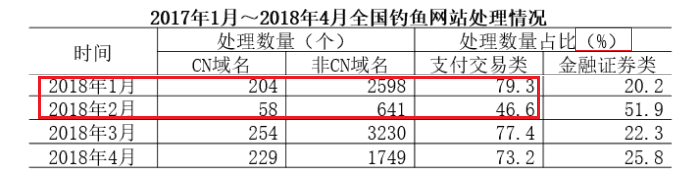
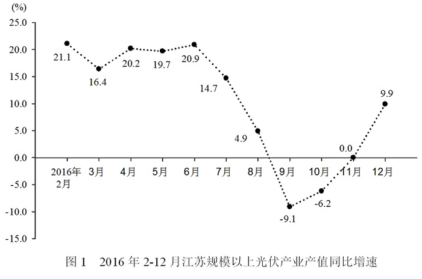
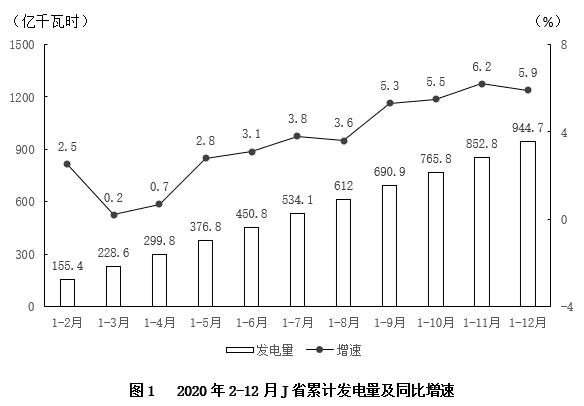
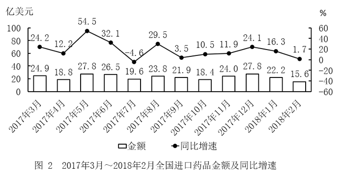
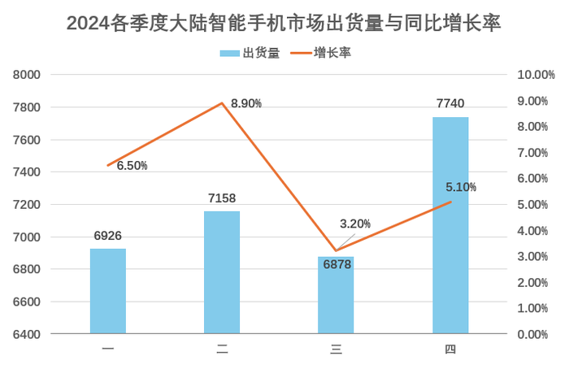

# 可验证的估算与秒算策略

快捷估算的目标是提前排除选项，不是省略逻辑：每次估算都要知道误差方向，剩余选项接近时恢复精算。常用技巧：放缩夹逼用上下界排除；材料同时给现期量和增长量时，基期量可直接相减，并用“基期量×候选增速”回代验证；化除为乘看选项乘`(1+r)`是否接近原值；拆一法`A÷B=1+(A-B)÷B`先算离1的零头；部分接近整体时用“1-其余部分占比”的补集法。比较第n月单月量与此前月均值只需比较`n×当月量`与累计量。算完用常识校验量级与范围，所谓“秒杀”必须能说明为什么其他选项不可能。

## 一、放缩法估算

   **例:2019国家地市级**

问：能够从上述资料中推出的是:
   C. 2018年2月全国支付交易类钓鱼网站处理数量环比下降了不到50%

秒杀法：用放缩法估算C项

1、C项数字范围大，不用精算，直接用放缩法估
2、支付交易类18年2月处理量：(58+641)×46.6%<700×50%（放大）=350
3、支付交易类18年1月处理量:(204+2598)×79.3%>2800×3/4（缩小）=2100
4、所以环比下降量肯定是大于2100-350=1750的，基期又为2100，下降率明显也是大于50%（1750⁺ ÷ 2100），不选C
5、原理：原式A-B=C，假设放缩量为D，(A-D)-(B+D)=A-B-2D＜A-B
6、熟练的只需写一两个数字就可以估出C项不对，实现秒杀

✏️常规法：老实精算，不用放缩

1、支付交易类18年2月处理量：(58+641)x46.6%=700x45%=315个
2、支付交易类18年1月处理量：(204+2598)x79.3%=2800x80%=2240个
3、则环比增长率=（315-2240）/2240 ≈-86%，环比下降>50%，C错误

## 二、已给增长率，优先用代入法

   **例：2019年420联考(山西县级+乡镇)**
2014年我国实施“单独两孩"生育政策，出生人口1687万人，比上年增加47万人。2016年实施“全面两孩"生育政策，出生人口1786万人，比上年增加131万人；出生率与“十二五”时期年平均出生率相比，提高了0.84个千分点。2017年我国出生人口1723万人，虽然比上年减少63万人，但比“十二五”时期年平均出生人口多出79万人；出生率为12.43%，比上一年降低0.52个千分点。2017年二孩数量进一步上升至883万人，二孩占全部出生人口的比重达到51.2%，比2016年的占比提高了11个百分点。
问：能够从上述资料中推出的是:

   D. 2017年出生人口比2013年增长超过5%

秒杀法：已给r的，优先用代入法

D项已给r=5%，优先用代入法，且5%=1/20
由材料得：13年出生人口为1687-47=1640万人
1640×（1/20）=82＜17年人口 - 13年人口=1723-1640=83
即实际增长量83＞82，故增长超过5%，选D
这样做只算了1个乘法和2个减法，比下方的常规法简单

✏️常规法：常规思路，不用代入和乘法

1、算出13年出生人口:1687-47=1640万人
2、代入增长率公式:r = （现期 - 基期）/ 基期
3、2017年出生人口比2013年增长了（1723-1640）/1640 = 83/1640 > 82/1640 = 1/20 = 5%，D正确

## 三、直除化成分数+零头比较

   **例:2019年420联考(山西县级+乡镇)**

问：能够从上述资料中推出的是:
   D. 2014年至2017年我国成年国民人均期刊阅读量，增长率最高的年份为2017年

秒杀法：不直除，化成分数+零头比较

1、15年、16年均为下降，不用比较
2、14年增长率=(6.07−5.51)/(5.51)=(0.56)/(5.51)；17年增长率=(3.81−3.44)/(3.44)=(0.37)/(3.44)
3、这时不要直除，化成分数+零头来比较，即(0.56)/(5.51)=(0.551+0.009)/(5.51)=(1)/(10)+(0.009)/(5.51)；同理(0.37)/(3.44)=(1)/(10)+(0.026)/(3.44)
4、很明显，前者的零头比后者零头小，前者比后者小，故17年的增长率最高，选D
5、这里过程写的比较详细，实战中这些直接心里口算了，很快出答案

## 四、基期比重秒杀法

   **例:2018年重庆市考(下半年)**
2017年，我国发明专利申请量为138.2万件，同比增长14.2%。共授权发明专利42.0万件，同比增长9.2%。其中，国内发明专利授权32.7万件，同比增长8.2%。在国内发明专利授权中，职务发明为30.4万件，占92.8%；非职务发明为2.3万件，占7.2%。
问：2016年，国内发明专利授权占我国授权发明专利的比例为:
   A.23.7%   B.25%
   C.77.9%   D.78.6%

秒杀法：基期比重秒杀法

a=8.2%，b=9.2%，a-b的绝对值为1%，故两期比重差的绝对值＜1%。（`两期比重差=现期比重 × (a - b) / (1 + a)；由于 |a - b| = 1%，且分母1+a ≈ 1.08，所以两期比重差的绝对值 < 1%`）
A、B选项差>1%，故排除A、B；C、D选项差刚好符合，故答案在C、D中，且一个是基期比重，一个是现期比重
因为b>a，即分母增长的快些(授权发明专利增长更快)，故16年(基期)的比重肯定比17年现期大，故选C、D中大的D(注意这里方向的判断不要反了哦)
> 原理：基期比重不存在绝对“秒杀”，核心是通过公式变形+选项差距实现快速估算。基期比重公式为：(A)/(B)×(1+b)/(1+a)，比较a和b，①如果a＞b，则（1+b）÷（1+a）＜1，基期比重 ＜现期比重。②如果a＜b，则（1+b）÷（1+a）＞1，基期比重 ＞现期比重。再估幅度：当|a-b|很小（如<1%）时，可直接选与现期比重最接近的选项。

✏️常规法：用基期比重公式算

1、基期比重=(A)/(B) × (1+b)/(1+a)=(32.7)/(42) × (1+9.2%)/(1+8.2%)=77.9% × (1.092)/(1.082) >77.9%，选D

## 五、巧用增速差和基期量成反比来求占比

   **例:2020年安徽省考**
2019年1至6月，全国发行地方政府债券28372亿元，同比增长101.09%。其中发行一般债券12858亿元，同比增长23.21%，发行专项债券15514亿元，同比增长322.38%；按用途划分，发行新增债券21765亿元，同比增长553.80%，，发行置换债券和再融资债券6607亿元，同比减少38.71%。
问2018年1至6月，发行一般债券的占比较发行专项债券的占比约:
   A.低9.36%   B.低52.81%
   C.高47.93%   D.高53.43%

秒杀法：混合增长率：增速差(线段长度)和基期量成反比

1、题中，发行地方政府债券由发行一般债券和发行专项债券组成，符合混合增长率概念
2、三者的增长率r分别为:(一般债券)23.21%、(政府债券)101.09%、(专项债券)322.38%；
3、23.21%到101.09%的增速差(线段长度)为78%，101.09%到322.38%的增速差约为221%，故一般债券和专项债券的增速差之比为78:221，故其基期量之比约为:221:78
4、基期的一般债券看成221份，专项债券看成78份，那么政府债券就是221+78=299份
5、再求题中占比差即:(221 - 78)/299 = 47.8%，选C，这比下面的常规方法快特别多，前提是混合增长率知识熟练

✏️常规法：分别算出三种债券的基期量，然后求占比，计算麻烦

1、代入公式:基期量=(现期量)/(1+增长率)和比重=(部分)/(整体)
2、可得一般债券基期量=(12858)/(1+23.21%)=10454;专项债券基期量=(15514)/(1+322.38%)=3676
3、政府债券基期量=(28372)/(1+101.09%)=14000
4、故题目所有占比差=(10454−3676)/(14000)=48.4%，选C项
5、常规法思路简单，但是就是难算，没有上面方法简单

## 六、乘积增长率思想解平均数增长率

   **例:2022粉笔模考省考第八季**
2021年上半年，J省农林牧渔业总产值3045.8亿元，同比增长4.5%，比上年同期加快4.3个百分点。夏粮总产276.15亿斤，较上年增加1.39亿斤，增长0.5%；夏粮亩产373.9公斤，较上年略减0.8公斤，下降0.2%。
问：2021年上半年，J省夏粮种植面积比上年同期约增长：
   A.-0.7%   B.-0.4%
   C.0.4%   D.0.7%

秒杀法：乘积增长率思想解平均数增长率

1、乘积增长率：1+r乘=(1+r1)x(1+r2)=1+r1+r2+r1×r2；即：r乘=r1+r2+r1×r2，这和间隔增长率公式一样：r间=r1+r2+r1×r2(r1，r2均小于10%时候，r1xr2可省略)
2、夏粮种植面积=夏粮总产÷夏粮亩产；夏粮总产=夏粮亩产×夏粮种植面积；即r(总产)=r(亩产)+r(面积)+r(亩产)×r(面积)
3、问J省夏粮种植面积的增长率，则带入公式，0.5%(总产)=-0.2%(亩产)+r(面积)+(-0.2%×r)；r1×r2可省略，则r(面积)=0.7%

✏️常规法：代入平均数的增长率公式算

1、平均数的增长率=−0.2%=(a−b)/(1+b)=(0.5%−b)/(1+b)
2、解得b=0.7%
3、这个方法也不慢，但如果你不记得平均数的增长率公式，那么使用乘积增长率的思维也能计算。其实乘积增长率和平均数增长率底层原理一样的，只是前者适用A=B×C，后者适用 C=A÷B

## 七、以相同涨跌幅涨跌的，如果给了上期涨跌量，先尝试直接代入涨跌量看是否能秒杀

   **例：2021湖北省考**

问：按照2019年7月上旬的环比涨跌幅，2019年7月中旬聚乙烯的价格约为（）
   A.7929.1元/吨  B.8031.5元/吨
   C.8134.3元/吨  D.8236.9元/吨

秒杀法：代入法-以相同涨跌幅涨跌的，如果给了上期涨跌量，先尝试直接代入涨跌量看是否能秒杀

1、2019年7月上旬聚乙烯的价格为8081.7元/吨，比上期价格上涨152.6元/吨，按照2019年7月上旬环比涨跌幅，因基期量变大，则2019年7月中旬的增长量应大于152.6元/吨，因此2019年7月中旬聚乙烯的价格>8081.7元/吨+152.6元/吨，即2019年7月中旬聚乙烯的价格>8234.3元/吨，秒选D

✏️常规法：计算出上期增长率，再算现期

1、2019年7月上旬环比涨幅为：(152.6)/(8081.7−152.6)=(152.6)/(7929.1)=1.9%
2、因此2019年7月中旬聚乙烯的价格为：8081.7x(1+1.9%)≈8082x1.02≈8244元/吨，选D

## 八、年均r相同，算未来值

   **例：粉笔模考2022年第九季**
2017年，我国在“一带一路"沿线国家(不含中国)专利申请公开量为5608件，同比增长16.0%。其中，在印度专利申请公开量为2724件，在俄罗斯专利申请公开量为1354件，专利申请初具规模。2017年，“一带一路"沿线国家在华申请专利4319件，同比增长16.8%；在华申请专利的“一带一路"沿线国家数达到41个，较2016年增加4个。
问：若以2017年的速度增长，到2019年，我国“一带一路”治线国家(不含中国)专利申请公开量将达到多少件?
   A.6505   B.6823
   C.7028  D7546

秒杀一：二项式展开+估算

1、根据公式有现期量=基期量×(1+r)，则2019公开量=2017公开量×(1+r)x(1+r)=2017公开量×(1+r)²
2、则有:5608×(1+16%)²=5608×(1+0.16)²=5608×(1+0.16²+0.32)=5600×1.32=7392，实际值略大于此，选D

秒杀二：间隔增长率思想来估算

1、根据间隔增长率公式，有r=16%+16%+16%x16%≈32%，则2019公开=5608×(1+32%)≈7392，实际值略大于此，选D

秒杀三：累加增长量来估算

1、先计算出2018年增长量为：5608×16%=897
2、假设2019年也增长897，则2019年公开量为:5608+897+897=7402，但2019年增长量一定大于897，所以2019年公开量一定大于7402，选D

✏️常规法：依次计算出2018年、2019年公开量，计算量较大

1、计算2018年公开量:5608×(1+16%)=6505
2、计算2019年公开量:6505×(1+16%)=7546，选D

## 九、画图法估平均数

   **例：2018广东**

问：2015-2017年，各季度的岗位空缺与求职人数比率的平均值约为（）
   A.1.07   B.1.09
   C.1.11   D.1.13

秒杀法：画图法+削峰填谷思想

1、依次代入选项在图中画出，如A选项1.07，图中低于1.07的数值只有2个，高于1.07的有9个，因此不能为平均数.
2、同理，B、D答案也排除，选C。

✏️常规法：算出总值除以个数得出平均数

1、定基准线为1.00，则2015年第一季度~2017年第四季度分别相差:0.12、0.06、0.09、0.10、0.07、0.05、0.10、0.13、0.13、0.11、0.16、0.22，相加可得：1.34
2、故2015-2017年，各季度的岗位空缺与求职人数比率的平均值约为1.34/12+1.00=1.11，选C

## 十、精确拆分

   **例**：134735×9.1%-134091×8.9%=？

秒杀法：借用乘法分配律将相近数字拆分，从而简化运算

1、9.1%=8.9%+0.2%，即题目化为134735×(8.9%+0.2%)-134091×8.9%
2、简化：134735×8.9%+134735×0.2%-134091×8.9%
👉(134735-134091)×8.9%+134735x0.2%
👉644×8.9%+134735×0.2%≈327

## 十一、大块头比重

   **例：2015广东**
2014年，全国汽车产销分别是2372万辆和2349万辆，同比增长7.3%和6.9%。汽车销售排名前十位的企业集团销售合计为2107.7万辆，比上年同期增长8.9%，高于全行业增速2个百分点。
问：2014年汽车销量排名前十位的企业集团销量占汽车销售总量的()。
   A.89.7%   B.88.9%
   C.73.4%  D.67.5%

秒杀法：大块头比重

1、理论：若所求部分占整体的比重接近100%，且选项悬殊较小时，可通过计算剩余部分比重，再用1减去该数值，从而得到所求比重
2、则在本题中，所求比重为（排名前十销量÷总销量），观察选项，数值接近1且悬殊较小，则计算剩余部分比重，即：（2349-2107.7）÷2349约等于10.3%
3、则所求比重为1-10.3%=89.7%，答案为A

## 十二、某月和月均比大小

   **例：2013联考**

问：2011年7月产量低于上半年月均产量的是()。
   A.电  B.钢材
   C.水泥  D.乙烯

秒杀法：巧妙利用某月和月均间关系求解

1、根据题意，已知7月与1~7月的产量，要求7月与（1~7月-7月）÷6相比较
2、则将两个数值都乘6，化为6×7月与1~7月-7月
3、再将两个数值分别加1个7月的值，化为7×7月与1~7月相比较
4、则题目变为:7倍的7月产量低于1~7月产量的是?
5、再依次计算选项7月产量乘7，与该指标1~7月的产量进行比较，得出答案D
6、结论：此方法适用于已知N月与1-N月数值的情况，再通过加减数值，将原本要计算的月均数值凑成题目已知的1-N月数值，从而将麻烦的除法步骤省略，化为更易估值的乘法。

✏️常规法

1、依次计算选项的月均产量:（1~7月-7月）÷6，再与该指标的7月产量比较

## 十三、顺差、逆差的增长率

   **例：2010国考**
2008年，某省农产品进出口贸易总额为7.15亿美元，比上年增长25.2%。其中，出口额为5.02亿美元，增长22.1%；进口额为2.13亿美元，增长33.2%。
问：2008年，该省的农产品外贸顺差比上年增长了:
   A.5%  B.15%
   C.25%  D.35%

秒杀法：结合混合增长率思想分析

1、理论：顺差=出口-进口；逆差=进口-出口。混合增长率：整体的增长率介于两部分增长率之间，且偏向于基数较大的一方
2、在本题中，要求顺差增长率，已知出口、进口增长率，则可套用此种方法直接判断，无需计算
3、由于顺差=出口-进口，则出口=顺差+进口，则将出口增长率看为整体，顺差、进口增长率看作部分，且顺差基数为：5.02-2.13=2.89，那么顺差基数大于进口基数
4、则有：出口增长率介于顺差增长率、进口增长率之间，且偏向顺差增长率一方
5、而已知进口增长率为33.2%，出口增长率为22.1%，那么顺差增长率只能小于22.1%，才能保证出口增长率在顺差、进口之间，则排除C、D
6、又知出口增长率偏向顺差增长率，则顺差增长率与出口增长率之间的差一定小于进口增长率与出口增长率的差(11.1%)，则顺差增长率还需要大于11%(22.1%-11.1%)，则只能选B

✏️常规法：依次计算各部分值

1、先计算2007年的出口值：5.02÷(1+22.1%)=4.11；2007年的进口值：2.13÷(1+33.2%)=1.6；则2007年的顺差值为:4.11-1.6=2.51
2、再计算2008年的顺差值:5.02-2.13=2.89
3、最后计算2008年顺差值的增长率:(2.89-2.51)÷2.51=15.1%，答案选B

## 十四、同比增速大于上月，则环比增速就大于上年

   **例：2018江苏**
【图片】
问：2016年3—12月，江苏规模以上光伏产业产值环比增速低于上年同期的月份个数为：
   A.2  B.3
   C.5  D.8

秒杀法：同比增速大于上月，则环比增速就大于上年

观察图。12月同比增速9.9%、11月同比增速0%、10月同比增速-6.2%、9月同比增速-9.1%、8月同比增速4.9%、7月同比增速14.7%、6月同比增速20.9%、5月同比增速19.7%、4月同比增速20.2%、3月同比增速16.4%、2月同比增速21.1%
根据“同比增速大于上月”的，即12月、11月、10月、6月、4月（观察折线图呈上升趋势的月份）
根据“则环比增速就大于上年”，所以有5个月份的环比增速高于上年同期
则问题求"低于上年同期的月份"，我们知道“高于上年同期”的有5个，则低于上年同期的月份有10-5=5个。（同比增速大于上月，则环比增速就大于上年；也可以叫同比增速小于上月，则环比增速就小于上年）
> 原理：假设2016年9月看成A，同比增速为a，2016年8月看成B，同比增速为b，则2016年9月环比增速=(A÷B)-1，2015年9月=A÷（1+a），2015年8月=B÷（1+b），则2015年9月环比增速=(A)/(B)×(1+b)/(1+a)×-1。
> 比较环比大小即看 (A÷B)-1-（(A)/(B)×(1+b)/(1+a)×-1）是否大于或小于0。
> 把式子化简，(A)/(B) -（(A)/(B)×(1+b)/(1+a)） =(A)/(B)×(a−b)/(1+a)，发现是两期比重差公式。那么直接比较大小看a-b即可，即比较同比增速。

✏️常规法

计算2016环比增速，再根据同比增速计算2015基期，再根据2015年基期计算2015环比增速，最后再比较。

## 十五、只要累计不滑坡，当月就比累计多

   **例：2022国家**
【图片】
问：2020年3-12月，J省当月发电量同比增速快于当月累计发电量同比增速的月份有几个？
   A.5  B.6
   C.7  D.8

秒杀法：只要累计不滑坡，当月就比累计多

问题问当月发电量同比增速快于当月累计发电量同比增速，就是问当月就比累计多有几个。
   图中给了累计发电量即同比增速，我们直接看3~12月增速上升的月份即可。
有1-4月、1-5月、1-6月、1-7月、1-9月、1-10月、1-11月
答案为7个，选C。
> 原理：本质是混合增长率，因为当月累计发电量=上月累计发电量+当月发电量，要求当月发电量同比增速快于当月累计发电量同比增速，根据“整体增速介于两部分增速之间”，可得当月发电量同比增速＞当月累计发电量同比增速＞上月累计发电量同比增速，即当月累计发电量同比增速＞上月累计发电量同比增速时满足条件。

## 十六、灵活使用间隔增长率

   **例：2019国考**
【图片】
问：2016年5月，全国进口药品金额环比增速：
   A.超过100%  B.在40%~100%之间
   C.在0%~40%之间  D.低于0%

秒杀法：灵活使用间隔增长率

间隔增长率r＝r1+r2+r1*r2，只要是三个时间节点就可以用间隔增长率公式，不用考虑时间间隔是否相等。
常规法要计算2个除法＋估算。
求2016年5月环比增速，这里有两个时间点，即2016年5月和2016年4月
   图中给了2027年5月同步增速。即2016年4月\_r2\_2016年5月\_r1\_2027年5月构成间隔增长率，r1为54.5%，间隔增长率r＞54.5%（`因为2017年4月同比增速12.2%，所以2027年5月相对于2016年4月＞54.5%，当然你可以精算，2017年4月同比增速12.2%，值为18.8，估算一下2016年4月大约是17，17涨到26.5大约是55%~60%`），求r2。
带入 r=54.5+r2+54.5×r2，r2=（r-54.5）÷（1+54.5%）＞0，排除D，因为r＞54.5%，大不了多少，r-54.5大概是一个10%以内的数，所以r2在0%~40%之间，选C。

✏️常规法

基期=现期÷（1+r）可得：2016年5月进口药品金额=27.8÷（1+54.5%）≈18.5亿美元，2016年4月进口药品金额=18.8÷（1+12.2%）≈17.1%美元；由增长率=（现期÷基期）-1=（18.5÷17.1）-1＜10%，其范围符合C项。

## 十七、基期环比=现期环比+上月同比-当月同比

   **例：2025山东潍坊“青年优秀人才引进计划”选调**
【图片】
问：23年第四季度，大陆市场出货环比增速为（ ）。
   A.30.7%  B.22.5%
   C.17.1%  D.10.5%

秒杀法：基期环比=现期环比+上月同比-当月同比

问题求基期环比
上月同比=3.2%
当月同比=5.1%
现期环比：6878涨到7740，假设涨10%，则涨了690，那么还差200左右，6878的3%大约200，则现期环比=10%+3%≈13%。（`因为选项差距大，大胆估`）
则基期环比=13%+3.2%-5.1%≈11%，选D。（`该公式存在误差`）
> 原理：本质就是两次间隔增长率的计算（只要是三个时间节点就可以用间隔增长率公式，不用考虑时间间隔是否相等）。路径A：去年上月 → 今年上月（上月同比） → 今年本月（现期环比）；路径B：去年上月 → 去年本月（基期环比） → 今年本月（当月同比）。
> 既然起点（去年上月）和终点（今年本月）都一样，那么两条路径的总涨幅必须相等。根据间隔增长率的精确公式（总增长率 = r1 + r2 + r1×r2），我们可以列出等式：
> 路径A的总涨幅 = 上月同比 + 现期环比 + (上月同比 × 现期环比)
> 路径B的总涨幅 = 基期环比 + 当月同比 + (基期环比 × 当月同比)
> 令两者相等，则基期环比 = 上月同比 + 现期环比 + (上月同比 × 现期环比) - 当月同比 - (基期环比 × 当月同比)
> 对比提到的简易公式（基期环比=现期环比 + 上月同比 - 当月同比），你会发现简易公式直接丢掉了两个交叉乘积项：被忽略的部分 = (上月同比 × 现期环比) - (基期环比 × 当月同比)
> 当这几个增长率都很小时，这两个乘积属于“高阶无穷小”（比如2% × 2% = 0.0004，即0.04%），在粗略估算时可以忽略不计。所以当增长率大/选项差距小就不适用。
> 举个例子：上月同比 = 10%、现期环比 = 10%、当月同比 = 5%，按照简易公式估算：基期环比 ≈ 10% + 10% - 5% = 15%。但套用精确公式计算：路径A总涨幅 = 10% + 10% + 10%×10% = 21%；精确的基期环比 = (21% - 5%) / (1 + 5%) = 16% / 1.05 ≈ 15.24%。0.24个百分点的误差就出来了。

✏️常规法

定位统计图可知2024年第三、第四季度出货量及同比增速分别为6878万台，增速3.2%、7740万台，5.1%。
根据公式：基期=现期÷（1+r），则23年第三、第四季度出货量分别为6878÷（1+3.2%）≈6665万台、7740÷（1+5.1%）≈7364万台。
根据公式：增长率=（现期÷基期）-1，则23年第四季度，大陆市场出货环比增速为（7364÷6665）-1≈699÷6665≈10.5%，故正确答案为D。

## 十八、生活常识思维秒杀

   **例：2021新疆**
按收入来源分，前三季度，全国居民人均工资性收入13020元，增长8.6%；人均经营净收入3757元，增长9.3%；人均财产净收入1949元，增长12.3%；人均转移净收入4157元，增长7.2%。
问：2019年前三季度，四种收入来源中收入同比增量最高的是：
   A.人均工资性收入  B.人均经营净收入
   C.人均财产净收入  D.人均转移净收入

秒杀法：结合常识分析

1、这道题原本考察的是增长量公式比较，但是我们仔细想想，我国是工薪阶层为主体的，主要收入还是工资。秒选A;
2、资料分析的材料几乎都是出题人从国家或各地方统计局网站上收集到的真实数据。常识积累：
①运输货运量：公路是最大的，民航是最小的。
②交通拥堵：优先考虑重庆、四川。
③彩票类：竞猜型彩票最多。
④能源类：农业用水量最大；第二产业用电最多；工业用气最大。
⑤西南下雨时间长雨量大。
⑥近两年受台风影响最多的省份：广东、广西、海南。
⑦问某个产品哪月的售价最高，有二月选二月，因为二月是过年期间。
⑧城镇与农村收入最高的季度：城镇是第一季度（年终奖），农村是第四季度（农作物收成）。
⑨中国快递物流量最多的季度：第四季度（双十一、双十二）。
⑩人身险中寿险数值大的增长率缓慢。

## 等比例缩放法

**1、原理**：分子分母同时扩大或者缩小相同倍数或比例，分数值不变

**2、操作**：竖向看，分子、分母原来是几倍，加减的数字也是几倍，其分数值不变。

`比如`：(100)/(200)=(100×(1+1%))/(200×(1+1%))=(100+1)/(200+2)=(100+5)/(200+10)
**3、题型**：适用除法计算。

- （1）(A)/(B)、(A)/(1+r)

> `例`：(673.34)/(1+6.96%)【A.600，B.620，C.630，D.724】

> 分析：(673.34)/(1+6.96%)看成(673)/(107)，观察673大约是107的6倍多，则(673−42^+)/(107−7)≈630，选C。通过等比例缩放法，把分母变成100，则答案就很明显了。

- （2）(A)/(1+r)×r、(A)/(B)×(1+b)/(1+a)

- （3）分数比较

> 计算的本质：通过等比例缩放尽可能把分母消掉或把分母变成容易约掉的数字。
> 分数比较的本质：通过等比例缩放，把两个分数的分子或分母变成一样，大小就容易判断了。

**4、练习**：

- （1）求(4937)/(1+23.8%)×23.8%

先截三位4937写成494、 123.8% 写成124 、23.8%写成238，式子变为(494)/(124)×238
由于124的两倍【248】与238相差10，所以把238缩放两倍，238=119×2
总式子改写成(494)/(124)×119×2
124与119相差5，494大概是124的4倍。
124减去5 ，则494减去5的4倍，即(494−20)/(124−5)×119×2
119约掉，最后474×2=948（选与答案相近的一个）
- （2）(770)/(140)和(880)/(159)比较大小

利用“分子分母同时扩大或者缩小相同倍数或比例，分数值不变”，统一两个分数的分母或分子，大小关系就容易判断了。
为了方便计算，统一两个分数的分母为140，那么第一个分数不需要放缩。
分数(880)/(159)，分子（880=160×5+80）是分母的5.5倍。进行放缩，分母159减去19，那么分子880减去（19×5.5）；`19×5.5=（19×5）+9.5=95+9.5=104.5`
则分数(880)/(159)变为(880-104.50)/(140) = (770⁺)/(140)；
此时只需比较(770)/(140)和(770⁺)/(140)大小；
分母相同，分子越大分数越大，因此(770)/(140)＜(880)/(159)
- （3）(500.2)/(588.9)−(500.2+10.8)/(588.9+21.3)（`给现期、增长量，求比重差`）

先把式子变成(500)/(589)−(500+11)/(589+21)（`保留三位`）
使用等比例缩放法，可以操作左边分数也可操作右边分数，明显左边分数好操作；右边分数分母加了21，那么左边我们也加21，则(500+？)/(589+21)，直接看，589大约是500的1.1倍多，21÷1.1约等于19，则？处为19，则式子为(500+19)/(589+21)
则整个式子变为：(500+19)/(610)−(500+11)/(610)=(8)/(610)
不要计算，直接看，610的1%是6.1，差8-6.1=1.9，610的0.3%大约1.8，则答案为1%+0.3%=1.3%，

## 化除为乘（求基期量）

-   **1、应用条件**：|r|＜5%

-   **2、应用方法**：

-   （1）**(A)/(1+r)≈ A ×(1-r)**
-   （2）**(A)/(1−r)≈ A × (1+r)**
-   **3、原理**：

-   （1）(A)/(1+r)=(A×(1−r))/((1+r)×(1−r))=(A×(1−r))/(1−r^2)，当|r|<5%时，r^2<0.25%，0.25%相对于1来说忽略不计。因此1-r^2约等于1。因此(A)/(1+r)（真实值）≈ A×(1-r)（估算值），其误差范围是r^2。

-   （2）注意：真实值略大于估算值。因为估算把分母1-r^2当成1，分母变大了，分数就变小了。所以，需要选择相对偏大的选项。

-   **4、应用延申**：当|r|＜10%，选项第二位不同也可以使用，此时误差范围<1%。当|r|较大时误差显著增加，因此不适用于高增长率场景。

-   **5、例子**：

-   （1）求(2522)/(1+2%) 【A.2548、B.2354、C.2563、D.2472】

-   观察题目，2%<5%，使用化除为乘。
-   式子变为2522.5×（1 - 2%）≈2522.5 - 50⁺ ≈2472.5⁻，与D选项接近，选D
-   （2）求(804.78)/(1−8.4%) 【A.826、B.879、C.921、D.742】

-   804.78除一个小于1的数一定大于804.78，排除D。
-   观察题目，|8.4%|<10%，并且选项A，B第二位不同，使用化除为乘。
-   式子变为804.78×（1+8.4%）≈804.78 + 67⁺ ≈ 871⁺，答案应该比871多一点，但C选项921多太多。答案为B。
-   当然C选项也可以通过误差分析，误差为-8.4%×-8.4%大概等于0.7%，而871与B选项879差了大概0.8%，因此答案为B。

## 415份法

**1、定义**：415份数法与数量中的比例法类似，均是将数量关系转化为份数比例关系，从而化简计算。一般来讲，在现期A和増长率r是已知量的前提下，我们可以用415份数法求得**基期B、变化量X**的数值。

- （1）415份数法中“415”分别代表基期、变化量、现期的份数，一般来说，我们只需根据增长率求出现期对应的份数，即可根据现期量求得一份的大小，再根据问题进行下一步计算。

- （2）415份数法使用的核心公式为X=Br`[增长量=基期×增长率]`和B=A-X`[基期=现期-变化量]`。

**2、使用步骤**：

- （1）把增长率r化成相近的分数a/b；

- （2）写出比例，基期：変化量：现期=b：a：(a+b)（基期为b份，变化量为a份，现期为b+a份）；

- （3）根据现期现量A和其对应的份数（a+b）可以求得每一份对应的量（`份量`）；

- （4）根据份量的大小可求变化量、基期。

**3、注意**：

- （1）増长率为负数时变化量也为负数，此时“415份数法”即变成“4(-1)3份数法”。

- （2）很多时候増长率r并不与某个分数完全相等，而是近似的看成某个分数。估算必然会产生误差，对于估算出的一份量，规则为”估大则一份变大、估小则一份变小”（把23%估算成1/4，即是估大了，则求出的一份量比实际量要大；把23%估算成1/5，即是估小了则求出的一份量比实际量要小)。如果选项中有与估算值完全一样的数据，小心有坑！！！

- （3）**如果所求为基期，一般先求变化量，再使用公式B=A-X**。不要用份量乘以基期份数，因为份量非实际值，一般是估算来的，会产生误差，用份量乘以份数则误差被扩大若干倍。

**3、需要经常记忆的分数**：

28.6%=2/7
42.9%=3/7
37.5%=12.5×3=3/8
62.5%=5/8
[分母小化分](/资料分析/速算技巧.html#六、分母小化分)

**例:** 2024年电子类器件平均售价785元，比去年增长28.9%，求2023年平均售价和增长量分别是多少？
解析使用415份法，28.9%约等于28.6%=2/7，即基期：变化量：现期=7：2：9，现期为785元，所以每份为785÷9=87，增长量为87×2=174元，因此2023年平均售价为785-174=611元。

若题目是比去年增长-28.9%，则基期：变化量：现期=7：-2：5，所以每份为785÷5=157元，增长量=157×-2=-314元。因此2023年平均售价为785-（-314）=1099元。

## 假设分配法

> 假设分配的核心是“抓住主要矛盾”，将“大数”分完，“小数”有误差也不影响结果。

**1、使用场景**：求任何基期(B)和变化量(X)的题目

**2、使用时机**: 增长率不在任何分数附近时或当求基期或变化量只是计算过程的中间步骤时。

### 增长率>0

**1、核心公式**：变化量（X）＝基期量（B）×增长率（r）；在r较小的情况下，可以用现期代替基期（`即X=B×r≈A×r`）。假设分配法通俗地说呢，就是利用核心公式一步步地把现期A分成基期B和变化量X两个部分。
**2、使用步骤**：
- （1）假设基期量B为一个方便计算的整数（`B &lt; A`）；

- （2）已知增长率r，根据X=B×r可计算出变化量；

- （3）根据现期-（基期+变化量）= 剩余分配量；重复步骤（1）（2）（3），直到把现期分配完即可；

- （4）最后把每一步分配的基期和变化量进行相加。

`假设的基期量尽量保证【基期+变化量】与现期相近，如果相差太大分配次数会变多`

**例:** 现期A=1360，增长率r=23%，请求出前期B和变化量X。
解析【图片】
此题最后一步若想更为精确则可考虑:

若取B=6，X=1时，r=1/6=16.7%<23%
若取B=5，X=2时，r=2/5=40%>23%
则1 < X < 2；那就取中，B=5.5，X=1.5

**例:** 现期A=632，增长率r=6.1%，请求出前期B和变化量X。
解析

画出分配树:

【图片】

当然你也可以继续分配，因为r比较小（X＝Br≈Ar），先分配X为-5×6.1%≈-0.3，这里为什么X估小一点，因为在第一步X=37时就估大了，为了精确，因此第二步可以估小一点。此时B就等于-5+0.3=-4.7，那么此时B=600+(-4.7)=595.3，x=36.7。

**例:** 现期A=624，增长率r=13%，请求出前期B和变化量X。
解析

画出分配树:

【图片】
此题最后一步剩余-54，因为-54太多还需要继续分配。
因为r比较小（X＝Br≈Ar），先分配X为-54×13%≈-6，此时B就等于-54+6=-48。

**例:** 现期A=1752，增长率r=71%，请求出前期B和变化量X。
解析

第一步：确定分配数1000:710，剩余42
第二步：r=71%太大，不能使用X≈Ar，直接平分，21：21，再进行修正，变成23：19，19/23>71%，继续修正，变成25:17，17×4/25×4等于68%，与71%差不多了。
你可以继续修正，比如变成24.5:16.5，此时就不用计算了，大概与71%相等了
因此B=1000+24.5=1024.5，X=710+16.5=726.5

【图片】

总结

当r在0~20%，先确定分配数，后续在确定是否使用X≈Ar
当r在25%左右，B：X=4：1
当r在33%左右，B：X=3：1
当r在50%左右，B：X=2：1
当r在66%左右，B：X=3：2
当r在70%以上，直接平分再进行修正

### 增长率<0

   **1、**当增长率为负数时，变化量为负数，基期量比现期量大，因此分配的基期量要大于现期量。

   **2、注意**：分配的时候符号不能省略；步骤跟增长率＞0时一致。

   （1）分配的基期与现期符号要一致。
   （2）分配的基期与变化量符号要不同。

**例:** 现期A＝432，增长率r＝-6%，请求出前期B和变化量X。
解析第一步：对现期A＝432进行分配，增长率<0，假设基期量=500，变化量＝500×（-6%）＝-30，A剩余＝432-（500-30）＝-38。
第二步：对剩余的现期-38进行分配，r＝-6%比较小，利用X＝Br≈Ar，变化量＝-38×（-6%）≈2，基期量＝-38-2＝-40。分配完毕。
把每一步分配的基期和变化量进行相加。
因此前期B=500＋（-40）＝460，变化量X=-30＋2＝28。
用计算器精确计算前期B＝459.5，变化量X＝-27.5。

**例:** 现期A＝618，增长率r＝-9%，请求出前期B和变化量X。
解析第一步：对现期A＝618进行分配，增长率<0，假设基期量=700，变化量＝700×（-9%）＝-63，A剩余＝618-（700-63）＝-19。
第二步：对剩余的现期-19进行分配，r＝-9%比较小，利用X＝Br≈Ar，变化量＝-19×（-9%）≈2，基期量＝-19-2＝-21。分配完毕。
把每一步分配的基期和变化量进行相加。
因此前期B=700＋（-21）＝679，变化量X=-63＋2＝-61。
当然，如果你认为r＝-9%算大，不敢使用X＝Br≈Ar，你可以正常分配，比如上面第二步，对剩余的现期-19进行分配，假设基期量=-20，变化量＝-20×（-9%）＝1.8，剩余-0.8。因为-0.8太少，相对基期来说误差可以忽略不计，直接全部分配到基期。因此基期=700+（-20）+（-0.8）=679.2，变化量X=-63+1.8=-61.2。
用计算器精确计算前期B＝679.1，变化量X＝-61.1。

**例:** 现期A＝2178，增长率r＝-31%，请求出前期B和变化量X。
解析第一步：对现期A＝2178进行分配，增长率<0，假设基期量=2500，变化量＝2500×（-31%）＝-775，A剩余＝2178-（2500-775）＝453。
第二步：对剩余的现期453进行分配，假设基期量=600，变化量＝600×（-31%）＝-186，A剩余＝453-（600-186）＝39。
第三步：对剩余的现期39进行分配，假设基期量=60，变化量＝60×（-31%）＝-18.6，A剩余＝39-（60-18.6）＝-2.4。剩余太少，直接全部分配给基期，分配完毕。
把每一步分配的基期和变化量进行相加。
因此前期B=2500＋600＋60＋（-2.4）＝3157.6，变化量X＝现期-基期＝2178-3157.6=-979.6。
用计算器精确计算前期B＝3156.5，变化量X＝-978.5。

## 拆1法

**1、使用场景**：你的列式存在(1+a%)/(1+b%)（`a%，b%可正可负`），比如基期计算、比重计算等等。

**2、使用技巧**：该方法是存在误差的，当分母越接近1时，那么误差就越小。

- （1）先判断分数的与1的大小关系。
- （2）若比1大，则 a%＞b%，可把原式子化简为≈ 1 + (a-b)%；
- （3）若比1小，则 a%＜b%，可把原式子化简为≈ 1 - (b-a)%；
> 例如60%×(1+13.1%)/(1+14.5%)。根据方法(1+13.1%)/(1+14.5%) ≈ 1 - 1.4%。整个式子变成60% × (1 - 1.4%) ≈ 60%-0.8%=59.2%。

**3、使用时机**：满足一个即可。

- （1）b%＜5%。

- （2）|b%-a%|＜5%。

**例**：（2019深圳）乘用车累计产销分别完成1735.1万辆和1726.0万辆，同比分别增长0.1%和0.6%。...。中国品牌乘用车累计销售724.2万辆，同比下降1.5%。

问：2017年1-9月，中国品牌乘用车销量占乘用车销量的比重是（ ）。
   A.41.9%  B.42.9%
   C.44.1%%  D.46.2%

解析

   本题为基期比重问题。
   根据基期比重公式 A/B × （1+b/1+a），则2017年1-9月，中国品牌乘用车销量占乘用车销量的比重= 724.2/1726 × (1+0.6%/1-1.5%)。
   先算A/B，选项AB差距1%，个人认为差距是比较大的，可以估算。724.2/1726≈(864-140)/1726≈50%-（140/1726）≈42%⁻ `140/1726=(172.6-32.6)/1726=10%-2%=8%⁺`
   根据拆1法，42%⁻× (1+0.6%/1-1.5%)=42%⁻×（1+0.6%-(-1.6%)）=42%⁻×（1+2.1%）≈42%⁻+0.9%=42.9%⁻，对应B项。
   故正确答案为B。
