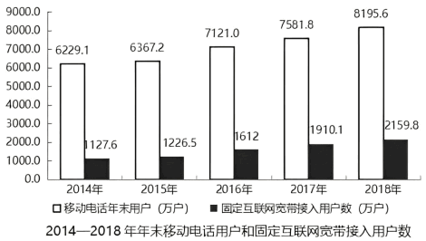

# 增长四量关系

所有基础增长题都可以从两条关系推出：`A=B+X`（现期=基期+增长量）、`A=B×(1+r)`。由它们可得基期量`B=A÷(1+r)`、增长量`X=B×r=A×r÷(1+r)`、增长率`r=X÷B`。下降8%时增长率取-8%，公式照常成立，作答时注意题干要的是不是下降量的绝对值。正增长时现期量必大于基期量，若结果违背这一大小关系，通常是`1+r`写反，应回头复核。

## 一、已知现期和基期

-   **公式**：增长量 = 现期 - 基期

**例**：（2019河北）

问：与2017年相比，2018年移动电话用户净增数比固定互联网宽带用户净增数多多少万户?
   A. 364.1  B. 486.7
   C. 526.8  D. 531.0

解析

   第一步，本题考查增长量计算中的已知现期量与基期量。
   第二步，定位柱状图，2018年固定互联网接入用户数为2159.8万户，2017年为1910.1万户。2018年移动电话用户为8195.6万户，2017年为7581.8万户。
   第三步，根据增长量=现期量-基期量，则有(8195.6-7581.8)-(2159.8-1910.1)减法计算，材料与选项精确度一致，考虑尾数法，尾数为8-7=1，以1结尾。
   因此，选择A选项。

**例**：（2019广东）近年来，A省新登记市场主体保持较快增长势头。全省实有各类市场主体从2015年的775.95万户增长到2018年的1146.13万户。2018年，全省新登记市场主体229.74万户，日均新登记市场主体6294户，同比增长17.82%。

   问：2015—2018年，A省实有各类市场主体数增长了约（ ）万户。
   A. 170.2  B. 270.2
   C. 370.2  D. 470.2

解析

   由题干“2015-2018年，······增长了约多少万户”，判定本题为增长量计算问题。
   定位文字材料可得：“全省实有各类市场主体从2015年的775.95万户增长到2018年的1146.13万户”，故2015-2018年，A省实有各类市场主体数增长量=现期 - 基期=1146.13-775.95约等于370万户，与C项最为接近。
   故正确答案为C。
