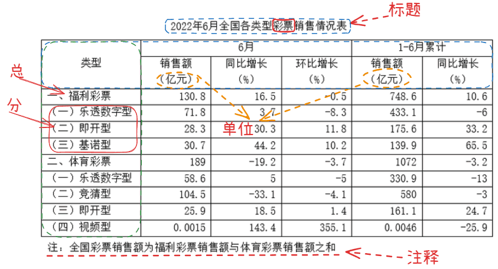
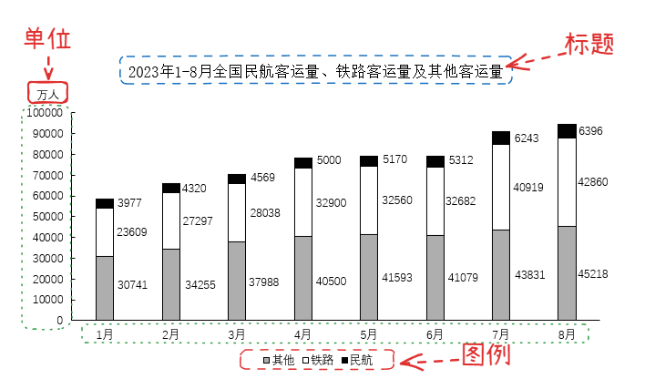
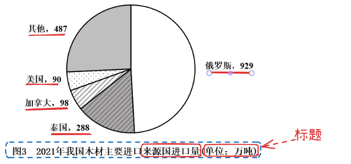

# 结构阅读与数据定位

资料分析先考定位后考计算：按“材料结构→题干→回材料定位”的顺序做题，不要从头逐字记忆数据。定位时标记三类信息：时间（现期、基期、累计期及同比环比口径）、单位（亿元与万元、人次与人数，留意表头统一单位）、主体（全国与地区、总量与分项、进口与出口）。找到数据后用同义词复核口径，如“社会消费品零售总额”不能与“限额以上零售额”混用；题干问跨两个年度的增长、或问“占全国的比重”时，取数与分母都按题干口径。

## 一、核心原则

**1、粗读材料，了解给定材料的框架结构；**

**2、读题干，提取题目中的关键信息点；**

**3、回到材料中，快速定位相应的数据。**

## 二、文字型材料

**1、**文字型题目，分为多段型材料（`多个段落组成`）跟孤段性材料（`一个段落`）。现在给到的材料基本都是多个段落，段落第一句话会交代当前材料描述的时间年份，每个段落都会有不同的主题，段落结构一般都是采取“总——分”的方式进行叙述。

- （1）**多段型材料**重点看每个段落的时间、关键词和结构(一般为“总一分”，“其中...”，后面跟的是“分”；分结构的内容可以略读)，留意一下标点、单位。
- （2）**孤段型材料**重点看时间、关键词、标点(尤其是句号和分号，这些标点可以把大段的文字分成一个个小单元)。
**2、问题分布：**

- （1）第1题：一般出现文章的开头，特别是第一句话。
- （2）第2、3题：文章的中间，第2题可从第1题读到的位置开始往下找，第3题类似。
- （3）第4题：一般在最后两段里，文段少重点看最后一段。
- （4）第5题：综合分析题，遍布整篇文章。
`注意：个别有反常（例如江苏真题）`

**例**：多段型材料（2024国家）

2022年`(时间)`，京津冀地区生产总值`(关键词)`合计10.0万亿元，是2013年的1.8倍。//其中`(后面是“分”内容)`，北京、河北跨越4万亿元量级，均为4.2万亿元，分别是2013年的2.0倍和1.7倍；天津1.6万亿元，是2013年的1.6倍。//京津冀第一产业、第二产业、第三产业`关键词`增加值占生产总值比重构成由2013年的6.2：35.7：58.1变化为2022年的4.8：29.6：65.6。京津冀三地第三产业增加值占生产总值比重分别为83.8%、61.3％和49.4%，较2013年分别提高4.3、7.2和8.4个百分点。
2013—2022年`(时间)`，京津冀地区城镇累计分别新增就业`(关键词)`288.1万、405.5万和748.4万人。//2021年，北京`(关键词)`法人单位从业人员中，第三产业比重为84.4%，较2013年提高6.2个百分点，其中信息服务业和商务服务业占比达25.5%，较2013年提高6.2个百分点；天津和河北`关键词`第三产业就业人员占比为60.5％和46.6%，较2013年提高10.9和15.1个百分点。
2022年`(时间)`，京津冀三地全体居民人均可支配收入`(关键词)`分别为77415元、48976元和30867元，与2013年相比，年均分别增长7.4%、7.1％和8.2%。//其中`(后面是“分”内容)`，城镇居民人均可支配收入分别增长7.3%、6.9％和7.1%，农村居民人均可支配收入分别增长8.2%、7.3％和8.6%。
   问题1：以2013年为基期，则2013-2022年京津冀地区生产总值`(根据问题关键词，定位文字材料第一段)`年均约增加多少万亿元？
问题2：2013—2022年，北京城镇累计新增就业`(根据问题关键词，定位文字材料第二段)`人数约占同期京津冀地区城镇累计新增就业总人数的：

**例**：孤段型材料（2020内蒙古）

2019年`(时间)`全国房地产开发投资`(关键词)`132194亿元，比上年增长9.9%，增速比上年加快0.4个百分点。//其中`(后面是“分”内容)`，住宅投资97071亿元，增长13.9%，增速比上年加快0.5个百分点。//2019年，全国商品房销售面积`(关键词)`171558万平方米，比上年下降0.1%。//其中，住宅销售面积增长1.5%，办公楼销售面积下降14.7%，商业营业用房销售面积下降15.0%。//商品房销售额`(关键词)`159725亿元，增长6.5%，增速比上年回落5.7个百分点。其中，住宅销售额增长10.3%，办公楼销售额下降15.1%，商业营业用房销售额下降16.5%。
   问题1：2018年全国房地产开发投资`(根据问题关键词，定位文字材料第一句)`比上年增长：
问题1：2019年全国住宅投资`(问住宅就是“分”的内容，定位文字材料第一和第二句)`在房地产开发投资中的比重约为：

## 三、表格型材料

1、重点看标题、横纵坐标和单位。

- （1）一般拿到表格，第一步就是先看标题，因为标题会包含时间和关键词。
- （2）看完标题之后，再去看横排和竖排都代表什么意思。有时横纵标目中也会有总分结构，这种情况就可以按照文段的方式找出每个分类的关键词；
- （3）留意特殊单位，有时出题人会在这里设坑（例如吨/万吨/亿吨）

**例**：（2024浙江）

## 四、图形材料

1、在具体考试中，它又分为很多的类型：饼状图、柱状图、折线图、趋势图、网状图等。

2、解题思路同样是首先看标题、横纵坐标、单位、注释、图例(`统计指标`)。像柱状图、折线图一般都会有标题、横纵坐标、图例还有单位。

**例**：（2024黑龙江）

**例**：（2023国家）

