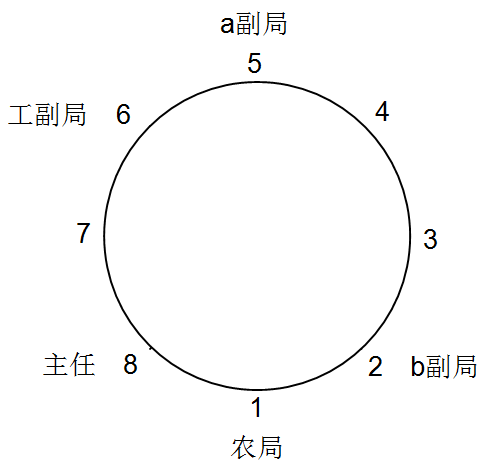
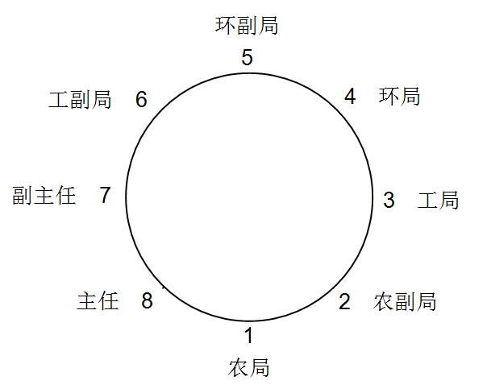
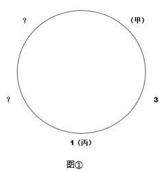
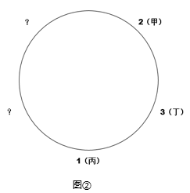
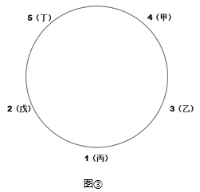
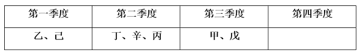
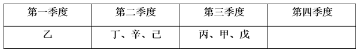
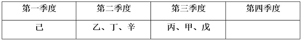
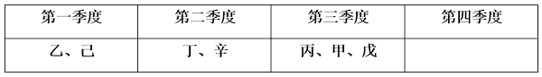

# 组合排列

如果参加的是国考，尤其是考行政执法 类或地市级，在组合排列题型里面，会有一种题是前面给出一则材料，后面给出 5 道小题，即“一拖五”，类似资料分析，除此之外，国考和省考基本没有区别。

题目特征：题目给出一组对象(如赵、钱、孙、李)，并给出对象所具有的若干信息(如年龄性别、职业、身高、专业等)，需要对各类信息进行匹配。

## 一、解题技巧

##### **1、排除法**：根据已知条件直接排除错误选项。

##### **2、代入法**：将选项代入已知条件中，验证是否正确。

- （1）题干条件确定（都为真），选项信息充分（选项中人物与信息全部一一匹配好）时优先考虑排除法；
- （2）题干条件不确定（半对半错；有真有假），尝试带入题干验证；设问中有“可能”，“不可能”或设问中有“补充以下哪项条件可以推出”考虑带入法。
- （3）当代入法做题时，如果某个选项符合条件，可直接选择该项，无需再验证其他选项。
##### **3、辅助技巧**：

- （1）最大信息：最大信息就是指题干中出现次数最多的信息，以最大信息为推理起点，会使推理更加简单清晰。
- （2）假设法：题干没有明确推理起点，且代入复杂，考虑假设。
- （3）画表法：遇到排序类问题可以画一维表，涉及到大小比较的时候，可以用符号（＞、＜、＝）将信息表示出来；遇到两组以上对象，且无法排除代入类问题可以画二维表。

* * *

**例**：（2018江苏宜兴事业单位）在一次国际会议上，来自四个国家的五位代表被安排坐在一张圆桌旁，为了使他们能够自由交谈，事先了解到情况如下：甲是中国人，还会说英语；乙是德国人，还会说汉语；丙是英国人，还会说法语；丁是日本人，还会说法语；戊是日本人，还会说德语。请问如何安排？

   A. 甲丙戊乙丁
   B. 甲丁丙乙戊
   C. 甲乙丙丁戊
   D. 甲丙丁戊乙

解析

   题干条件确定，优先考虑排除法。根据条件1和条件2，乙会说汉语，应该与中国人甲坐在一起，可以排除AB两项；根据条件3，丙是英国人，应该与会说英语的甲坐在一起，排除C项。故正确答案为D。

**例**：（2020江苏）某医院护士小娟从抗疫前线胜利归来，单位同事小红、小丽和小明三人结伴来看望她。他们送给小娟一束鲜花及一些慰问品。小娟问这些礼物是谁买的？三人笑着回答：
小红：我没有买，小丽也没有买；
小丽：我没有买，小明也没有买；
小明：我没有买，是她们两人共同买的。
后来小娟得知，他们三人每人说的话都是一半对、一半错。

   根据上述信息，可以得出以下哪项？（ ）
   A.礼物是小红买的   B.礼物是小丽买的
   C.礼物是小明买的   D.礼物是三人共同买的

解析

   题干信息不确定，优先考虑代入法。
    代入A项，小红前半句错，后半句对；小丽前半句对，后半句也对，和题干要求一半对、一半错矛盾，排除；
    代入B项，小红前半句对，后半句错；小丽前半句错，后半句对；小明前半句对，后半句错，符合题干要求，当选；
    代入C项，小红前半句对，后半句对，和题干要求一半对、一半错矛盾，排除；
    代入D项，小红前半句错，后半句错，和题干要求一半对、一半错矛盾，排除。故正确答案为B。

**例**：（2017江苏事业单位）某政务服务中心一楼有公安、民政、人社和卫计共4个服务窗口，现计划按照业务量由多到少调整窗口的顺序。已知，调整前各窗口业务量如下：1号窗口比民政窗口多；3号窗口比2号窗口少；卫计窗口比公安窗口多；人社窗口比民政窗口少。卫计窗口不是3号窗口就是4号窗口。

   据此，以下哪一项一定为真？
   A. 公安窗口不是业务量最少的
   B. 卫计窗口不是业务量最多的
   C. 人社窗口应该从4号调整到3号
   D. 民政窗口应该从3号调整到2号

解析

   出现比较大小，分析条件：1号＞民政；2号＞3号；卫计＞公安；民政＞人社；卫计不是3号就是4号。整理可得1号＞民政＞人社，故1号只能是卫计或者公安，而卫计不是3号就是4号，说明1号是公安。
    而卫计＞公安（1号）＞民政＞人社，说明卫计是窗口最多的，而2号＞3号，那么卫计不可能是3号，故卫计是4号。
    卫计（4号）＞公安（1号）＞民政＞人社，又因为2号＞3号，故卫计（4号）＞公安（1号）＞民政（2号）＞人社（3号）
    逐一分析选项
    A项：根据分析可知，公安业务量是第二多的，不是最少的，可以推出，当选；
    B项：根据题干可知，卫计窗口是业务量最多的，无法推出，排除；
    C项：根据题干可知，人社原来是3号窗口，无法推出，排除；
    D项：根据题干可知，民政原来是2号窗口，无法推出，排除。
    故正确答案为A。

**例**：（2016江苏公务员）某单位工会成立职工业余兴趣活动小组，分台球、乒乓球、羽毛球、登山四个小组。已知该单位的甲、乙、丙、丁、戊、己、庚等7人每人各参加其中的两个小组，每个小组最少有其中的两人参加。最多有其中的5人参加。另外，还知道：
（1）丁与戊的参加情况完全相同；
（2）己与庚的参加情况完全相同；
（3）如果甲参加台球组，则丁也会参加台球组；
（4）只有乙和丙参加乒乓球组。

   如果登山组只有己和庚参加，则可以得出以下哪项？
   A.甲参加台球组，羽毛球组
   B.乙参加台球组，羽毛球组
   C.己参加台球组，登山组
   D.庚参加羽毛球组，登山组

解析

   题干有7个对象，4组信息，对象信息比较多，可以借助列表格，让推理更加清晰。
     二维表，如下图：
     条件（1）：丁戊的参加情况完全相同（标黄）；
     条件（2）：己庚的参加情况完全相同（标绿）；
     条件（3）翻译为：甲（台球）→丁（台球）；
     条件（4）：只有乙丙参加乒乓球；
     确定条件：登山组只有己庚参加。
     根据条件（4）和确定条件，在相应位置画“√”、“×”。题干已知：每人参加两个小组。甲已经有两个“×”，推出甲一定参加台球和羽毛（丁戊与甲都有个“×”，推出甲一定参加台球和羽毛球（丁戊与甲相同）。
   
   故正确答案为A。

**例**：（2019 河南）某班分小组进行了摘草莓趣味比赛，甲、乙、丙 3 人分属3 个小组。3 人摘得的草莓数量情况如下：甲和属于第 3 小组的那位摘得的数量不一样，丙比属于第 1 小组的那位摘得少，3 人中第 3 小组的那位比乙摘得多。据此，将 3 人按摘得的草莓数量从多到少排列，正确的是：

   A.甲、乙、丙    B.甲、丙、乙
   C.乙、甲、丙    D.丙、甲、乙

解析

   分析题干条件：
    （1） 甲和属于第 3 小组的那位摘得的数量不一样；
    （2） 丙比属于第 1 小组的那位摘得少；
    （3）3 人中第 3 小组的那位比乙摘得多。
    题干条件全部为真，但排除法或代入法难以解题，考虑最大信息。题干条件中“第 3 小组”出现次数最多，即为最大信息，从提到最大信息的条件（1） 和条件（3）入手开始推理：根据条件（1）“甲和属于第 3 小组的那位摘的数量不一样”，可知甲不在第 3 小组，根据条件（3）“3 人中第 3 小组那位比乙摘的多”可知乙也不在第 3 小组，所以只能丙在第 3 小组，且丙大于乙；再结合条件（2）“丙比属于第 1 小组的那位摘的少”可知，甲在第 1 小组，且丙小于甲，因此草莓数量应该是甲＞丙＞乙。故正确答案为 B。

**例**：（2021甘肃）三位房东甲、乙、丙将自己的房子分别租给租客小李、小张、小王。甲说他租给的是小李；小李说他租的是丙的房子；丙说他租给的是小王。

   若这三人均没有说真话，则下列选项正确的是：
   A.房东乙将房子租给了小张
   B.房东丙将房子租给了小李
   C.小王租的是房东乙的房子
   D.小李租的是房东乙的房子

解析

   第一步：分析题干条件。
   （1）甲房租给小李；
   （2）小李租丙房；
   （3）丙房租给小王；
   （4）三个人都没说真话。
   第二步：根据题干信息进行推理。
   三人都说假话，首先把假话变成真话为：
   （1）甲房没租给小李；
   （2）小李没租丙房；
   （3）丙房没租给小王。
   根据最大信息，条件（1）、（2）都提到小李，即小李没租甲房和丙房，则小李一定租的是乙房。
   故正确答案为D。

**例**：（2024深圳）博物馆陈列了簪、钗、钿、篦四种清代发饰，其主要材质各不相同，有金、银、铜、玉四种发饰的主要材质，以下说法均为真：
①如果簪是金的，那么钗一定不是铜的；
②如果钗不是金的，那么篦一定是玉的；
③如果钗是金的，那么钿一定是玉的；
④如果钿是铜的，那么篦一定不是银的；
⑤如果钿不是银的，那么篦就是银的；
⑥如果篦是铜的，那么簪一定不是玉的。

   由此可推知，簪的主要材质是（ ）。
   A.金
   B.银
   C.铜
   D.玉

解析

   第一步：翻译题干。
   ①簪金 -> - 钗铜；
   ② - 钗金 -> 篦玉；
   ③钗金 -> 钿玉；
   ④钿铜 -> - 篦银；
   ⑤ - 钿银 -> 篦银；
   ⑥篦铜 -> - 簪玉。
   第二步：根据题干条件进行推理。
   题干条件②③涉及了钗金的所有情况，故从此处开始推理。结合条件②“- 钗金 -> 篦玉”和条件③“钗金 -> 钿玉”可知，无论钗是否是金的，材质为玉的一定是篦或钿；再根据条件⑤“- 钿银 -> 篦银”等价于“钿银 或 篦银”可知，材质为银的也一定是篦或钿，因此篦或钿的材质只能是银或玉，则簪和钗的材质只能是金或铜。
   假设簪是金的，根据条件①可知钗一定不是铜的，此时与前面推理的结果矛盾，因此簪是铜的，对应C项。
   故正确答案为C。

## 二、特殊题型

### 只对一半题型

##### **1、题型特征**：说了两句话，只猜对了一半。

##### **2、解题技巧**：

- （1）代入法。
- （2）运用最小信息假设法（即出现次数最少的），假设出现次数最少为真，代入看能否满足一对一错，如果满足则假设成立。
##### **3、秒杀技巧**：将条件前半句和后半句中主体和需要匹配的信息进行重新结合形成新的猜测，而这个新的猜测一定是错的。

**例**：甲、乙、丙三人大学毕业后选择从事各不相同的职业：教师、律师、工程师。其他同学做了如下猜测：
小李：甲是工程师，乙是教师。
小王：甲是教师，丙是工程师。
小方：甲是律师，乙是工程师。
后来证实，小李、小王和小方都只猜对了一半。

那么，甲、乙、丙分别从事何种职业？
   A.甲是教师，乙是律师，丙是工程师
   B.甲是工程师，乙是律师，丙是教师
   C.甲是律师，乙是工程师，丙是教师
   D.甲是律师，乙是教师，丙是工程师

解析

   方法一：题干条件不确定，优先采用代入法。将A项代入，小李和小方两句都猜错了，而小王两句都猜对了，不符合题干要求，排除；将B项代入，小李两句一对一错，而小王和小方两句都猜错了，不符合题干要求，排除；将C项代入，小李和小王两句都猜错了，而小方两句都猜对了，不符合题干要求，排除；将D项代入，小李、小王和小方都只猜对了一半，符合题干要求，当选。故正确答案为D。
   方法二：运用最小信息假设法，丙的信息最少，假设小王说的丙是工程师为真，则甲是教师为假；小李说的甲是工程师为假，则乙是教师为真；小方说的乙是工程师为假，则甲是律师为真。因此甲是律师，乙是教师，丙是工程师，故正确答案为D。
   方法三：将条件前半句和后半句中主体和需要匹配的信息进行重新结合形成新的猜测，而这个新的猜测一定是错的。以小李说的话为例，结合秒杀技巧得到，“甲是教师”这样一个新的猜测必定是错的，因为如果甲是教师为正确的话，题干中小李这句话前后半句就都是错误的，不符合只对一半的条件；同理可得，乙是工程师也必定是错的。通过这样的前后结合我们就可以将题干信息整理如下：甲不是教师，乙不是工程师。甲不是工程师，丙不是教师。甲不是工程师，乙不是律师。从这个信息中我们很快能够发现甲就必须是律师，乙必须是教师，丙必须是工程师，这题答案为D。

**例**：阿根廷大学的一位老师让五位留学生看校史上的五位大数学家的画像，让每位学生任意挑选两幅画像说出名字。
张说：“2号是高斯，3号是黎曼。”
倪说：“1号是希尔伯特，2号是闵可夫斯基。”
朱说：“3号是闵可夫斯基，5号是希尔伯特。”
韦说：“2号是高斯，4号是外尔。”
方说：“4号是外尔，1号是黎曼。”

   老师发现每位学生都只说对了一半，那么1号画像是\_\_\_\_\_\_。
   A.黎曼
   B.闵可夫斯基
   C.希尔伯特
   D.高斯

解析

   优先考虑代入法解题。
   代入A项，1号是黎曼，要保证张说的只对一半，则2号是高斯，但此时倪的说法均错误，不符合题干要求，排除；
   代入B项，1号是闵可夫斯基，此时倪的说法均错误，不符合题干要求，排除；
   代入C项，1号是希尔伯特，要保证朱说的只对一半，则3号是闵可夫斯基，此时要保证张说的只对一半，则2号是高斯，要保证韦说的只对一半，则4号不是外尔，但此时方的说法均错误，不符合题干要求，排除；
   代入D项，1号是高斯，可推出3号是黎曼，2号是闵可夫斯基，5号是希尔伯特，4号是外尔，符合题干要求，当选。
   故正确答案为D。
   `这题不能用秒杀技巧，因为题干求某个人，秒杀技巧只能判断“谁是谁”的答案是错的`

### 点名题型

   **1、条件**：只有某某或某特征的人说的是真话

   **2、秒杀技巧**：题干里某特征句里提到的人且说的话都为假

**例**：（2021江苏）甲、乙、丙、丁4位中学同学毕业30年后相聚。现在，他们已成为企业家、大学教师、歌手和会计师，且每人只有一种身份，并不重复。他们在中学时代就各人的未来职业有过如下预言:
甲：乙不会成为歌手；
乙：丙会成为会计师；
丙：丁不会成为企业家；
丁：乙不会成为大学教师。
现在看来，他们当中只有会计师的预言是正确的。

   根据上述信息可以推断，甲、乙、丙、丁的职业分别是：
   A.企业家、大学教师、歌手、会计师
   B.大学教师、歌手、企业家、会计师
   C.企业家、歌手、会计师、大学教师
   D.会计师、大学教师、歌手、企业家

解析

   点名题型，题干里某特征句里提到的人且说的话都为假。只有会计师说的预言是正确的，则乙不可能是真话，因为如果乙是真话，则乙和丙都是会计师了，与题干矛盾，所以乙和丙都不是会计师，不是会计师的丙说的话也是假话，那么丁就为企业家，选D。

**例**：（2017江西）有四个人，他们分别是小偷、强盗、法官、警察。第一个人说：“第二个人不是小偷。”第二个人说：“第三个是警察。”第三个人说：“第四个人不是法官。”第四个人说：“我不是警察，而且除我之外只有警察会说实话。”

   如果第四个人说的是实话，那么以下说法正确的是：
   A.第一个人是警察，第二个人是小偷
   B.第一个人是小偷，第四个人是法官
   C.第三个人是警察，第四个人是法官
   D.第二个人是强盗，第三个人是小偷

解析

   方法一：秒杀法
    1.  点名题型，题干里某特征句里提到的人且说的话都为假。“第四个人不是警察，且只有第四个人和警察说真话”这句话是真的。
    2.  那么警察说的是真话。第二个人提到警察，根据秒杀技巧那么第二个人是假话，则第三个不是警察。
    3.  第三个人说：“第四个人不是法官”为假话，则第四个人为法官。
    4.  所以第二个人说假话，第三个人不是警察，第四个人是法官，则第一个人就是警察；
    5.  第一个人说：“第二个人不是小偷”为真话，那么第二个为强盗，第三个人为小偷。故正确答案为D。
   方法二：代入法
    1.  分析题干已知信息。
    2.  ①第二个人不是小偷
    3.  ②第三个人是警察
    4.  ③第四个人不是法官
    5.  ④第四个人不是警察，且只有第四个人和警察说真话
    6.  通过④可知①②③中，只有一个人说真话，故本题为真假推理题。因为三句话中，没有矛盾和反对关系，故可考虑代入排除。
    7.  A项：第一个人是警察，代入题干，即“第二个人不是小偷”为真，那么与A“第二个人是小偷”矛盾，排除；
    8.  B项：第一个人是小偷，那么他说的话是假话，代入题干，“第二个人不是小偷”为假，即第二个人是小偷，而小偷只有一个，不能两人都是小偷，排除；
    9.  C项：第三个人是警察，那么第三个人说真话，而题干第二个人说：“第三个是警察。”即两个人说了真话，排除。
    10.  故正确答案为D。

### "3+2" + "4+3"题型

   **1、什么是"3+2" + "4+3"题型**：具体来说，如果有5个人，可以分成3人和2人两组，3人和2人之间差1。如果有7个人，则可以分成4人和3人两组，4人和3人之间也差1。

   **2、秒杀技巧**：

    1.  （1）找相同：首先，找出题干中相同条件的人，将他们归为一组。
    2.  （2）做排除：根据题目中的条件，排除不符合要求的人。

**例**：（2018辽宁）某校招聘专任教师时有张强、李颖、王丹、赵雷、钱萍5名博士应聘。3人毕业于美国高校，2人毕业于英国高校；2人发表过SSCI论文，3人没有发表过SSCI论文。
已知，张强和王丹毕业院校所在国家相同，而赵雷和钱萍毕业院校所在国家不同；李颖和钱萍发表论文的情况相同，但王丹和赵雷发表论文的情况不同。最终，英国高校培养的一位发表过SSCI论文的博士被录取。

   由此可以推出：
   A.张强没发过SSCI论文
   B.李颖发表过SSCI论文
   C.王丹毕业于英国院校
   D.赵雷毕业于英国院校

解析

   方法一：5个人，可以分成3人和2人两组，使用秒杀技巧，找到相同条件：根据“张强和王丹毕业院校所在国家相同”，排除张强和王丹。
   再找到相同条件：根据“李颖和钱萍发表论文的情况相同”，排除李颖和钱萍。
   最后剩下赵雷，所以答案是D项。
   方法二：正常排列，分析题干。① 张强和王丹毕业院校所在国家相同；② 赵雷和钱萍毕业院校所在国家不同；③ 李颖和钱萍发表论文情况相同；④ 王丹和赵雷发表论文情况不同。
   进行推理。根据条件②赵雷和钱萍毕业院校所在国家不同，可知两人中必有一个人与条件①中张强和王丹毕业院校相同，根据题干可知，3人毕业于美国高校，2人毕业于英国高校，因此张强和王丹肯定毕业于美国高校，排除C项；
   根据条件④王丹和赵雷发表论文情况不同，可知两人中必有一个人与条件③中李颖和钱萍发表论文情况相同，根据题干可知，3人没有发表过SSCI论文，2人发表过SSCI论文，因此李颖和钱萍没有发表过SSCI论文，张强发表过SSCI论文，排除A项和B项。
   故正确答案为D。

**例**：（2010江苏）N中学在进行高考免试学生的推荐时，共有甲、乙、丙、丁、戊、己、庚等7位同学入围。在7人中，有3位同学是女生，4位同学是男生，有4位同学的年龄为18岁，而另3位同学年龄则为17岁。已知，甲、丙和戊年龄相同，而乙、庚的年龄则不相同；乙、丁与己的性别相同，而甲与庚的性别则不相同。最后，只有一位17岁的女生得到推荐资格。

   据此，可以推出获得推荐资格的是：
   A.庚
   B.戊
   C.乙
   D.甲

解析

   方法一：7个人，可以分成3人和4人两组，使用秒杀技巧，找到相同条件：甲、丙和戊年龄相同，乙、丁与己的性别相同，排除BCD，故正确答案为A。
   方法二：正常排列，分析题干。有3女4男，4个18岁，3个17岁。在年龄上：甲＝丙＝戊，乙 ≠ 庚，在性别上：乙＝丁＝己，甲 ≠ 庚。
    第二步：找突破口并展开推导。
    （1）根据性别判断：由“3女4男”以及在性别上“乙＝丁＝己，甲 ≠ 庚”可知，甲与庚中必有一人与乙、丁、己三人的性别相同，可知乙、丁、己三人是男生，甲与庚中必是一男一女。最后推荐的是女生，故乙、丁、己不被推荐。
    （2）根据年龄判断：由在年龄上“甲＝丙＝戊，乙 ≠ 庚”和“4个18岁，3个17岁”可推知，乙和庚中必有一人与甲、丙、戊年龄相同，他们四人为18岁，最后推荐人的是17岁，则甲、丙、戊都不被推荐。
    （3）一共有甲、乙、丙、丁、戊、己、庚等7位同学入围，排除乙、丁、己、甲、丙、戊后，必然是庚入围。故正确答案为A。

### 4+3+2+1题型

   **1、什么是4+3+2+1题型**：有4个人，对应3个条件，其中一个条件有三个人满足，另一个条件2个人满足，最后一个条件1个人满足，即满足每个条件的人数分别为3、2、1，这就是“3+2+1”。

   **2、解题技巧**：

    1.  （1）第一步：用3找出不同的人。即根据“一个条件有三个人满足”，找到不满足条件的人。
    2.  （2）第二步：用2找到不同的人的队友。结合“一个条件有两个人满足”，找到“不同的人”的队友。
    3.  （3）第三步：队友就是正确答案，选答案。

**例**：（2017天津）合格的教师应该具备三个条件：第一要有责任心；第二要有丰富的知识；第三要有一定的管理水平。现有至少符合条件之一的甲、乙、丙、丁四位大学毕业生报名竞争一个教师岗位，其中一人合格，已知：
（1）甲、乙管理水平相当；
（2）乙、丙都有责任心；
（3）丙、丁并非都有责任心；
（4）四人中三个人责任心强、两人管理能力突出、一人知识丰富。

   那么能够胜出的一位是：
   A.丙
   B.丁
   C.甲
   D.乙

解析

   常规方法需要画二维表格，略。
   题干符合“3+2+1”型排列组合题，可以用固定技巧来解题。
   第一步：用“3”找出不同的人。3是指“三个人责任心强”，则不同的人是没有责任心的人，根据（2）（3）得知乙、丙有责任心，4个人中有3个人有责任心，丙有责任心则丁没有责任心，不同的人是丁。
   第二步：用“2”找到不同的人的队友。“2”是指“两人管理能力突出”，找到丁的队友，根据（1）甲和乙管理能力相当，甲乙是一伙，则丙丁是一伙。
   第三步：队友就是正确答案，选答案，则丙是答案，对应A项。
   为什么队友就是正确答案？因为甲、乙没有管理能力，丁和丙有管理能力，此时丁没有责任心了，答案不能选丁，则只能选丙。

**例**：（2022江苏）某高校选派甲、乙、丙、丁4位专家组成乡村振兴调研小组，担任组长的专家为男性、党员、教授。已知这4位专家中：
（1）每位专家都至少具有组长的一个特征；
（2）有党员3人，男性2人，教授1人；
（3）甲和乙性别相同；
（4）乙是党员当且仅当丙是党员；
（5）丙和丁不全是党员。

   由此推出，担任组长的是：
   A.甲
   B.乙
   C.丙
   D.丁

解析

   常规方法需要画二维表格，略。
   题干符合“3+2+1”型排列组合题，可以用固定技巧来解题。
   第一步：用“3”找出不同的人。有党员3人，根据（4）（5）得知乙、丙是党员，4个人中有3个人是党员，则丁不是党员。
   第二步：用“2”找到不同的人的队友。“2”指男性，根据（3）甲和乙性别相同；则丙丁性别相同，丙丁是一伙的。
   第三步：队友就是正确答案，选答案，则丙是答案，对应C项。

### 矛盾大小比较

   **1、题型识别**：A>B，C>D

   **2、答案**：选择AC > BD

    1.  `例如`：男生人数多于女生人数，北京多于上海。那么北京男生 > 上海女生

**例**：（2015广东）某高中只有文科班和理科班，男生人数比女生多，理科班人数比文科班多。

   根据以上条件，可以判断下列说法必定为真的是：
   A.文科班的男生总人数多于文科班的女生总人数
   B.理科班的男生总人数多于理科班的女生总人数
   C.文科班的男生总人数多于理科班的女生总人数
   D.理科班的男生总人数多于文科班的女生总人数

解析

   分析题干已知条件可知：男> 女；理> 文。
   因此男理 > 女文
   故正确答案为D。

**例**：（2020上海）某三甲医院的医生中，专科医院毕业的医生人数大于非专科医院毕业的医生人数，女医生的人数大于男医生的人数。

   如果上述论述是真的，那么\_\_\_\_\_项关于该医院医生的断定也一定是真的。
   （1）非专科医院毕业的女医生人数大于专科医院毕业的男医生人数。
   （2）专科医院毕业的男医生人数大于非专科医院毕业的男医生人数。
   （3）专科医院毕业的女医生人数大于非专科医院毕业的男医生人数。
   A.（1）和（2）  B.只有（2）
   C.只有（3）   D.（2）和（3）

解析

   已知：
   ①专科医学院毕业人数非专科医学院毕业人数
   ②女医生人数男医生人数
   根据A>B，C>D得出AC > BD。所以专科医院毕业的女医生人数 > 非专科医院毕业的男医生人数。
   故正确答案为C。

### 圆桌问题

   **1、题型特征**：出现圆形，考查座位排列或信息匹配，难度较大。

   **2、解题技巧**：先画出圆桌，圆桌和表格一样，都是辅助工具。注意左右顺序，直线排列时，所有人都面向同一方向落座，左右方向很容易判断，而一群人围坐在圆桌时，所有人是面向桌子中心落座，此时左右方向就是我们非常容易混淆弄错的。

    1.  > 以下图为例，四个人围桌而坐，均面向桌子，在这种简单情况下，我们可以很轻松地知道，甲的左手边是乙，右手边是丁；丙的左手边是丁，右手边是乙。归纳规律之后，我们发现，每个人的顺时针方向为左手边，逆时针方向为右手边。因此，在圆桌上分不清左右的时候，我们只需要画个简单的时针箭头就能快速分清方向了。

    2.  

**例**：（2014四川）某开发区发展委员会召开环境工作专题圆桌会议，参加会议的有委员会主任和副主任，以及委员会所属的开发区环保局、工业局和农业局的局长和副局长。他们八个人均匀地坐在一张会议圆桌旁，只有一个同部门的正职和副职的座位被分隔开了。并且：
（1）委员会副主任对面的人是坐在环保局局长左边的一位局长；
（2）工业局副局长左边的人是坐在农业局局长对面的一位副局长；
（3）农业局局长右边的人是一位副局长，这位副局长坐在委员会主任左边第二个位置上的副局长的对面。

   则座位一定被隔开的是：
   A.环保局的局长和副局长
   B.工业局的局长和副局长
   C.农业局的局长和副局长
   D.委员会的主任和副主任

解析

   当题干信息真假确定，选项信息不充分时，采用最大信息优先原则。
   农业局局长出现了两次，因此，以农业局局长的信息为切入点。
   由（2）可知：农业局局长对面的副局长的右边是工业局副局长；由（3）可知：农业局局长右边是一位副局长，工业局副局长右边第二个位置是委员会主任，具体如下图所示：
   
   由（1）可知：环保局局长和其左边的局长是坐在一起的，但在上图已列位置中没有两个局长连在一起的情况，在剩下的三个位置中，只有3、4连在一起，那么两位局长就在3、4，所以委员会副主任只能在7的位置上，4的位置上是环保局局长，而3的位置上就只能是工业局局长。
   又由只有一个同部门的正职和副职的座位被分隔开了，所以2的位置上是农业局副局长，5的位置上是环保局副局长，被隔开的是工业局局长和工业局副局长。具体如下图所示：
   
   因此，选择B选项。

**例**：（2018国家）某次会议讨论期间，甲、乙、丙、丁、戊被安排在一张圆桌前进行讨论，圆桌边放着标有1～5号的五张座椅(未必按序排列)。实际讨论时，甲、乙、丙、丁、戊5人均未按顺序坐在1～5号的座椅上，已知：
（1）甲坐在1号座椅右边第二张座椅上；
（2）乙坐在5号座椅左边第二张座椅上；
（3）丙坐在3号座椅左边第一张座椅上；
（4）丁坐在2号座椅左边第一张座椅上。

   如果丙坐在1号座椅上，则可知甲坐的是哪个座椅？
   A.2号  B.3号
   C.4号   D.5号

解析

   根据题干，圆桌边放着标有1-5号的五张座椅，注意1-5号并不是按照顺序排列的。
   （1）甲坐在1号座椅右边第二张座椅上；
   （2）乙坐在5号座椅左边第二张座椅上；
   （3）丙坐在3号座椅左边第一张座椅上；
   （4）丁坐在2号座椅左边第一张座椅上；
   （5）丙坐在1号座椅上。
   可从确定信息（5）开始推理，丙坐在1号座椅上，则根据（1）可确定甲的位置（注意：左右是根据就餐人员面对桌子的朝向确定的），根据（3）可确定3号座椅在丙（即1号）右边的第一张座椅上。如图①所示：
   
   则甲只可能坐在2号、4号、5号座椅的其中一个，排除B项。
   **1**、假设甲坐2号座椅，根据（4）可知，丁坐在3号座椅上。如图②所示：
   
   则2个问号处位置有一个是5号座椅；但根据（2）乙坐在5号座椅左边第二张座椅上，即乙的位置是2号或者3号座椅，但是2号和3号已经确定有人坐，不可能是乙坐。故假设不成立。
   2、假设甲坐在4号位置，根据条件（2），则4号座椅的右边是5号座椅（如果4号座椅的右边不是5号座椅，5号座椅只能在1号座椅左边，则根据（2），乙坐在4号，这与假设条件“甲坐在4号位置”矛盾，因此4号座椅的右边只能是5号座椅），即乙坐在3号座椅。根据条件（4）可知，丁坐在5号位置，戊坐在2号位置。如图③所示：
   
   假设成立。
   3、假设甲坐在5号位置，根据条件（2），乙坐在1号位置，这与题干条件（5）矛盾，故假设不成立。
   综上所述，甲坐在4号座椅，即C项。
   故正确答案为C。

### 材料题型

   **1、题型特征**：一段材料，多个问题；此类题型较难，技巧性低，并且耗时。国考（一拖五）、江苏等会考。

   **2、题型分类**：

    1.  （1）分组：通常题干给出一些主体和信息，根据一定的推理，将各主体与对应的信息匹配。
    2.  （2）排序：题干也给出一些主体和信息，按照一定的顺序标准将各主体进行排列，比如时间先后顺序、年龄大小、奖项前后等。
   **3、注意**：

    1.  （1）推出条件，最重要，每题几乎都要用到。正反结论均要推出，可以把所有推出条件写一旁。可以利用推出条件正向假设或者逆向假设。
    2.  （2）此类题型通常只剩余2个位置，互相组合。如果不是，按条件给出的可能性分类讨论即可。
   **例：（2025国考）某科研机构今年拟举办甲、乙、丙、丁、戊、己、庚、辛8次学术会议，每个季度最多举办3次，且各次会议举办时间不重叠。具体安排要求如下：
    （1）丁、辛安排在第二季度；
    （2）甲、戊安排在同一个季度；
    （3）丁在乙之后丙之前举办；
    （4）丙在甲之前己之后举办。**

   **`1.`下列哪2次会议可以安排在第一季度？**

   A.甲和戊 B.丙和丁

   C.丁和己 D.己和庚

解析

   第一步：分析题干条件。
   （1）丁、辛在第二季度；
   （2）甲、戊在同一个季度；
   （3）丁在乙之后丙之前举办；
   （4）丙在甲之前己之后举办；
   （5）甲、乙、丙、丁、戊、己、庚、辛8次学术会议，每个季度最多举办3次。
   第二步：根据题干条件进行推理。
   根据条件（1）可知，丁在第二季度举办，排除B、C两项；根据条件（3）和（4）可知，甲的前面一定有乙、丁、己、丙4次会议，结合条件（5）“每个季度最多举办3次”可知，甲一定不在第一季度举办，排除A项，只有D项符合。
   故正确答案为D。

   **`2.`如果第二季度只安排2次会议，那么以下哪次会议一定安排在第一季度？**
   A.甲 B.乙 C.庚 D.丙

解析

   第一步：分析题干条件。
   （1）丁、辛在第二季度；
   （2）甲、戊在同一个季度；
   （3）丁在乙之后丙之前举办；
   （4）丙在甲之前己之后举办；
   （5）第二季度只安排2次会议。
   第二步：根据题干条件进行推理。
   根据条件（1）和（5）可知，第二季度只安排了丁、辛两次会议，结合条件（3）可知，丁在乙之后举办，因此乙会议一定在第一季度举办，对应B项。
   故正确答案为B。

   **`3.`如果丙、戊安排在第四季度，下列哪2次会议可以安排在第三季度？**
   A.甲和庚 B.乙和丁
   C.乙和己 D.己和庚

解析

   第一步：分析题干条件。
   （1）丁、辛在第二季度；
   （2）甲、戊同一季度；
   （3）丁在乙之后，在丙之前；
   （4）丙在甲之前，在己之后；
   （5）乙、丙、丁、戊、己、庚、辛8次学术会议，每个季度最多举办3次；
   （6）丙、戊在第四季度。
   第二步：根据题干条件进行推理。
   本题题干信息确定，选项信息充分，优先考虑排除法。
   根据条件（1）（3）可知，乙在第二季度或者之前，不可能安排在第三季度，排除B、C两项；
   根据条件（2）（5）可知，甲一定在第四季度，排除A项。
   经验证，D项满足题干所有条件，当选。
   故正确答案为D。

   **`4.`如果每个季度至少安排1次会议，并且最后一个季度仅安排1次会议，下列哪2次会议一定安排在第三季度？**
   A.甲和戊 B.乙和丙
   C.丙和己 D.己和庚

解析

   第一步：分析题干条件。
   （1）丁、辛在第二季度；
   （2）甲、戊在同一个季度；
   （3）丁在乙之后丙之前举办；
   （4）丙在甲之前己之后举办；
   （5）甲、乙、丙、丁、戊、己、庚、辛8次学术会议，每个季度最多举办3次；
   （6）每个季度至少安排1次会议；
   （7）第四季度仅安排1次会议。
   第二步：根据题干条件进行推理。
   根据条件（1）（2）（5）可知，甲和戊不可能安排在第二季度；此时结合条件（7）可知，甲和戊不可能安排在第四季度；再结合条件（4）可知，甲前面已经有己、丙，而每个季度最多举办3次，所以甲和戊在同一季度的情况下，不可能安排在第一季度，因此甲和戊只能安排在第三季度，对应A项。
   故正确答案为A。

   **`5.`如果甲安排在第三季度，第四季度不安排会议，庚不可能和哪次会议安排在同一个季度？**
   A.乙 B.丙
   C.己 D.辛

解析

   第一步：分析题干条件。
   （1）丁、辛在第二季度；
   （2）甲、戊同一季度；
   （3）丁在乙之后，在丙之前；
   （4）丙在甲之前，在己之后；
   （5）甲、乙、丙、丁、戊、己、庚、辛8次学术会议，每个季度最多举办3次；
   （6）甲在第三季度，第四季度不安排会议。
   第二步：根据题干条件进行推理。
   根据题干条件（3）和条件（4）可知，丙前有乙、丁和己，情况较少，因此可优先从丙入手进行假设。
   假设丙被安排在第一季度，由条件（1）可知，丁、辛在第二季度，此时，丙在第一季度，丁在第二季度，不符合条件（3），因此，丙不能安排在第一季度。
   假设丙被安排在第二季度，由条件（1）（2）（6）可知，丁、辛在第二季度，甲、戊在第三季度。结合条件（3）（4）（5）可知，乙和己在丙之前的第一季度，此时第一季度和第三季度均可安排庚，庚可能和乙、己、甲、戊安排在同一个季度。
   
   假设丙被安排在第三季度，由条件（1）（2）（6）可知，丁、辛在第二季度，甲、戊在第三季度。结合条件（3）（4）（5）可知，乙和己在丙之前的第一季度或第二季度（如下图所示）。此时第一季度和第二季度均可安排庚，庚可能和乙、己、丁、辛安排在同一个季度。
   
   或
   【图片】
   或
   【图片】
   综上，庚不可能和丙安排在同一个季度。
   本题为选非题，故正确答案为B。
