# 位置规律

   **图形特征**：元素组成相同

## 一、平移

### 1、移动方向

- （1）直线方向：上下平移、左右平移、斜对角线

- （2）绕圈移动：顺时针、逆时针

- （3）元素位置互换

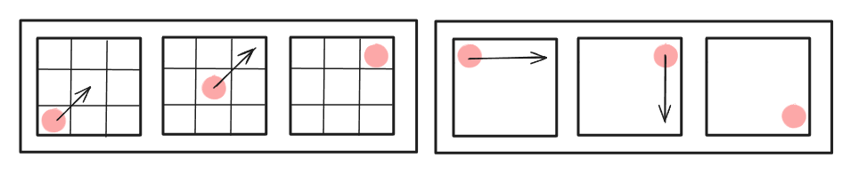

### 2、移动步数

- （1）以恒定的步数移动，注意空白也可作为平移的元素

- （2）以递增或递减的步数进行移动（`等差`）

- （3）注意移动元素是否可重合!（`比如两个黑块突然变一个，一个黑块突然变两个`）

- （4）多宫格的拆分：将多宫格拆分为多部分，每个部分有各自的运动规律。常考内圈、外圈的独立移动。

- （5）平移走到尽头的路径选择：①循环（`从头开始`）；②折返（`调头`）

（2022北京）每道题包含两套图形和可供选择的4个图形。这两套图形具有某种相似性，也存在某种差异。要求你从四个选项中选择最适合取代问号的一个。正确的答案应不仅使两套图形表现出最大的相似性，而且使第二套图形也表现出自己的特征。

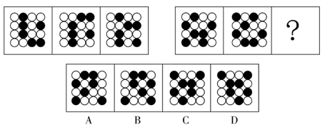

解析

   第一组图形两两相邻比较可以发现，第一幅图中每一行黑球整体往下平移一行得到第二幅图（循环走），第二幅图中每一行黑球整体往下平移一行得到第三幅图（循环走）。
   第二组图形运用此规律，只有A项符合。故正确答案为A。

## 二、旋转、翻转

### 1、旋转

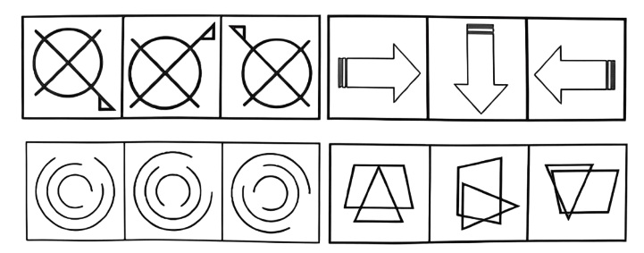
- （1）旋转方向：顺时针、逆时针

- （2）常见旋转角度：45°、60°、90°、120°、180°

- （3）常见考法：旋转固定角度、旋转角度递增、顺逆周期性旋转、旋转结合其他考点

### 2、翻转

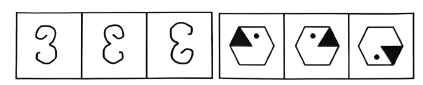
- （1）左右翻：以竖轴为轴进行翻转

- （2）上下翻：以横轴为轴进行翻转

（2019广东）下列选项中最符合所给图形规律的是（ ）。

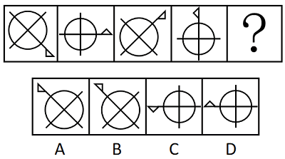

解析

   元素组成相同，优先考虑位置规律。
   观察题干图形，图一图三元素相同，图二图四元素相同，考虑图形间的位置规律。
   从图一到图三，图形逆时针旋转了90°，从图二到图四，图形逆时针旋转了90°，所以图五应该是图三逆时针旋转90°所得，只有B项符合。
   故正确答案为B。

## 三、随笔练习

**例1**：(2024年青海)从所给四个选项中，选择最合适的一个填入问号处，使之呈现一定的规律性。

   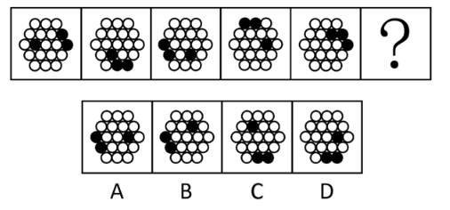

解析

   元素组成相同，优先考虑位置规律。
   观察发现，题干图形内圈和外圈的黑球数量均相同，优先内外分开看。
   如下图所示，标记为①的黑球在内圈每次逆时针移动一格，标记为②③的黑球在外圈每次顺时针移动三格，只有C项符合规律。故正确答案为C。
   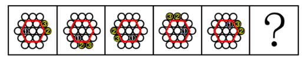

**例2**：(2020年湖南)从所给四个选项中，选择最合适的一项填入问号处，使之呈现一定的规律性。

   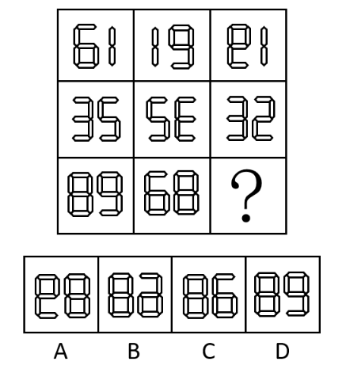

解析

   本题为九宫格题。元素组成相同，优先考虑位置规律。
   九宫格优先看横行，第一行图1旋转得到图2，图2左右翻转得到图3，第二行验证符合此规律。
   第三行应用此规律，图1旋转得到图2，故？处图形由图2左右翻转得到，只有B项符合。

**例3**：(2022年江苏)请从所给的四个选项中，选出最恰当的一项填入问号处，使之呈现一定的规律性。

   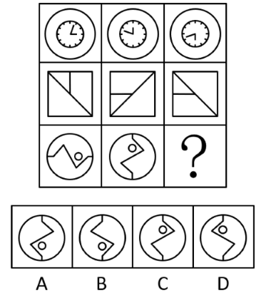

解析

   元素组成相同，优先考虑位置规律。
   九宫格优先横向看，第一行中，图一逆时针旋转得到图二，图二上下翻转得到图三；
   第二行经验证，符合该规律；第三行应用规律，只有B项符合。

**例4**：(2018年山东)从所给的四个选项中，选择最合适的一个填入问号处，使之呈现一定的规律性：

   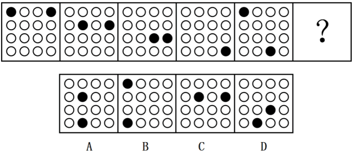

解析

   元素组成相同，优先考虑位置规律。
   1号黑球沿着对角线向右下方循环移动，每次移动1格（循环移动）；
   2号黑球沿图形外圈移动，每次顺时针移动1格。
   故1号黑球应该移动到第2行第2列的位置，2号黑球应该移动到第4行第2列的位置。只有A项符合。
   故正确答案为A。

**例5**：(2018深圳)从所给四个选项中，选择最合适的一个填入问号处，使之呈现一定的规律性：

   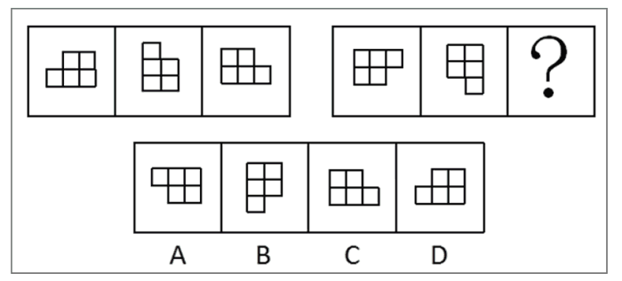

解析

   元素组成相同，考虑位置规律。
   第一行图，第一个图形顺时针旋转得到第二个图形，第二个图形顺时针旋转后再上下翻转得到第三个图形。
   第二行图按照此规律，将第二个图形先顺时针旋转后再上下翻转。
   故正确答案为A。

**例6**：(2021海南)以下哪项不是由左图得到的？

   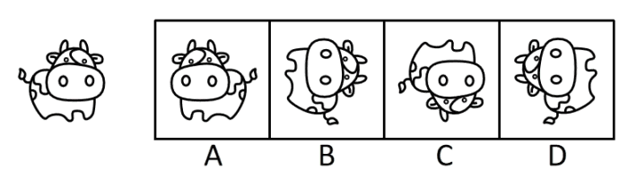

解析

   元素组成相同，优先考虑位置规律，逐一分析选项。
   A项：可由左图左右翻转得到，排除；
   B项：可由左图先顺时针旋转，再上下翻转得到，排除；
   C项：选项图形与左图不一致，选项缺少一个牛角，不能由左图得到，当选；
   D项：可由左图逆时针旋转得到，排除。

**例7**：(2023甘肃)从所给的四个选项中，选择最合适的一个填入问号处，使之呈现一定规律性：

   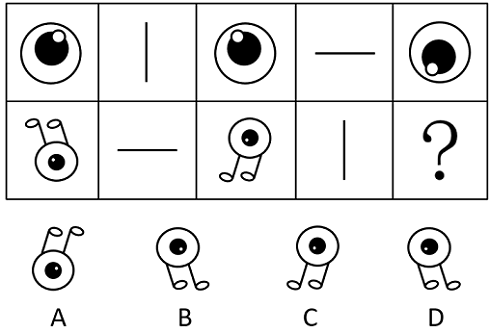

解析

   元素组成相同，优先考虑位置规律。
   观察上方第一组图形发现，图1以图2为轴经过左右翻转得到图3，图3再以图4为轴经过上下翻转得到图5。
   下方第二组图形应用此规律，图1以图2为轴经过上下翻转得到图3，图3再以图4为轴经过左右翻转得到？处图形。只有B项符合。
   故正确答案为B。

**例8**：(2014年广州)从所给四个选项中，选择最合适的一个填入问号处，使之呈现一定的规律性：

   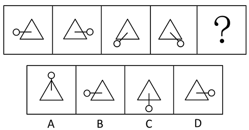

解析

   元素组成相同，考查位置规律。
   观察图中图形，三角形保持不动，直线和圆以直线在三角形内部的端点为轴旋转。
   第一个图形逆时针/顺时针旋转180度得到第二个图形，第二个图形顺时针旋转135度得到第三个图形，第三个图形逆时针旋转90度得到第四个图形，将第一个图形的旋转方向确定为逆时针，那旋转方向分别为逆、顺、逆、？，所以？处图形的旋转方向应为顺时针；
   旋转角度分别为180度、135度、90度、？，为等差数列，所以？处图形的旋转角度应为45度。
   因此？处图形应由第四个图形顺时针旋转45度所得，只有C选项符合。
   故正确答案为C。
