# 数量规律

   **考查频次**：数量规律是图形推理中考查最多、变化最多的考点。它可以单一考点命题，也可以两个考点结合命题(如面和线结合的考法)，还可以和其他规律结合命题(如数量规律和属性规律的复合考法)

   **题型特征**：图形元素组成不同

   **解题思路**：当图形元素组成不同时，常考查属性、数量及其他特殊规律。当题干图形无明显属性规律时，可优先考虑数量规律。常考的数量规律有五种：点、线(笔画)、面、素、角。图形元素组成不同，且无明显属性规律。

## 一、点数量

##### **1、**在图形推理中，只需考虑线条相交得到的点(即交点)，不考虑端点，下面五幅图中标灰的点就是交点。

##### **2、**交点中有一类特殊的点——切点，即由相切关系得到的交点，如图5，共有 3个交点，其中有2个点为切点。（`注意：切点是交点，交点不一定是切点`）

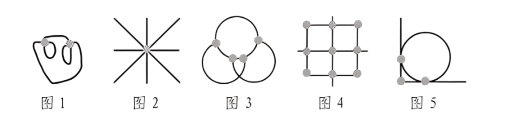

##### **3、当有以下特征图时，可能考察点的数量规律**

- （1）线条交叉明显（比如米字形）
- （2）绕来绕去的一团线
- （3）切点（或顶点）较多
##### **4、注意考察点的形式**：曲直交点、曲曲交点、直直交点

##### **5、数点情况**：

- （1）整体数点：
        ①交点的数量成等差数列
        ②交点的数量无序，但是可以排成有序。比如题干给四幅图，前四幅图的交点数量分别为3、1、5、2；即答案选择4个交点的，排成有序。
- （2）局部数点：内部和外部交点；内部线条与外框的交点。

（2023广东）从所给的四个选项中，选择最合适的一个填入问号处，使之呈现一定的规律性。

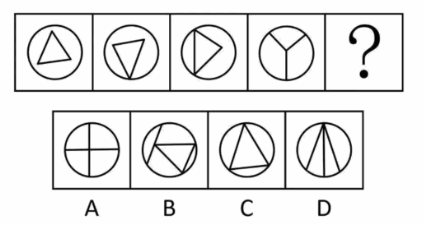

解析

   观察发现，题干图形均由圆形外框和内部直线构成，且内部直线与外框有明显交叉，考虑框上交点数，题干图形的框上交点数依次为0、1、2、3，故？处应选择框上交点数为4的图形，排除C项；
   继续观察发现，题干前三幅图形中均出现三角形，考虑直线数，题干图形的直线数均为3，故？处应选择直线数为3的图形，只有D项符合。
   故正确答案为D。

## 二、线数量

##### **1、当有以下特征图时，可能考察线的数量规律**：

- （1）如果图形出现的单一直线、多边形较多，可以优先考虑数直线的数量；
- （2）如果图形出现的单一圆、弧或者全曲线图形较多，可以优先考虑数曲线的数量；
- （3）如果图形出现半曲半直图形，注意考察曲直线条的运算或总线条数；
##### **2、注意**：

- （1）线出现明显拐点，是2条线。否则算1条。

- （2）3+2类型题目，可能会考察线的数量求和为定值。

- （3）九宫格可能会考察：①线的数量求和为定值；②每行或每列线的数量求和呈等差。

- （4）出现曲线和直线：曲线数、直线数、曲线直线求和或作差

- （5）注意平行线（图形特点：轮廓自带平行线；N字型、Z字型、工字型、H字型）：①考察平行线的组数；②平行线的方向。

(2019江苏)从四个图中选出唯一的一项，填入问号处，使其呈现一定的规律性

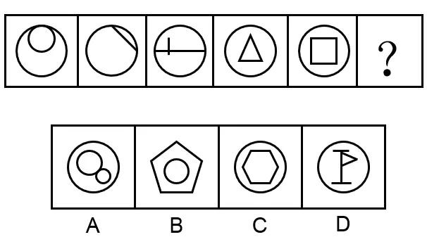

解析

   首先观察题干所有图形，发现都有一个圆形外框，所以问号处也应该是圆形外框，排除BC；
   进一步观察题干，发现图2圆内部就是一条单一的直线，图3的圆内部也有单一直线，图4和图5，图形内部都是多边形，所以优先考虑数直线数量，图1到图5，圆形内部的直线数量分别为01234，所以问号处应该是圆形框内部有5条直线的图形，排除A，选D。
   正确答案为D。

（2014深圳）从所给四个选项中，选择最合适的一个填入问号处，使之呈现一定的规律性：

   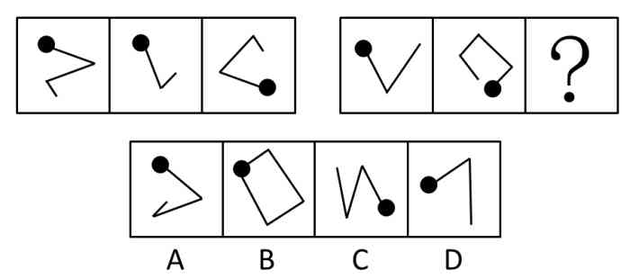

解析

   思路一：
    1.  观察发现，题干每幅图均由一个小黑圆和若干直线组成，虽然小黑点的位置在发生移动，但并没有规律。
    2.  因此观察直线，发现，第一组图直线数分别为3，2，3，相加之和为定值8，第二组前两幅图直线数分别为2，4，因此？处应选择一个直线数为2的图形，只有D项符合。
   思路二：
    1.  观察发现，题干每幅图均由一个小黑圆和若干直线组成，虽然小黑点的位置在发生移动，但并没有规律。
    2.  再次观察发现，题干出现线线相交，因此考虑数交点。第一组图交点数分别为2，1，2，相加之和等于5，第二组图前两幅图交点数分别为1，3，因此？处应选择一个交点数为1的图形，只有D项符合。

（2017国家）从所给的四个选项中，选择最合适的一个填入问号处，使之呈现一定的规律性。

   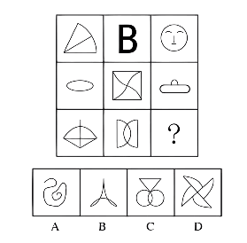

解析

   观察发现，曲线特征明显，考虑数曲线。
   九宫格，横向规律较为常见，优先考虑。
   第一行中曲线数依次为1、2、3，呈等差规律；
   第二行验证，符合规律；第三行应用规律，前两幅图曲线数依次为1、2，只有B项符合。
   因此，选择B选项。

## 三、面

### 1、面数量

- （1）**面**：指部分数、封闭空间、封闭区域、面积，或者更形象地说就是“窟窿”。注意黑色不是面。

- （2）**数面的特征图**：①图形被分割；②封闭区域明显；③生活化图形。

- （3）**注意**：如果同时出现数面、数线、数笔画、数点的特征图，优先数面

（2019广东）从所给的四个选项中，选择最合适的一个填入问号处，使之呈现一定的规律性。

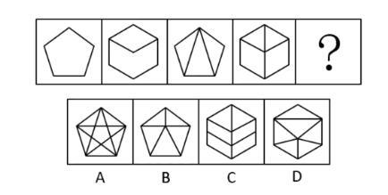

解析

   观察发现，图2到图4图形均被分割为多个封闭空间，考虑面数量。
   题干图形的面数量分别为：1、2、3、4、？，则？处应为5个面的图形。
   A项11个面，排除；B项5个面，当选；C项6个面，排除；D项6个面，排除。
   故正确答案为B。

### 2、特殊面

   （1）面的形状特征：
    1.  ①图形中所有面的形状。下面图1的面都是三角形，图2的面都是四边形。

    2.  ②图形中最大最小面的形状。特别明显的大面或小面，我们可以将其勾画出来进行对比。如下面图3的最大面是三角形，图4的最大面是四边形。考点：大小面与外框形状的关系（`1.大小面是否与外框图形一致；2.大小面与外框是否存在重合线；`）、大小面的对称性、大小面的曲直性、大小面面积占图形的比例。

    3.  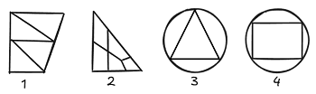

（2019北京）从所给的四个选项中，选择最合适的一个填入问号处，使之呈现一定的规律性。

   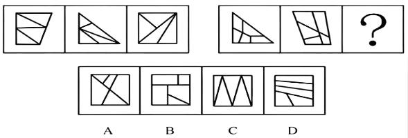

解析

   第一组图形中面的数量均为4，第二组前两幅图形中面的数量均为5，但选项中面的数量也都为5，所以看面的数量无法得出正确答案。
   需要我们再进一步观察，第一组图形中的面都是三角形，第二组前两幅图形中的面都是四边形，所以？处也应该选择一个所有面都是四边形的图形。所以答案选D

（2022国家）从所给的四个选项中，选择最合适的一个填入问号处，使之呈现一定的规律性。

   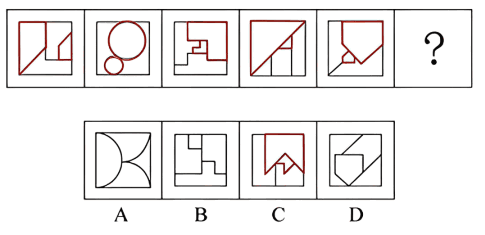

解析

   图形面的数量依次为4、4、4、5、4，面的数量不存在规律，可进一步观察面的大小，发现图形中存在明显的最大面和最小面，且最大面和最小面的形状相似，A、B项中两个相似的面大小均相同，D中不存在两个相似的面。
   答案选C。

   （2）黑白面类：每幅图都存在一部分全黑或者阴影的面。

    1.  ①结合九宫格：通过所占格子面积、个数成规律。

    2.  ②对称性：整体看图形没什么规律，黑色面和白色面各自都存在对称性，需要结合对称性的考点进行分析。

    3.  ③其他图形关系：如相同黑面和相同白面的关系，黑面与外框形状关系。

（2019山东选调）把下面的六个图形分为两类，使每一类图形都有各自的共同特征或规律，分类正确的一项是：

   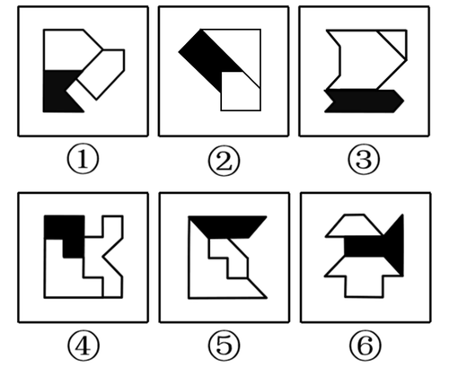

解析

   题每个图形整体上来看虽然都不对称，但是每幅图中的三个小图形均为对称图形，因此，可以分别画出每幅图形中三个小图形的对称轴，发现图①③④黑块的对称轴和一个空白图形对称轴平行，和另一个空白图形对称轴交叉；图②⑤⑥黑块的对称轴和两个空白图形的对称轴都交叉，因此，①③④一组，②⑤⑥一组。
   故正确答案为A。

（2025国家）把下面的六个图形分为两类，使每一类图形都有各自的共同特征或规律，分类正确的一项是：

   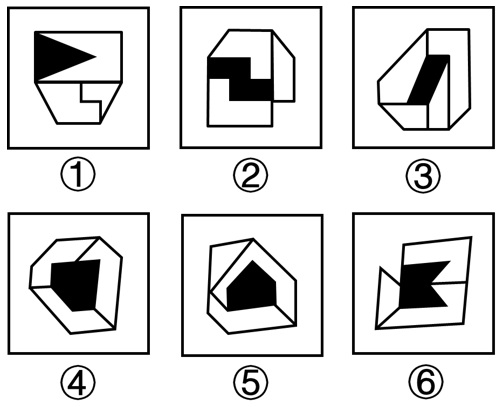

解析

   题干每幅图形均由多个面和一个黑块拼接而成，考虑图形间关系。观察发现，图①②⑥中黑块与图形外框均有1条公共边，图③④⑤中黑块与图形外框均有0条公共边，即图①②⑥为一组，图③④⑤为一组。
   故正确答案为A。

（2019上海）下列选项中，符合所给图形的变化规律的是\_\_\_\_\_\_。

   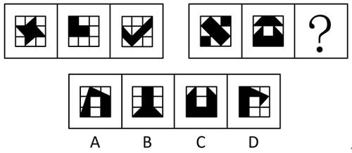

解析

   每幅图形均为九宫格，且存在黑色区域。观察发现，第一组图中，每幅图形中的黑色区域均占3个格子；第二组图中，前两幅图黑色区域均占6个格子，故？处图形黑色区域应占6个格子，只有C项符合。
   故正确答案为C。

### 3、面的数量复合

   （1）可能考察面数量和外框边数（是否相等、求和、求差）。

   （2）面数量和交点数。

   （3）存在相同面。考察相同面个数、组数。

（2017广州）请选择最适合的一项填入问号处，使之符合之前四个图形的变化规律。

   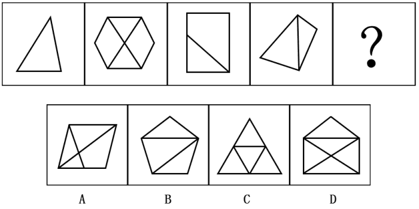

解析

   元素组成不同，且无明显属性规律，优先考虑数量规律。
   图形特征较为明显，窟窿比较多，因此考虑数面，题干图形面数量依次为1、4、2、2、？，无规律，图形均为直线组成，数直线，题干图形直线数量依次为3、8、5、5、？，无规律。
   再观察发现，题干图形外框的直线数为3、6、4、4、？，观察数字发现，每个图形外框直线数与该图形面数量之差均为2。
   因此？处也应选择一个外边框线条数量和面数量差为2的选项，只有B项符合。

## 四、角

> 角由两条具有共同端点（顶点）的射线构成，射线是直的。所以角的边不可以是曲线。

### 1、角数量

- （1）一般考查图形内部包含的角，即0~180°之间的角。角还可以细分为锐角、直角和钝角。一般直角考的多。

- （2）扇形、多边形故意留缺口也可以看作角、优先考虑数角。

- （3）图形中出现直角时（H、工、T字型、五角星 的修正和相似图形，电话卡图形），可优先关注直角。

（2015浙江）从所给的四个选项中，选择最合适的一个填入问号处，使之呈现一定的规律性。

【图片】

解析

   观察发现，图 4 与其他图形明显不同，从该图特征入手。
   该图由两条互相垂直的直线组成，则相关的数量类规律只有点、线和角。再观察发现题干和选项中多次出现直角，所以优先考虑直角的数量规律。
   题干给出的四个图形中直角的个数分别为 1、2、3、4，则问号处图形的直角个数应该是5，只有 D 项符合。故正确答案为 D。

### 2、角的特殊考法

   （1）外框直角数：内部凌乱或有图形没内部，则看外框，考虑外框的线条、外框的角数

   （2）直角复合旋转：直角数量复合角度旋转。

   （3）角与元素标记复合：元素标记的角（锐角、直角、钝角）。

   （4）相同角。

(2023浙江C)从所给的四个选项中选择最合适的一个填入问号处，使之呈现一定的规律性：

   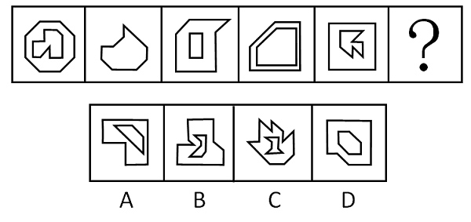

解析

   图形元素组成不同，且无明显属性规律，考虑数量规律。
   观察发现，题干每幅图都是由直线构成，存在直线相交且出现明显的直角，优先考虑数直角数。
   图形大多分为内、外两部分，考虑分开数直角数。
   外框图形直角数依次为0、1、2、3、4、“？”，所以“？”处应该选择一个外框直角数为5的图形，只有B项符合。

(2023北京)请从四个选项中选出最恰当的一项填在问号处。

   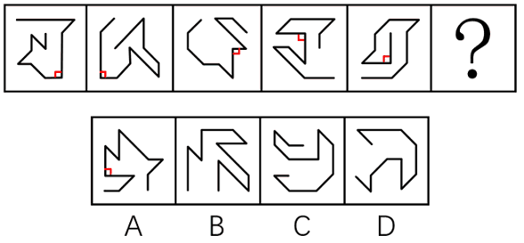

解析

   元素组成不同，且无明显属性规律，优先考虑数量规律。
   观察发现，每幅图均由直线构成，且每幅图中均由横线和竖线构成一个直角，且直角位置顺时针旋转，分别位于右下、左下、左上、右上、右下，故？处直角位置应在左下，故正确答案为A。

(2015广东乡镇)从所给的四个选项中，选择最合适的一项填在问号处，使之呈现一定的规律性：

   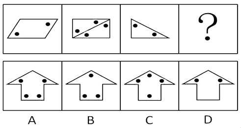

解析

   出现小黑点，考虑功能元素，考虑点与其他元素之间的位置关系，发现所有黑点都仅出现在图形的锐角处，A、B 两项存在直角处小黑点，C 项存在钝角处小黑点，排除 A、B、C 三项。

(2018广州40%)请选择最适合的一项填入问号处，使之符合整个图形的变化规律。

   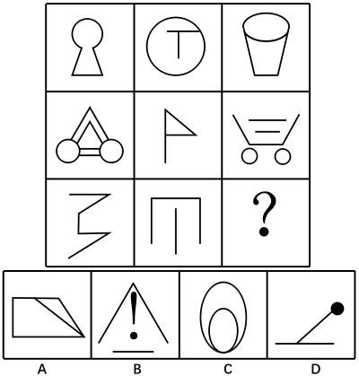

解析

   图形元素组成不同，无明显属性规律，考虑数量规律。第一行中，图一有两个相同的锐角，图二有两个相同的直角，图三有两个相同的钝角；第二行经验证规律一致，所以第三行也应符合此规律，即图一有两个相同的锐角，图二有两个相同的直角，故？处应有两个相同的钝角，但发现此时无正确答案。观察发现，题干中每幅图都有两个相同的角，此时只有A项有两个相同的直角，B、C、D三项均无两个相同的角，因此选择A项。本题只需要考虑每幅图均有两个相同的角，不需要考虑角的大小。
   故正确答案为A。

## 五、元素（部分）数量

##### **1、**元素，可细分为个数、种类数和部分数3种情况。

##### **2、**图1，元素的个数是5，元素种类数是3(正方形、五角星、圆)，部分数是5；

##### **3、**图2，元素的个数是5，元素种类数是4(正方形、五角星、圆、桃心)，部分数是5

##### **4、**图3，元素的个数是3，元素种类数是3(五角星、四角星、椭圆)，因为这三种小元素都连在了一起，因此部分数是1 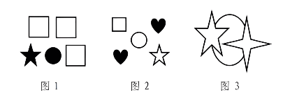

##### **5、**当图形由很多独立的小元素构成时，可优先考虑数素，可以数元素的个数、种类；出现黑色粗线条图形或者生活化图形(如品牌logo等)，优先数部分数。

##### **6、题目特点**：

- （1）元素凌乱
- （2）多个小图形或多个线条
- （3）加粗黑体

(2015湖北选调)从所给的四个选项中，选择最合适的一个填入问号处，使之呈现一定的规律性。

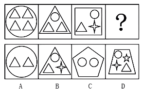

解析

   图形元素组成不同，且无明显属性规律，考虑数量规律。
   观察题干图形内部小元素种类，依次为1、2、3、？，则？处应为内部有4种小元素的图形，只有D项符合。故正确答案为D。

## 六、笔画

##### **1、考点**：大部分考一笔画图形或者笔画数量呈等差

##### **2、笔画数的特征图**：五角星、“日”字及其变形、“田”字及其变形、多圆相切、多圆相交以及出现大量端点时，优先考虑笔画数。

    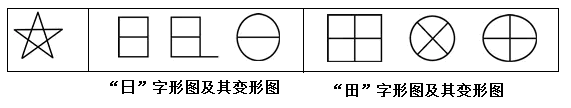
##### **3、判断图形的笔画**：对于简单图形，可通过临摹的方式直接得出，而对于复杂图形，可通过下列公式进行计算：连通图的笔画数 = 奇点数 ÷ 2（`奇点是以某个点为起点，延伸出的线条数为奇数`）。其中0个奇点的连通图可一笔画完成。

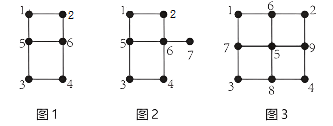

- （1）图 1 中，以点 1、2、3、4 为起点，延伸出来的线都是 2 条，偶数条，因此它们均为偶点；以点 5、6 为起点，延伸出来的线都是 3 条，奇数条，因此它们均为奇点。图 1 奇点数为 2，可以一笔画完成

- （2）图 2 中，以点 1、2、3、4 为起点，延伸出来的线都是 2 条，偶数条，因此它们均为偶点；以点 6 为起点，延伸出来的线为 4 条，偶点；以点 5 为起点，延伸出来的线为 3 条，奇点；以点 7 为起点，延伸出来的线为 1 条，奇点。图 2 奇点数为 2，可以一笔画完成。

- （3）图 3 中，以点 1、2、3、4 为起点，延伸出来的线都是 2 条，偶点；以点 5 为起点，延伸出来的线为 4 条，偶点；以点 6、7、8、9 为起点，延伸出来的线为 3 条，奇点。图 3 奇点数为 4 个，笔画数 =4÷2=2，故须两笔画才能完成

##### **6、简化一笔画判断之吹捏法**：在图形复杂性增加时，数奇点也会变得繁琐且耗时。而吹捏法完全摒弃了这一步骤，只需通过简单的铅笔画，即可迅速得出答案。

- （1）吹捏法步骤：先识别并“捏掉”图形中的所有封闭面的外轮廓线条，直到没有封闭面。注意原图是多部分分离图形要分开捏，最后分别加上捏后的笔画，如下图最后三角形和圆。

- （2）分析剩余结构：对剩余结构数笔画即可。（`如果最“捏”没了，即剩余部分为空，则为1笔画`）

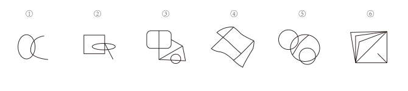

（2018国家）把下面的六个图形分为两类，使每一类图形都有各自的共同特征或规律，分类正确的一项是：

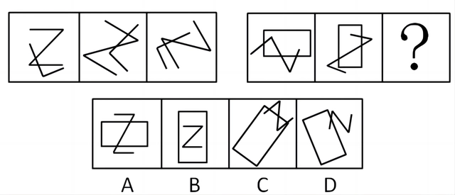
   A. ①②⑥，③④⑤
   B. ①②⑤，③④⑥
   C. ①②③，④⑤⑥
   D. ①③⑤，②④⑥

解析

   本题为分组分类题目。图形元素组成不同，无明显属性规律，考虑数量规律。
   观察发现，图①为“日”字的变形图，图⑤为多圆相交，考虑笔画数。
   图①②⑤的奇点数都是2，为一笔画图形，图③④⑥的奇点数都是4，为两笔画图形。
   即图①②⑤一组，图③④⑥一组。
   故正确答案为B。

## 七、随笔练习

**例1**：（2009四川）从所给四个选项中，选择最合适的一个填入问号处，使之呈现一定的规律性：

   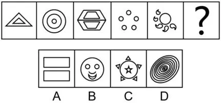

解析

   观察图形交点明显，都是两个图形且相交的。
   第一组图形中，两图交点数量都为2；第二组图形，两图交点数量交点数量为3，那么第三个图形的交点数量也应为3，只有C符合。

**例2**：（2019 联考）从所给的四个选项中，选择最合适的一个填入问号处， 使之呈现一定的规律性：

   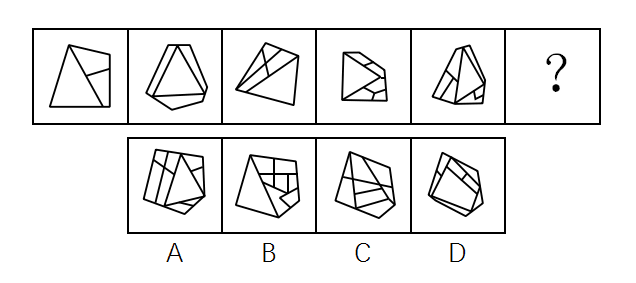

解析

   题干图形元素组成不同，且封闭面明显，“窟窿”较多，考虑数面。
   题干面数量依次为 2、3、4、5、6、？，故“？”处应该选择面数量为 7 的图形，对应 C 项。

**例3**：（2017河南）从所给的四个选项中，选择最合适的一个填入问号处，使之呈现一定的规律性。

   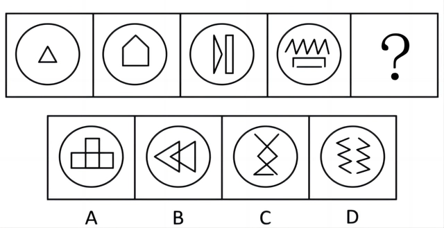

解析

   图形分割明显，可以考虑面数量规律。
   面数量分别为3、4、5、6、7、？，问号处需填8个面的图形，选项面数量分别为9、8、8、8，排除A项。考虑面考点细化发现，每个图形被分割最大面均为三角形，故答案为B。

**例4**：（2014浙江）请从所给的四个选项中，选择最合适的一个填入问号处，使之呈现一定的规律性：

   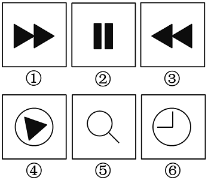

解析

   题干中出现较多折线和改造图，考虑数角。
   观察已知的图形，角的个数分别为3、5、7、9，形成等差数列，因此问号处的图形应该有11个角，只有C项符合。故正确答案为C。

**例5**：（2016广西）把下面的六个图形分为两类，使每一类图形都有各自的共同特征和规律，分类正确的一项是：

   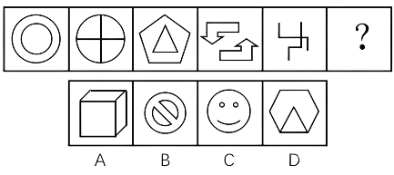
   A. ①②⑥，③④⑤
   B. ①③④，②⑤⑥
   C. ①⑤⑥，②③④
   D. ①③⑤，②④⑥

解析

   图形元素组成不同，优先考虑属性规律，但无唯一答案。
   观察发现，题干图形出现了粗线条和生活化图形，考虑部分数。
   图①③⑤的部分数均为1，图②④⑥的部分数均为2。故图①③⑤为一组，图②④⑥为一组。
   故正确答案为D。

**例6**：（2018江苏）从四个图中选出唯一的一项，填入问号处，使其呈现一定的规律性。

   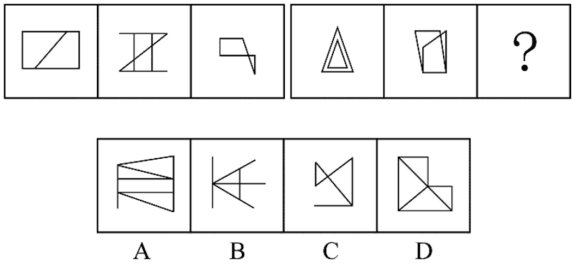

解析

   图形元素组成不同，无明显属性规律，考虑数量规律。
   观察发现，图2为“田”字变形，图5有多个端点，均为笔画数特征图，故考虑笔画数。
   题干均为两笔画图形，A项为两笔画图形，B项为三笔画图形，C项为四笔画图形，D项为一笔画图形，只有A项满足。

**例7**：（2020浙江）从所给的四个选项中，选择最合适的一个填入问号处，使之呈现一定的规律性：

   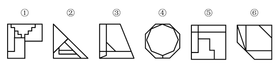

解析

   第一段中，所有图形中均有 2 组平行线；第二段中，前两个图形中均存在 3 组平行线，所以问号处的图形中也应存在 3 组平行线，只有 A 项符合。

**例8**：（2019国家）把下面的六个图形分为两类，使每一类图形都有各自的共同特征或规律，分类正确的一项是：

   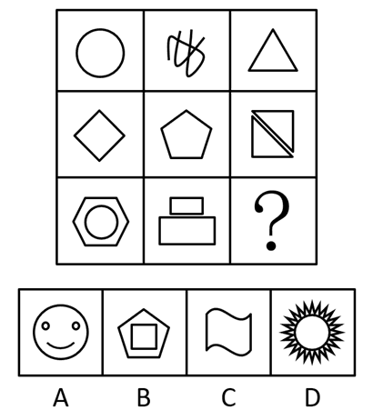
   A.①③④，②⑤⑥
   B.①②⑥，③④⑤
   C.①③⑤，②④⑥
   D.①④⑥，②③⑤

解析

   本题为分组分类题目。观察图形发现，多边形内部被线条分割，优先考虑数面的数量，但题干图形的面数量都是5，无法分组。继续观察发现，图①③⑤中存在明显最小的面，且最小的面的形状均与图形外轮廓形状相同，图②④⑥中存在明显最大的面，且最大的面的形状均与图形外轮廓形状相同，故①③⑤一组，②④⑥一组。 故正确答案为C。

**例9**：（2019河南司法）从所给的四个选项中，选择最合适的一个填入问号处，使之呈现一定的规律性：

   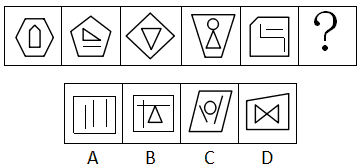

解析

   元素组成不同，且无明显属性规律，考虑数量规律。
   题干图形出现明显的多边形以及单一曲线，考虑数线条数。九宫格优先横着观察，三行图形依次由1，2，3，4，5，6，7，8，“？”条线组成。故“？”处应该选择由9条线组成的图形，对应B选项。

**例10**：（2018江苏）从四个图中选出唯一的一项，填入问号处，使其呈现出一定的规律性。

   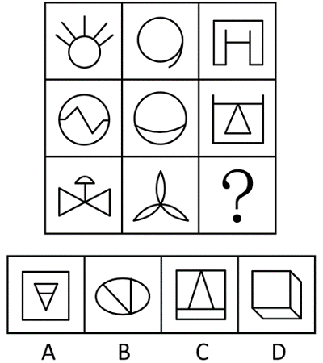

解析

   元素组成不相同且属性无明显规律，考虑数量规律。
   观察图形发现，题干展开图中出现多边形和单一直线，考虑数直线数。整体数直线无规律，考虑内外分开数。
   每幅图外部直线数分别为：6、5、4、4、5，内部直线数分别为：5、4、3、3、4，发现每幅图外部直线数-内部直线数=1，故？处也应该选择一个符合此规律的图形，只有A选项符合。

**例11**：（2024江苏34%）请从四个选项中选出最恰当的一项填入问号处，使题干图形呈现一定的规律性。

   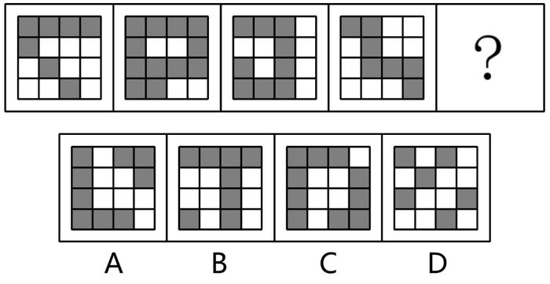

解析

   元素组成不同，优先考虑属性规律。观察发现，题干出现全直线、全曲线图形，可以考虑曲直性。九宫格优先看横行，第一行图形分别为有曲有直图形、全曲线图形、全直线图形；经验证，第二行符合此规律；第三行应用此规律，故“？”处图形应是全直线图形，排除B项；
   继续观察发现，题干图形出现明显封闭空间，考虑面数量，第一行图形面数量均为1，第二行图形面数量均为2，第三行前两幅图形面数量均为3，故“？”处图形面数量应为3，排除C项；
   对比A、D两项，A项图形部分数为2，D项图形部分数为1，题干图形部分数均为1，只有D项符合。
   故正确答案为D。

**例12**：（2023广东事业单位）请从所给的四个选项中，选择最合适的一个填入问号处，使之呈现一定的规律性（ ）。

   【图片】

解析

   元素组成不同，且无明显属性、位置规律，优先考虑数量规律。观察发现，题干图形中黑块全部相连，考虑笔画数。题干中所有由黑块构成的图案都能由一笔画成，故？处应选择黑块构成的图案能够被一笔画成的选项，只有C项符合。
   故正确答案为C。
