# 空间类

## 一、六面体

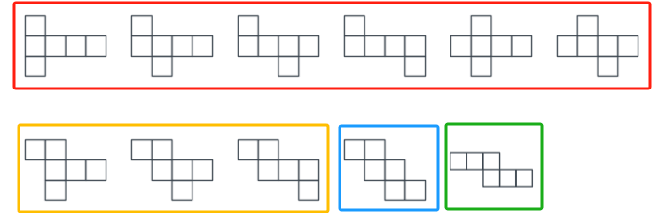

六面体常见展开图

### （一）相对面

##### **1、定义**：如果 a 面和 b 面是相对面，那么在立体图只能看到 3 个面的情况下，a 面和 b 面只能出现一个，且必须出现一个。

##### **2、在平面展开图中，相对面有以下两个基本判定法则**：

- （1）方法一：在平面展开图中，如果两个面在同一行或同一列，且中间隔了一个面，那么这两个面是相对面。
        `如下图所示`，a 面和 f 面、b 面和 d 面、c 面和 e 面均是在同一行或同一列，且中间隔了一个面，所以这 3 组就是相对面
    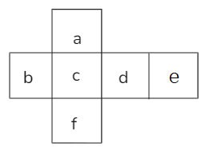
- （2）方法二：在平面展开图中，如果两个面在“Z”字形两端，且紧靠着“Z”字形中间那条线，那么这两个面也是相对面。
        `如下图所示`，三幅图的 a 面和 b 面都是在“Z”字形两端，且紧靠着“Z”字形中间那条线，所以它们都是相对面。注意图 3 的 c 面和 d 面虽然也在“Z”字形两端，但没有紧靠着“Z” 字形中间那条竖线，所以不是相对面。
    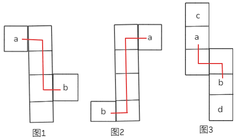

**例**：（2016江苏）上边这个图形是由下边四个图形中的某一个作为外表面折叠而成，请指出它是哪一个？

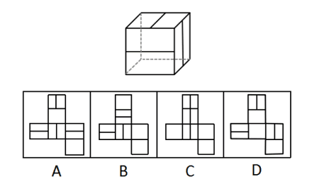

解析

   简单观察可知，立体图形中的三个直线对于的面都挨在一起，属于相邻面。
   A项：第1行的直线面和第3行中间的直线面属于同列相隔一个面的相对面，折叠后只能出现一个面；第3行左右两侧的直线面属于相对面，折叠后只能出现一个，即选项在折叠后最多只能看到两个直线面，所以不可能出现三个直线面被同时看到的情况，排除。
   B项：左侧的三个直线面紧挨在一起，是相邻面，没有相对面的关系，选项可能是题干的展开图，排除思维解题，先保留。
   C项：总共三个直线面，第1行的直线面和第3行中间的直线面属于相对面，折叠后只能看到一个面。所以在折叠后最多只能看到两个直线面，排除。
   D项：第3行左右两侧的直线面属于相对面，折叠后只能看到一个面，加上上方的直线面，选项在折叠后最多只能看到两个直线面，排除。
   故正确答案为B。

### （二）相邻面

> 相邻面法又分为公共边和公共点，我们先来说说公共边。

#### 1、公共边法

   （1）平面图中两个相邻面的相交线或直角的两条边是同一条边。如图一所示，面A和面B直接挨在一起，所以面A和面B是相邻面，中间标红的边是二者的公共边。面A和面C没有紧挨着，但两条蓝边互相垂直，折叠后可知两条蓝边重合，所以面A和面C是相邻面。

    2.  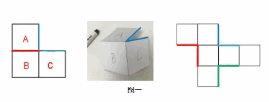
   （2）“L”型的两条边是同一条边。如图二所示。

    1.  ①面b的左边和面d的上边呈直角，两条蓝边是同一条边。 面b、面e、面d、面c呈 “L” 型，面b和面c是 “L” 型两端的面，因为两条蓝边是同一条边，且两个蓝点是同一个点（找到面b和面d垂直的边、重合的点），所以这两个蓝点往外延伸出的两条红边也是同一条边。
    2.  ②同理面a和面f在右侧“L”型的两端，边2和边3互相垂直，是同一条边，边2和边3上的两个蓝点是同一个点，由这两个蓝点往外发散出的两条边是同一条边，即边1和边4。
    3.  ③如果听不懂可以先记下来，考试不考查原理，可以之后在做题中慢慢了解。
    4.  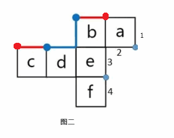
   （3）一列/行连着4个面，两头的两条边是同一条边。如图三所示。

    1.  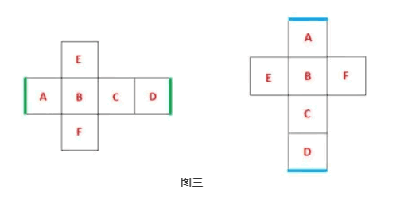

**例**：（2019江苏）左边给定的是纸盒外表面的展开图，右边哪一项能由它折叠而成？请把它找出来。

   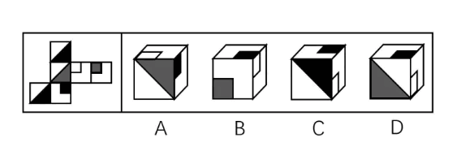

解析

   先确定选项的面，再根据面的位置决定解题方法。
   A项：看灰色三角形面和白块面的公共边，或者看灰色三角形面和黑块面的公共边，均没有问题，保留。
   B项：灰块面和白块面在展开图中挨着，画出展开图和选项的公共边，展开图中公共边挨着灰块，而选项的公共边挨着白块，如下图一所示，对应不一致，排除。
   C项：黑块面和白块面在展开图中有公共边，因为互相垂直的两条边是公共边，画出展开图和选项的公共边，均挨着黑块，没有挨着白块，如下图二所示。观察正面，黑三角形面在展开图中有两种情况，如下图三所示的1,2。选项的黑块面和白块面的关系没有问题，而面1和黑块面同列相隔一个面，属于相对面，不能同时出现，故C项立体图正面不能是面1；面2和白块面属于 “Z” 字形两端的相对面，不能同时出现，故正面不能是面2，排除。
   D项：观察灰色三角形面和黑块面的公共边，如下图四所示，展开图中的公共边挨着灰色三角形，而选项中的公共边挨着白色三角形，对应不一致，排除。
   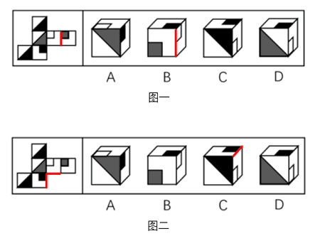
   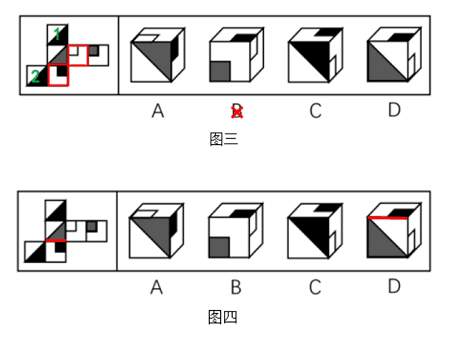

#### 2、公共点法

   （1）相邻三个面的公共点是唯一的。如图一所示。展开图的公共点相交黑色直角三角形的直角顶点，而立体图的公共点与黑色直角三角形不相交，所以二者不一致；

    1.  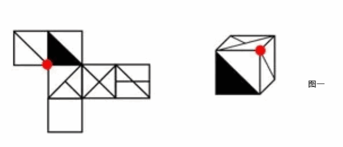
   （2）“L”型的两个点是同一个点。如图二所示，左上角存在 “L” 型，在 “L” 型中找出互相垂直的两条蓝边（是同一条边），两条蓝边的蓝点为公共点。这两条蓝边延伸出的两条红边是同一条边，因为两个蓝点是同一个点，且一条直线有两个点，所以两个红点也是同一个点。

    1.  

**例**：（2018山东）左边给定的是纸盒的外表面，下面哪一项能由它折叠而成？

   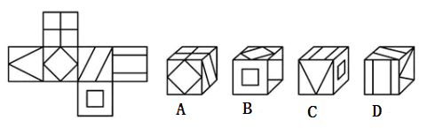

解析

   观察选项，先确定面。
   A项：正面和上面的公共边对应一致。在展开图中，选项的三个面紧挨在一起，可以考虑公共点。如下图一所示，展开图中的公共点没有发散出线条，而选项的公共点发散出了一条直线，对应不一致，排除。
   B项：选项的三个面在展开图中紧挨在一起，可以考虑公共边、公共点。如下图二所示，展开图和选项的公共点均发散出一条直线，所有的方法都是用来排除错误选项的，故先保留。
   C项：正面和上面在展开图中属于一排4个面最两端的面，有公共边。如下图三所示，找出展开图和选项的公共边，展开图中最左侧面的三角形顶点落在公共边上，而选项中是三角形的底边落在公共边上，细节对应不一致，排除。
   D项：上面和右侧面在展开图中属于同行相隔一个面的相对面，不能同时出现，排除。【选B】
   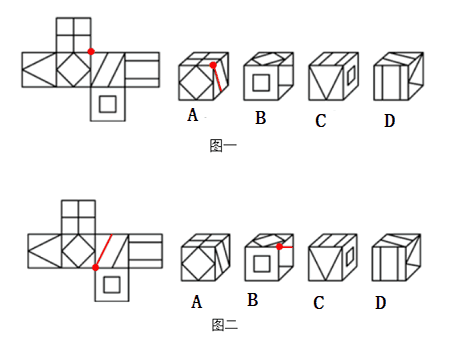
   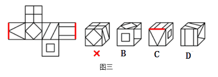

### （三）平移和旋转

   **1、基础知识之移面**：当满足同一行或同一列有4个面，那首尾两条边必然是同一条公共边，则两头的两个面，可以选择其中一个面平移4格到另一个面的旁边。

   **2、基础知识之转面**：当满足两个面之间呈直角时，则直角所对应的那两条边必然是同一条公共边，这两个面可以通过旋转来实现拼合。转面要注意两点，一是某个面要去的方向与它自身旋转的方向一致；二是旋转度数为90°。

    1.  `注意：中心对称图形旋转两格，图形不变。对于非中心对称图形来说，是上下左右互换了。`
    2.  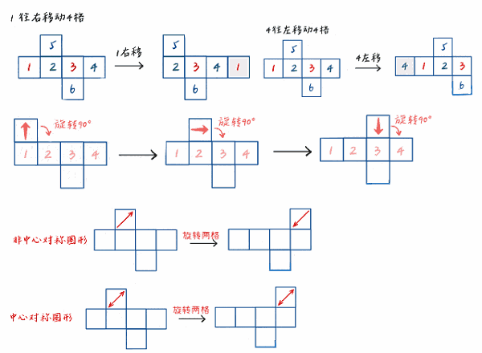

**例**：（2020重庆选调）左边给定的是六面体的外表面展开图，右边哪一项能由它折叠而成？

   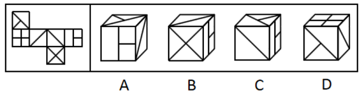

解析

   本题考查六面体。展开图不是常见的，需要将展开图中右下角的面旋转90°，并给每个面标号，如下图所示，逐一进行分析。
   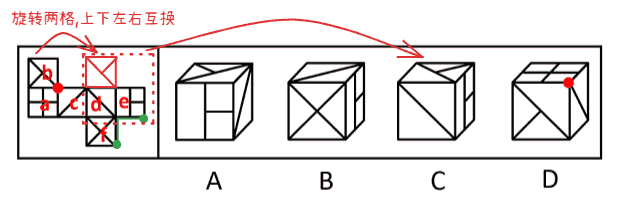
   A项：选项一定有面i和面f，右面为面e或面k，展开图中面f和面k为相对面，无法同时出现，故右面为面e。展开图中面e、面f和面i的公共点引出一条线，而选项中三个面的公共点引出两条线，选项与题干展开图不一致，排除；
   B项：选项前面是面f，右面是面e，选项中面f挨着面e的大长方形长边，根据直角的两条边是同一条边，展开图（绿色线条）中面f没有挨着面e的大长方形长边，选项与题干展开图不一致，排除；
   C项：b面往右旋转180°后和C选项的相对位置关系完美对应，当选；
   D项：选项前面是面b，上面是面a，面a的相对面是面d，相对面不能同时出现，所以选项右面是面c，则D选项由面a、面b、面c组成。根据相邻三个面的公共点是唯一的（红色点），选项中三个面的公共点（如上图所示）引出的1条直线是由面c发出来的，而展开图中，三个面的公共点引出的1条直线是由面b发出来的，选项与题干展开图不一致，排除。
   故正确答案为C。

### （四）解题方法

#### 1、画边法

   （1）结合选项，找一个特殊面的唯一点。
    1.  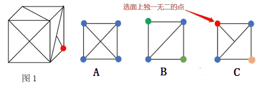
   （2）从起点出发，顺时针方向画边，并标出序号。`注意：展开图和立体图都要画边`
    1.  如下图所示，立体图的边1为cb的公共边，而展开图的边1为ce的公共边，面不一致，可以排除该选项。
    2.  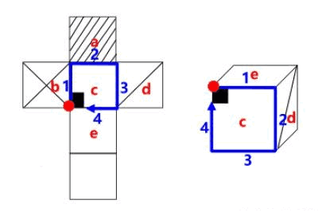
   （3）最后在展开图和立体图一一进行匹配，依据“公共边”不变的思维，面不一致排除。

**例**：（2017 河南）左边是给定的正方体的外表展开图，下面哪一项能由 它折叠而成？

   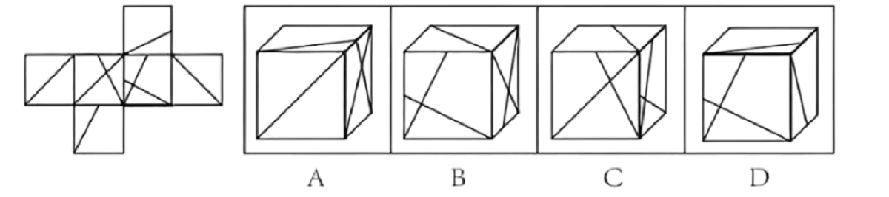

解析

   A 项：如下图所示，同时对选项和题干展开图中面 g 进行画边，选项中第 4 条边对应的是小直角三角形的直角边，而题干展开图中第 4 条边对应的是直角梯形的长底边，选项和题干展开图不一致，排除。
   B 项：如下图所示，同时对选项和题干展开图中面 g 进行画边，选项中第 2 条边对应面为展开图的 h，而题干展开图中第 2 条边对应的面为 j，选项和题干展开图不一致，排除。
   C 项：与题干展开图一致，当选。
   D 项：面 e 与面 j 为相对面，不能同时出现，选项和题干展开图不一致，排除。故正确答案为 C。
   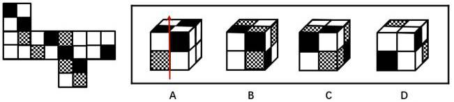
   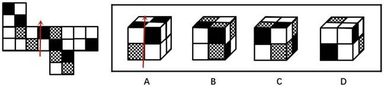

#### 2、箭头法

   （1）原理：在一个平面中我们知道可以用一根箭头来表示方向，同样的，在空间中任何方向也都可以用箭头在立体的维度中展现，由于箭头是有方向的，面和面组成体，因此在立体图形中箭头上下左右所对应的图形的样式即使做任何翻折是不会发生任何改变的，借助面上的箭头方向可以来对应排除。

   （2）箭头法做题步骤：

    1.  ①选项图形找基准面画箭头（如下图选项A的箭头）
    2.  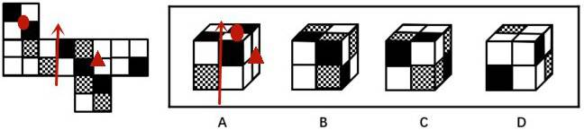
    3.  ②题干图形画对应面上的箭头（如下图所示）
    4.  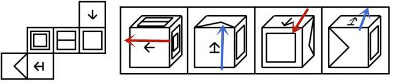
    5.  ③依据箭头判断正确与否（如下图所示），对应图形箭头的右面（红三角）的图形非相同图形，箭头上面的完全相同，因为有不同，所以排除选项A，其他选项类似排除。
    6.  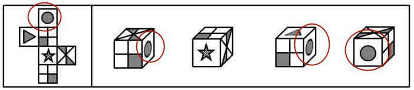
   （3）基准面的选用原则：

    1.  ①原则：题干图形出现最多的面。
    2.  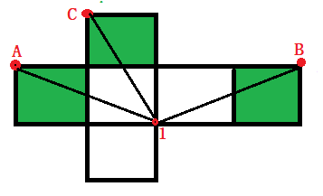
    3.  ②原则：非对称的特殊面（对称图形画箭头至少两次，浪费时间），红色圈内的图形是对称图形，画箭头各个角度没差别，这个时候即使出现很多次也不可能选择这种。
    4.  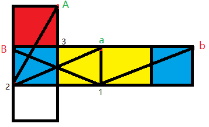
   （4）总结：就是先在展开的平面图中找到一组相同的面做标记，再看图形样式位置是否完全一致来进行选项的排除，

**例**：（2016重庆）下图上边给定的是纸盒的外表面，下列哪一项能由它折叠而成？

   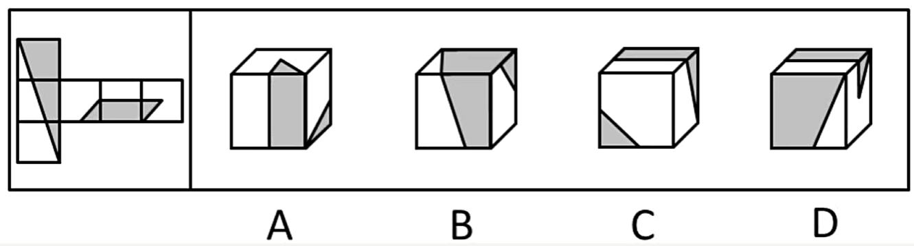

解析

   使用箭头法，如下图所示：
   A项：根据箭头可知，A选项立体图的阴影七角星在S面的下方，展开图的阴影七角星在S面的左边。并且本选项中阴影七角星面与双箭头面是相对面，不能在选项中同时出现，相对位置关系不匹配，排除；
   B项：根据箭头可知，注意面里面图形的方向。立体图中的火柴棍面的火柴头在箭头的左边，而展开图的火柴棍面的火柴头在箭头的右边，排除。
   C项：根据箭头可知，C选项立体图中箭头指着箭头面，而在展开图中箭头指着S面，相邻位置关系不匹配，排除；
   D项：不存在错误，为正确选项。
   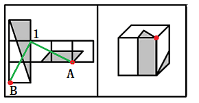
   故正确答案为D。

#### 3、马走日法

   （1）定义：马走日法跟象棋中的 “马” 走法一样，先找到一个某点，通过走两次“日”可以找到另一个公共点，那么这两个点为公共点，直到把公共点连接的三个面找出来。
    1.  `例1`：点A -> 点1，马走日第一次，点1 -> 点B，马走日第两次得到A、B为公共点，此时只能确定两个面，需要找到第三个面，继续使用马走日法，点B -> 点1 -> 点C 或者 点A -> 点1 -> 点C，因此公共点为ABC连接的三个面为绿色面。

    2.  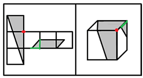
    3.  `例2`：点b -> 点1 -> 点B，所以b点和B点为公共点，B点连接了两个面，公共点连接的三个面为蓝色+红色的面已经找到了，因此不需要使用马走日法了。同理点a和点A为公共点。点a连接了两个面，公共点连接的三个面为黄色+红色的面。

    4.  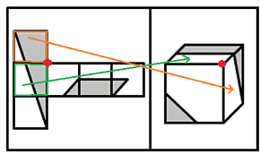
    5.  > 马走日法是为了找到3个公共点，马走日要灵活运用。例1中走了4次“日”，例2中走了两次“日”；例2图中的点3就不需要走“日”，因为本身点连接了3个面。

**例**：（2015国考）左边是给定的正方体的外表展开图，下面哪一项能由 它折叠而成？

   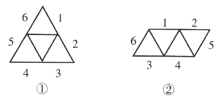

解析

   A 项：如下图所示，根据选项对点A进行走“日”，A->1->B，公共点对应的三个面为展开图最右边两个面+左下面，对比正方形，公共点是一致的，面也是一致，所以A选项正确。
   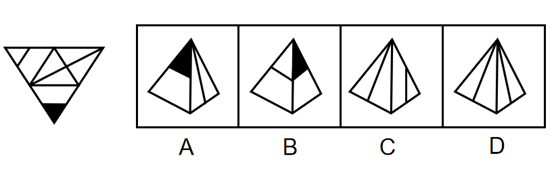
   B 项：如下图所示，正方形的三个面对应的公共点在展开图中存在，不需要走“日”，对比正方形右边的面，正方形公共点靠近小三角形，而展开图是离开三角形，所以正方形的点的位置不对。B错误
   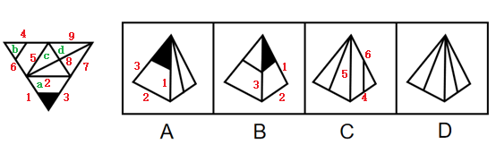
   C 项：如下图所示，正方形的三个面对应的公共点在展开图中存在，不需要走“日”，发现正方形的上面和左面是不对的。C错误
   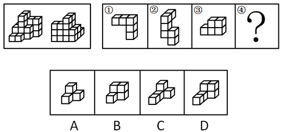
   D 项：发现通过正方形的正面是镜像无法找到对应的公共点，或者通过上面和侧面公共点在展开图对应的图是相反的，可以直接判断为错误。

## 二、四面体

> 四面体的展开图要么是三角形，要么是平行四边形。四面体的四个面都相邻，不存在相对面不能使用相对面排除法，直接使用相邻面排除法。

   **四面体的展开图中，如何判定公共边?**
- （1）方法一：构成一条直线的两条边是公共边。例如图①和图②中，1边和2边是公共边。
- （2）方法二：平行四边形展开图中，两端的短边是公共边。例如图②中，5 边和6边是公共边。
- （3）方法三：四面体同样可以使用[画边法](#_1、画边法)
    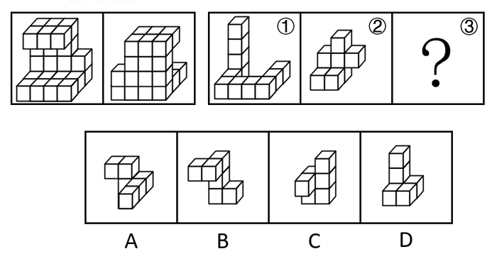

**例**：（2019江苏）左边给定的是纸盒外表面的展开图，右边哪一项能由它折叠而成？请把它找出来。

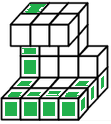

解析

   为便于讲解，将4个面编号为a、b、c、d。对a面使用画边法，从顶角开始顺时针将边编号为 1、2、3；对b面使用画边法，从顶角开始顺时针将边编号为4、5、6（`展开图和立体图都要画边`）。其余3条边编号7、8、9。如下图所示。
   平面图中，1和6是公共边，即1边连接的是a面和b面，A选项1的右边不是b面，A错误；
   3和7是公共边，即3边连接的是a面和d面，B选项3的左边不是d面，B选项错误；
   c面和d面中，中线均和8边相交，但在D中，中线没有和8边相交，D选项错误。
   故正确答案为 C。
   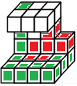

## 三、立体拼合

##### **1、题型判定**：

- （1）提问：题干中完整图形是由残缺图形与哪个选项共同构成？
- （2）题干：给出一个完整图形及几个残缺图形
##### **2、解题方法**：

    1.  **（1）数个数（选项个数是否与题干一致）**
        > `例`：（2019国家）下图为同样大小的正方体堆叠而成的多面体正视图和后视图。该多面体可拆分为①、②、③和④共4个多面体的组合，问下列哪一项能填入问号处？

        > 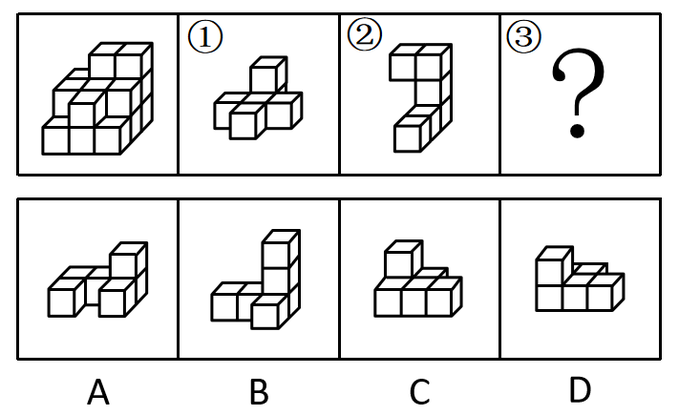

        > 解析：图形可分为前中后3排，最前面一排，根据正视图可知共有2个小立方体，中间一排，根据正视图和后视图可知共有8个小立方体，最后一排，根据后视图可知共有12个小立方体，故该多面体共有2+8+12=22个小立方体。观察题干图形发现，①有5个小立方体，②有6个小立方体，③有5个小立方体，所以若要将①、②、③、④组合在一起拼成题干多面体，则④应该有6个小立方体。A项有4个小立方体，B项有5个小立方体，C项有5个小立方体，D项有6个小立方体。故正确答案为D。

    2.  **（2）试拼（找特殊块->“占地大”的）**
        > `例`：（2021国家）左图给定的是由相同正方体堆叠成的多面体的正视图和后视图。该多面体可以由①、②和③三个多面体组合而成，问以下哪一项能填入问号处？

        > 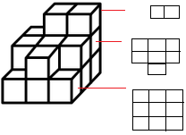

        > 解析：观察题干，母图一共4层，图①横跨了所有的层级，并且图①可以直接拼上去，没有第二种拼法，所以我们用先试拼，把图①拼上去。如下图所示

        > 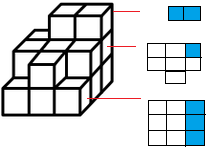

        > 对于图②最底下的一层有4个方块。在上图当中最底层刚好有四个格子，图②第二层3个方块也与上图倒数第二层缺3块对应，可以直接拼上去，如下图所示。

        > 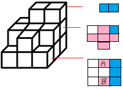

        > 剩下的就剩第一层五个方块，第二层的一个方块，对应的是C选项

    3.  **（3）分层画图法（化立体为平面，化拼为拆）**
        > `例`：（2022国家）左图给定的是由相同正方体堆叠而成的多面体。该多面体可以由①、②和③三个多面体组合而成，以下哪项能填入问号处？

        > 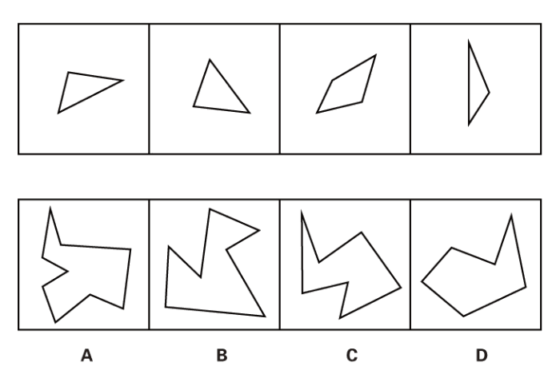

        > 解析：使用分层画图法要把每层的平面图画出来，如下图所示：

        > 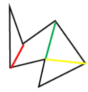

        > 首先，根据试拼的原理，先去考虑横跨层级多的图，把每一层的情况占据的位置在平面图中记录下来（打叉或画阴影）。优先看图②，横跨了三个层级，因为最底面占据3个位置，因此放在母图的最右侧。第二层占据一个位置；第三层占据2个位置，把平面图全部占据了。如下图所示

        > 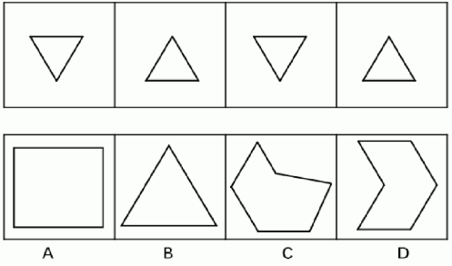

        > 然后观察图①，图①底层是一个十字架，明显在母图的底层平面图放不下，只能出现在母图二层平面图。而图①第顶层剩下一个，如果放在母图平面图顶层是放不下的，所以这一个方块要放在母图底层，所以要考虑旋转的情况，第一种左右旋转180度，及对应平面图的A位置，第二钟前后旋转180度，及对应平面图的B位置，并标记，如下图所示

        > 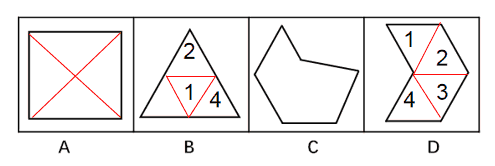

        > 假设放在A位置，平面图剩5个位置，观察选项，5个位置组成的图像明显不存在。因此放在B位置。并且母图第二层平面图剩一个位置，观察选项及位置关系，只有D符合。

## 四、平面拼合

##### **1、做题原则**：

- （1）图形在拼合时，各图形只可以平移，不能旋转、翻转。

- （2）平行等长消去，即平行且等长的两条边进行拼合，拼合之后线条抵消，当然如果没有别的线条与之平行，拼合后一定会保留下来。

##### **2、做题方法**：

- （2）优先找唯一方向（没有与之平行等长）的横线、竖线、斜线，此线一定在正确答案中出现，如果不出现则可以排除。

- （2）当题干中的小图形相同或者相似时，直接在选项中画出几个图形。

**例**：（2016江苏）下边四个图形中，只有一个是由上边的四个图形拼合（只能通过上、下、左、右平移）而成的，请把它找出来。

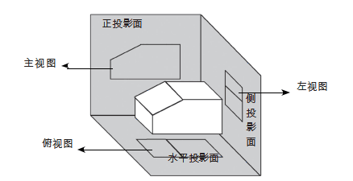

解析

   题干四幅图中，图4的左边有1条竖线，而其他图形均没有竖线，说明拼合后的图形的左边一定有1条竖线，对应C项。
   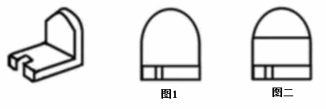

**例**：（2018江苏）下边四个图形中，只有一个是由上边的四个图形拼合（只能通过上、下、左、右平移）而成的，请把它找出来。

   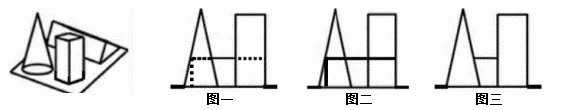

解析

   题干四幅图的形状均相同，直接在选项中画出这四个图形，只是核对时需要注意有两个三角形的顶点在上边，另外两个三角形的顶点在下面。
   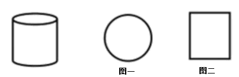
   A项、C项没办法分割成题干中的四个三角形，B项中只能分割成题干中的图1、2、4，图3的三角形顶点向下，B项中的三角形顶点向上，只有D项能分割成题干中的四个三角形。

## 五、三视图

##### **1、定义**：三视图指的是立体图形的正视图、俯视图和侧视图。出题人不一定会严格按照三视图角度来考查，可能出现右视图（从右向左）和仰视图（从下向上）等，要具体情况具体分析。

- （1）正视图是指从物体的正面观察，物体的影像投影在背后的投影面上，这个投影影像称为正视图；

- （2）俯视图是指由物体上方向下作正投影得到的视图，也叫顶视图；

- （3）侧视图是指从物体的左面向右面或右面向左面正投影得到的投影图。

    
##### **2、解题思维**

- （1）所有的三视图都是平面图。若选项中出现立体图形，则一定错误。

- （2）原图有线就有线，原图没线就没线。

    
    > 如上图所示，图1和图2都是立体图形从左前方往右后方观察的，立体图形上方内部明显无横线，所以三视图也应无横线，图1正确，图2错误。

- （3）当被遮挡住时，看不见被遮挡部分。

    
    > 如上图所示，图1、图2以及图3都是从立体图形左前方往右后方观察的，需要分两种情况进行讨论：①若只有图1和图2，得出的应是图1，因为后面的矩形应被前方的图形遮挡，被遮挡的部分应用虚线表示；②若只有图2和图3，得出的应是图3，被遮挡的部分用虚线表示最严谨，若没有用虚线表示，则被遮挡的部分应不画出来。

- （4）有些角度下弧会被压平。

    
    > 如上图所示，图1是圆柱体的俯视图，图2是圆柱体的主视图、左视图以及右视图。

##### **3、注意**：三视图中被遮挡的部分是否应画虚线，需要从题干已知图形进行判断，与题干已知图形保持一致即可。

##### **4、扩展（任一角度看）**：三视图中正视图一般是前往后看，俯视图一般是上往下看，侧视图一般是左往右看或右往左看，这些是最常见的角度。但有时候会考察从任一角度看，那么此时你要多角度观察（`优先观察三视图`）。

**例**：（2019联考）下列哪一项是题干所给图形的正面平视图？

解析

   所给图形的正面平视图最左侧一列应有三个正方形，且 B 面在最上方，排除 C 项；中间一列为A 面和 D 面，排除 B 项；最右侧一列的空白面在下方，排除 D 项。故正确答案为 A。

**例**：（2021广东）下方分别是一个由长方体堆积而成的立体图形和该立体图形的左视图、后视图，那么该立体图形的俯视图是（ ）。

   

解析

   A项：若选项左上角的小方块从俯视处可看见，则该立体图形从前至后第3行、从左至右第1列相交处存在一个较矮的小立体图形，因此后视图最右边的长方形应当存在一条横线，与题干中后视图不符，排除；
   B项：与A项同理，排除；
   C项：与题干一致，当选；
   D项：若选项从上至下第2行、从左至右第1列处的小方块从俯视图处可看见，则该立体图形从前至后第2行、从左至右第1列相交处存在一个较矮的小立体图形，因此后视图最右边的长方形应当存在一条横线，与题干中后视图不符，排除。

**例**：（2024广东）下图为给定的立体图形，从任一角度看，下列选项最不可能是该立体图形视图的是（ ）。

   

解析

   本题考查三视图。问从任一角度看，优先看三视图。
   A选项为正视图，排除。B、D需要按图中箭头方向观察，均可看到。
   
   C项可按下图中箭头方向观察，但视图应如下图所示，上半部分的右侧应存在曲线，下半部分应为矩形，而非曲线图形，C项图形错误，不是该立体图形视图，当选。
   

**例**：（2022福建事业单位）填入问号处最恰当的是（ ）。

   【图片】

解析

   观察第一组图形可知，图一为立体图，图二为该立体图的俯视图，图三为该立体图的左视图。第二组应用此规律，故？处应为第二组立体图的左视图，由于左视图的整体外轮廓应为矩形，排除C、D项。
   比较A、B项，题干中立体图底端连接处是光滑的面，因此在主视图上，二者之间并无分割线，排除选项A。
   故正确答案为B。

## 六、截面图

##### **1、截面图是什么**：用一个面(或一把无穷大的“刀”)将物体切开，被切部分的形状，也可以称为切面。

##### **2、切的原则**：①一刀切到底；②不能拐弯。

### 正、长方体

【图片】
* * *

【图片】
   **注**：**正、长方体都截不出：钝角三角形、直角三角形、正五边形、六边形以上图形。**

### 三棱柱

【图片】

### 圆锥

【图片】

### 圆柱

【图片】
   **注**：**圆柱截不出：梯形。**

### 圆台

【图片】

### 三棱锥

【图片】

### 四棱锥

【图片】

### 其他注意要点

1、六面体只能截出锐角三角形。
2、圆柱体无法截出梯形。
3、斜切过曲面必有曲线。
4、三视图基本100%能截出。
5、圆柱切不出半圆。
6、内部挖空部分带实线；镂空部分不能有实线。
7、正四棱锥截不出长方形。
8、圆柱、圆锥、圆台横着切均是“圆”，斜着切均是“椭圆”。需要特别注意的是圆柱从上向下斜着切两侧是曲线，而不是直线。

**例**：（2020国家）左图为给定的立体图形，将其从任一面剖开，以下哪个不可能是该立体图形的截面?

【图片】

解析

   题图形是“缺了一块”的圆柱体。其实就可以近似看成圆柱体。接下来应用结论，圆柱体常见的考点：圆柱体无法截出梯形。A项、C项、D项能截出的图形如下图所示。因此本题选无法截出的图形，答案为B项。
   【图片】

**例**：（2019江苏）左图为给定的立体，从任意角度剖开，右边哪一项不可能是它的截面图？

   【图片】

解析

   观察A项，外轮廓是矩形（正方形），只能从上向下竖着可以切出矩形，刀需经过内部圆柱，存在镂空部分；因此切出的截面上方中间部分应没有线，不能切出，当选。
   B 项：是同心圆，横着经过内部圆柱可以切出，排除。这里有的局长会问为什么选项B中间有实线呢？因为截的角度不同，选项A是上向下截，内部圆柱是暴露在外面的，属于镂空，而选项B是横着截，内部圆柱没有暴露外面，属于挖空。
   C 项：是矩形，从上向下竖着不经过内部圆柱可以切出，排除。
   D 项：是完整的圆，横着/拦腰不经过内部圆柱可以切出，排除。【选 A】

### 题型：三点截面

   > 空间类的题目，若你的空间想象力很好，这类题是非常简单的，可以不需要学习技巧。

   **1**、找对角线，连接对角线。要求对角线的 两个点 必须在同一平面。若没有同一平面的点，可通过平移构造对角线。（`若三点互相都能构成对角线，直接全部连线即可`）

   **2**、确定切割方向，往另一个点的方向去切。

**例**：（2024国家）上图为13个白色正方体和5个灰色正方体组合而成的多面体，现用经A、B、C三个顶点的平面对该多面体进行切割，正确的截面是：

   【图片】

解析

   【图片】
   通过步骤三可以确定答案为B。

**例**：（2024粉笔模考）下图为13个白色正方体和4个灰色正方体组合而成的多面体，现用经A、B、C三个顶点的平面对该多面体进行切割，正确的截面是：

   【图片】

解析

   【图片】
   通过步骤三可以确定答案为A。

**例**：（2024粉笔模考）下图为由13个白色正方体和5个灰色正方体组合而成的多面体，现用经A、B、C三个顶点的平面对该多面体进行切割，得到的截面是：

   【图片】

解析

   观察图，发现ABC三点都不在同一平面，我们需要把平移点构成对角线。
   【图片】
