# 图形数列

   图形题相较于分数数列、递推数列、多级数列等常见纯数字数列来说，在没有掌握一些常见技巧的前提下确实无从下手。目前在江苏、浙江、广东、吉林等有可能考查到这一考点，还有部分事业单位的考试。题干出现图形，常见的有圆圈题、三角形题、以及3×3或4×4方格形。圆圈题和方格形是图形题中最常考的题目。

## 一、题型特征

### 有圆心(圆圈)

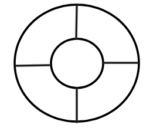
##### **1、解题技巧**：

- （1）对角线的两个数字通过一定的运算得到圆心的数字
- （2）圆心外的数字通过一定的运算得到中间的数字

##### **2、举个栗子**：

    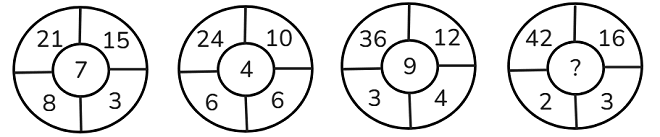
    `分析`：本题为圆圈题中带圆心的题目，首先考虑对角线的数字能否通过运算得到圆心的数字，第一个圆圈中发现15-8=7，21÷3=7，用此规律验证第二个圆圈：10-6=4,24÷6=4，规律正确。则最后一个圆圈问号处的数字为16-2=42÷3=14，故本题第4个中间值为14。

### 无圆心(圆圈)

##### **1、解题技巧**：

- （1）对角线的两个数通过一定的加减乘除运算与另外两个数运用同样的运算法则后数字相等，此种解题思路也是最常考的
- （2）其中三个数通过一定的运算法则得到另外一个数
##### **2、举个栗子**：

    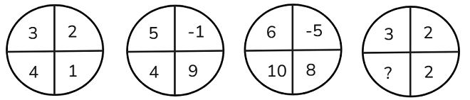
    `分析`：在分析无圆心的圆圈题时，首先考虑对角线的两个数做差，其次是做和或相乘，如果有明显的倍数关系可考虑做商。本题首先考虑对角线的数做差，4-2=2,3-1=2，做差后相等。验证第二个圆圈，5-9=-4，4-（-1）=5，做差后不相等，规律出现错误。观察第一个圆圈发现，4是2的两倍，4÷2=2，3-1=2，一个做商一个做差，然后相等。以此验证圆圈二，4÷-1=-4，5-9=-4，满足此规律，验证圆圈三，10÷-5=-2,6-8=-2，满足规律，则括号内的数应该为2，故本题答案为2。

### 三角形

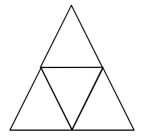
##### **1、解题技巧**：优先考虑外围的三个数字通过一定的运算得到中间的数字。

##### **2、举个栗子**：

    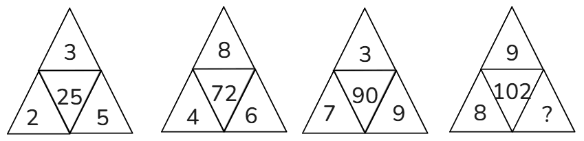
    `分析`：中间的数字明显大于周围的三个数字，优先考虑加法或者乘法。外围三个数直接相加并不能得到中间的数，因此考虑加法与乘法相结合。发现（2+3）×5=25，（4+8）×6=72，（3+7）×9=90，则问号处的数字为102÷（8+9）=6，故本题答案为6。

### 方格形

##### **1、如何考察**：一般考察3×3，3×4，4×4。九宫格考查的几率较大，此类题目看似难度较大，实则在掌握常见解题方向和技巧后难度并不大。

##### **2、解题技巧**：

- （1）分行或列成等差或等比数列；
- （2）各行或列单独计算为常数；
- （3）各行或列内部凑数字之间相等关系（+-×÷），比如每行数列中其中两项通过一定的预算得到第三项；
##### **2、举个栗子**：

    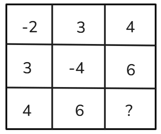
    `分析`：分行或分列看，数字之间没有明显的等差或等比，排除分行或分列成等比数列。接下来考虑分行或分列数字加和，发现每行数字之和为5，问号处应填入-5，故本题答案为-5。

## 三、总结

   **以上是常见的图形数列，但在考试中可能会出现其他创新图形，比如六边形、奇怪的形状。因此根据常见的图形数列总结3个解题思路**：
- （1）当图形数阵中有中心位置，优先用周围数字凑中心数字；
- （2）大数字出现在固定位置，用周围数字凑大数；
- （3）当图形数阵中没有中心位置，凑数字间的相等关系；

## 四、随笔练习

**例1**：（2019浙江）

   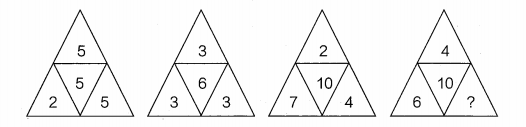
   A.10
   B.12
   C.14
   D.16

解析

   题目特征明显，为三角形的图形数列。凑中心数。
   观察其他数字与中心数字的关系，因为第二项、第三项中心数字均比周围数字大，故可以此为突破口找规律，考虑加法、乘法等可以使数字变大的方法。
   第一个数阵中 5×2-5=5
   第二个数阵中 3×3-3=6
   第三个数阵中 2×7-4=10
   即最上面的数字×左下角的数字-右下角的数字=中心数。
   则第四个数阵中，4×6-?=10，解得?=14。
   答案为C。

**例2**：（2014深圳）仔细观察数列的排列规律，然后从四个选项中选出最符合规律的一项来填补空缺项。

   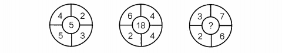
   A.2
   B.8
   C.9
   D.10

解析

   题目特征明显，为圆形的图形数列。凑中心数，观察其他数字与中心数字的关系。
   找到规律之后用其余项来验证此规律是否成立。
   观察第一项，可得4×3-(5+2)=5，即第一项规律为左上角数字×右下角数字-(左下角数字＋右上角数字)=中心数。
   用第二项验证：6×4-(2＋4)=18，此规律成立。
   故题干所求项应为3×6-(2＋7)=9。
   故正确答案为C。

**例3**：（2017广州）观察表中数字的变化规律，依次填入空格X、Y中的数字是:

   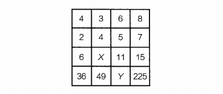
   A.5，81
   B.5，121
   C.7，81
   D.7，121

解析

   题目特征明显，为4×4方格形的图形数列。
   凑大数，先观察图形，大数在每一列的最后一个且均为平方数，再找每一列其余数字与大数之间的关系即可求解本题。
   第一、二、四列的大数分别为36、49、225，依次为6、7、15的平方。
   观察每一列，发现第一列和第四列的第三行数恰好为6、15，且前两行数字之和等于第三行数字：4＋2=6、6+5= 11、8＋7=15，故每一列规律为：第一行＋第二行=第三行、(第一行＋第二行)×第三行=第四行，则X=3＋4=7，Y=(6+5)×11=121。故正确答案为D。

**例4**：（2020上海）如图，问号处的数字为:

   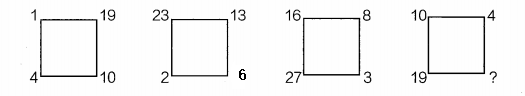
   A.1
   B.8
   C.19
   D.31

解析

   观察数列特征，没中心凑大数。
   第一个数阵中最大的数是右上角的19、第二个数阵中最大的数是左上角的23、第三个数阵中最大的数是左下角的27，大数位置不同，考虑单独的四则运算。
   先考虑加法，第一个数阵:1+19+10+4=34，第二个数阵:23+13+6+2=44，第三个数阵:16+8+3+27=54，构成数列：34、44、54，此数列是公差为10的等差数列，则其下一项为54+10=64。
   即第四个数阵:10＋4＋?＋19＝64，则?=31。

**例5**：（2022上海37%）根据下列图形上的数字规律，“？”处的数字应为\_\_\_\_\_\_。

   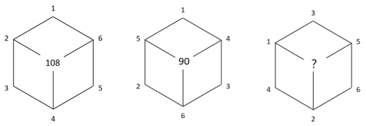
   A.64
   B.88
   C.96
   D.104

解析

   图形数列，有中心优先凑中心：
   第一个图形：（2+4+6）×（1+3+5）=108；
   第二个图形：（5+6+4）×（1+2+3）=90。
   规律为在每个正六边形中，与中心数字相连的三个数之和×其他三个数之和=中心数字。
   根据以上规律，第三个图形中，？=（1+2+5）×（3+4+6）=104。
   故正确答案为D。

**例6**：（2018浙江）把最合适的一项填入？中，使其符合一定的规律：

   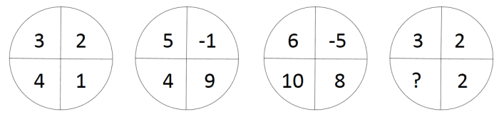
   A.-4
   B.-2
   C.0
   D.2

解析

   无圆心图形数阵，考虑对角线方向的数字联系。
   第一个数阵中，3-1=4÷2；
   第二个数阵中，5-9=4÷（-1）；
   第三个数阵中，6-8=10÷（-5）；
   故第四个数阵中，3-2=？÷2，？=2。故正确答案为D。

**例7**：（2020广东）把最合适的一项填入？中，使其符合一定的规律：

   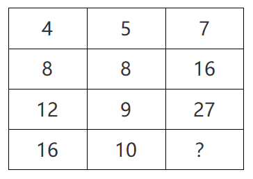
   A.16
   B.27
   C.38
   D.49

解析

   方格图形数阵，优先考虑横向和竖向规律，各行或列单独计算为常数。
   第一行 4+5+7=16；
   第二行 8+8+16=32；
   第三行 12+9+27=48；
   发现各行数字之和组成的数列16，32，48，（ ），是公差为16的等差数列，下一项为48+16=64，则所求项=64-16-10=38。
   故正确答案为C。

**例8**：（2023上海）根据下列数字关系，“?”中的数字不可能是\_\_\_\_\_。

   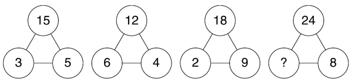
   A.3
   B.6
   C.9
   D.12

解析

   观察题干发现，各数阵之间无法形成统一的递推规律，考虑数字特性。
   分析可得，3与5均为15的约数，6与4均为12的约数，2与9均为18的约数，即在每个数阵中，下面两个数字均为上面数字的约数。
   按此规律，选项中只有C项9不是24的约数，
   C项当选。
