# 几何问题

##### **1、周长定义**：平面图形的边界长度，简单来说就是围绕一个平面图形的一圈长度。对于圆形，则指圆的边界，称为圆周长或圆周。

##### **2、面积定义**：面积是对一个平面的表面多少的测量。 对立体物体所有表面的面积称表面积。 对立体物体最底下的面的面积称底面积。

##### **3、表面积定义**：表面积是指一个物体所有表面积的总和，包括平面和曲面上的面积。

##### **4、体积定义**：体积是指物体所占空间的大小，即物体在三维空间中所占据的容积。体积是衡量物体占据空间多少的量，其国际单位制的基本单位是立方米，用符号m³表示。

## 一、总体解题思路

##### **1、**根据题意，画出几何示意图。如果出现“东南西北”问题，可以构建坐标系。

##### **2、**如果是规则图形，按照相对应的公式列方程或直接计算；

##### **3、**如果不是规则图形，通过割、补、平移、画辅助线等方法转化成规则图形，再按照相对应的公式列方程或直接计算。

##### **4、**在考场上，如果是求长度，可以用直尺量出几何图形的长、宽、高等辅助计算（不能带尺子的话就算了），注意要成比例。

## 二、平面图形公式

##### **1、长方形**

- （1）周长：(a＋b)×2

- （2）面积：a×b

    【图片】

##### **2、正方形**

- （1）周长：4a

- （2）面积：S\_正方形=a^2=(1)/(2)对角线^2

    【图片】

##### **3、三角形**

- （1）周长：a＋b＋c

- （2）面积：S\_三角形=(1)/(2)底×高=(1)/(2)ah

    【图片】

##### **4、正三角形**

- （1）周长：3a

- （2）面积：S\_正三角形=(3)/(4)a^2

    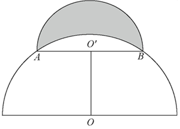

##### **5、圆形**

- （1）周长：2π𝑟

- （2）面积：πr^2

    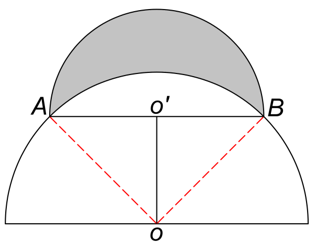

##### **6、扇形**

- （1）周长：弧长=πr×(n)/(180°)，n 是圆心角的度数。

- （2）面积：S\_扇形=(n)/(360°)π𝑟^2=(lr)/(2)（l 为弧长）

    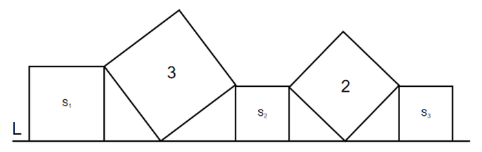

##### **7、梯形**

- （1）周长：a＋b＋c＋d

- （2）面积：S\_梯形=(上底+下底)/(2)×高

    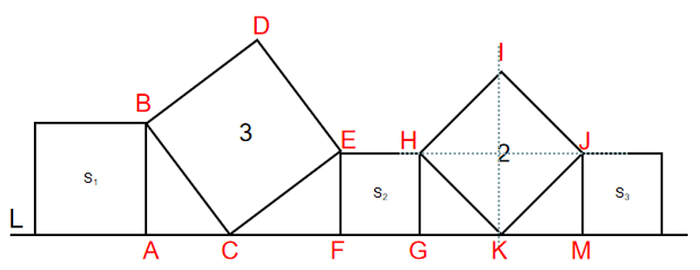

##### **8、平行四边形**

- （1）周长：2a＋2b

- （2）面积：ah

    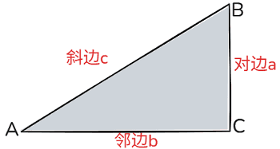

##### **9、菱形**

- （1）周长：4a

- （2）面积：S\_菱形=(对角线×对角线)/(2)=a²×sinα （其中a为边长，α为任意一个内角的角度）

    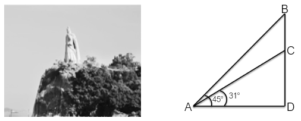

    **例**：（2024北京）如图所示，平行四边形空地分AB两区域，分别种植龙沙宝石月季和金凤凰月季。已知，龙沙宝石月季的A区面积为35平米，求B区种植金凤凰月季的面积为多少？
    【图片】

    1.  A.175  B.189  C.204  D.218

    解析

    2.  由题干可知A区面积为35平米，底为2.5m，设平行四边形的高是h，由三角形面积公式可得(1)/(2)×2.5×h=35，解得h=28m。
    3.  则B区域梯形的面积s=(1)/(2)(8-2.5+8)×28=189平米。
    4.  因此，选择B选项。

    **例**：（2024天津事业单位）平面做一个边长为3的正方形，再以这个正方形的对角线为边做第二个正方形，再以第二个正方形的对角线为边做第三个正方形，以此类推，第11个正方形的面积为（ ）。

    1.  A.2048  B.3072  C.8192  D.9216

    解析

    2.  第一个正方形的面积是3×3＝9；根据勾股定理可知正方形的对角线与边长的比值系是√(2)：1，所以第二个正方形的边长为3√(2)，第二个正方形的面积为3√(2)×3√(2)=18，以此类推，第三个正方形的边长为6，第三个正方形的面积为6×6＝36；第四个正方形的边长为6√(2)，第四个正方形的面积为72。第一个正方形的面积到第四个正方形的面积分别是9，18，36，72，很明显是首项为9，公比为2的等比数列，第11个正方形的面积就是a\_11，根据等比数列通项公式a\_n=a\_1×q^n−1，a\_11=9×2^10=9216
    3.  因此，选择D选项。

    **例**：（2025新疆）为丰富儿童的暑假生活，某公园在半径为20√(2)米的半圆形水池旁修建了一个弯月形儿童戏水池（如下图所示）。该弯月形戏水池可看作是由半径为20米的半圆O'和半径为20√(2)米的半圆O的圆弧围成的阴影部分，圆心距OO'为20米且OO'垂直于直径AB，那么该戏水池的面积为多少平方米？
    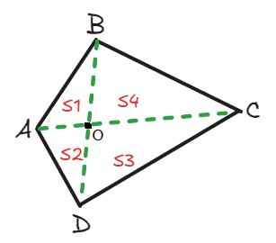

    1.  A.400  B.200π  C.800  D.400π

    解析

    5.  方法一：
        1.  如图所示，根据题意可知半圆O的半径为R=20√(2)米，半圆O'的半径为r=20米。连接OA、OB，可得OO'=O'A=O'B=20米，又因为OO'⊥AB，可得△OO'A和△OO'B均为等腰直角三角形，则∠AOB=∠OO'A+∠OO'B=45+45=90°，故S△OAB=0.5×OA×OB=0.5×20√(2)×20√(2)=400平方米，S\_半圆O^′=0.5π𝑟²=0.5×20×20×π=200π平方米；根据扇形面积公式：S\_扇形=(n)/(360°)πr^2，可得：S\_扇形OAB=(90°)/(360°)πR^2=200π平方米。
        2.  综上，所求戏水池面积S\_阴影=S\_半圆O^′−(S\_扇形OAB−S\_三角形OAB)=200π-（200π-400）=400平方米。
        3.  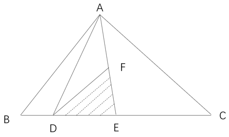
    6.  方法二：
        1.  半径为米的半圆的面积为S=0.5πr²=0.5×20×20×π=200π平方米。
        2.  阴影部分弯月形的面积明显小于半径为20米的半圆的面积，只有选项A小于200π，符合题意。

## 三、特殊三角形

##### **1、三角形图形定理**：

- （1）三角形内角和为180°，且任意一个外角等于不相邻的两个内角之和。 `拓展：n边形内角和=(n-2)×180°`

- （2）任意两边之和大于第三边，任意两边之差小于第三边。

- （3）中线定理：三角形的中线是连接三角形的一个顶点及其对边中点的线段，一个三角形有3条中线。每条中线将原三角形划分为两个面积相等的部分。直角三角形中的直角所对应的边上的中线为斜边的一半。

- （4）中位线定理：三角形两边中点的线段平行于第三边且长度为其一半。

    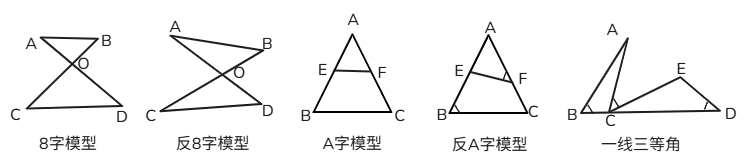
- （5）两个三角形的高相同，面积之比等于底之比；两个三角形的低相同，面积之比等于高之比。

    **例**：（2021联考）饲养兔子需要场地，小林准备用一段长为28米的篱笆围成一个三角形形状的场地，已知第一条边长为m米，由于条件限制第二条边长只能是第一条边长度的(1)/(2)多4米，若第一条边是唯一最短边，则m的取值可以为：

    1.  A.6  B.7  C.8  D.9

    解析

    5.  篱笆长28米，围成三角形场地。第一条边长为m米，第二条边长为(1)/(2)m+4米。第一条边是唯一最短边。
    6.  代入A选项：若m=6，则第二条边长为 0.5×6+4=7米，第三条边长为28-6-7=15米。因为 6+7<15，不满足三角形两边之和大于第三边的性质，所以排除A选项。
    7.  代入B选项：若m=7，则第二条边长为7.5米，第三条边长为13.5米，此时满足三角形三边关系以及第一条边是唯一最短边的条件。
    8.  代入C选项：若m=8，则第二条边长为8米，第二条边等于第一条边，不满足第一条边长为最短边这一条件，排除C选项。
    9.  代入D选项：若m=9，第二条边长为8.5米，此时第一条边不是最短边，排除D选项。
    10.  因此，选择B选项。

   **2、直角三角形**：

    1.  （1）勾股定理（直角三角形的两条直角边的平方和等于斜边的平方）： a² + b² = c²。常用勾股数：(3、4、5)；(5、12、13)；(6、8、10)；(7、24、25)。

    2.  （2）30°直角三角形边长比例=1：√(3)：2

    3.  （3）45°等腰直角三角形边长比例=1：1：√(2)

    4.  （4）圆中的直角：

        1.  ①不在同一直线的三个点确定一个圆。
        2.  ②圆的直径所对的圆周角是直角(90°)。
        3.  `注：圆上最远的两个点构成直径`
    5.  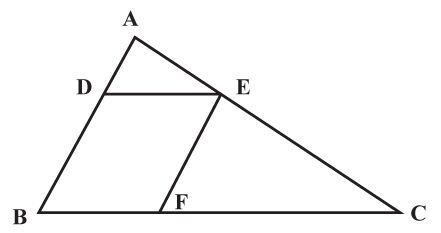

    **例**：（2020年四川）如图所示，在直线L上依次摆放着5个正方形。已知斜放置的2个正方形的面积分别是3和2。正放置的3个正方形的面积依次是S\_1、S\_2、S\_3，且。问S\_1+S\_2+S\_3的值为？
    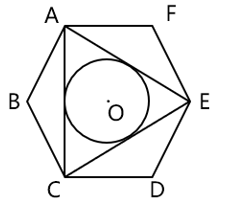

    1.  A.4   B.5   C.11   D.13

    解析

    2.  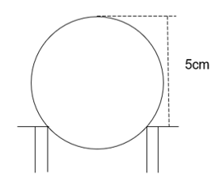
    3.  根据正方形HIJK和正方形BCED的面积分别为2和3，可得HI=HK=√(2)，BC=CE=√(3)，又因为HJ平分IK，故HG=JM=EF=1，正方形S\_2与S\_3的面积为1，由勾股定理可得，CF=√(CE^2−EF^2)=√(2)。由于∠BCA=∠CEF，∠ABC=∠FCE，BC=CE，根据“两角及其夹边对应相等的三角形全等”，可得三角形ABC与三角形FCE全等，故AB=CF=√(2)，正方形S\_1的面积为2，故S\_1+S\_2+S\_3=2+1+1=4
    4.  故正确答案为A。

   **3、正余弦函数（直角三角形）**：

    1.  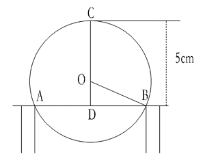
    2.  （1）正弦：sinA=(对边)/(斜边)=(a)/(c)

    3.  （2）余弦：cosA=(邻边)/(斜边)=(b)/(c)

    4.  （3）正切：tanA=(对边)/(邻边)=(a)/(b)

    5.  常用三角函数值：
    6.  30°

        45°

        60°

        sin

        (1)/(2)

        (2)/(2)

        (3)/(2)

        cos

        (3)/(2)

        (2)/(2)

        (1)/(2)

        tan

        (3)/(3)

        1

        √(3)

    **例**：（2023湖北）厦门鼓浪屿海滨覆鼎岩上屹立着一尊郑成功雕像。为了测量石像的高度，某测量小组选取的测量点A与覆鼎岩底部D在同一水平线上，如下图所示。已知覆鼎岩高CD为24米，在A处测得石像头顶部B的仰角为45°，石像底部C的仰角为31°（参考数据：sin31°≈0.52，cos31°≈0.86，tan31°≈0.6），则石像BC的高度约为：
    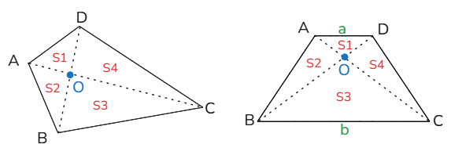

    1.  A.20米  B.18米  C.16米  D.14米

    解析

    5.  在直角三角形ACD中，已知∠CAD=31°，CD=24米，tan∠CAD=(CD)/(AD)，则AD=(CD)/(tan31°)≈24÷0.6=40米。在直角三角形ABD中，已知∠BAD=45°，可得AD=BD=40米，则石像BC=BD-CD=40-24=16米。
    6.  故正确答案为C。

   **4、等腰三角形**：等腰三角形的两个底角相等，简称：等边对等角；

    1.  （1）120°等腰三角形边长比例=1：1：√(3)，面积S=(3)/(4)a^2=(1)/(3)×(3)/(4)c^2（a为腰长，c为底边长）

    **例**：(2018国考) 一艘非法渔船作业时发现其正右方有海上执法船，于是沿下图所示方向左转 30°后，立即以 15 节 (1 节 =1 海里 / 小时 ) 的速度逃跑，同时执法船沿某一直线方向匀速追赶，并正好在某一点追上。已知渔船在被追上前逃跑的距离刚好与其发现执法船时与执法船的距离相同，问执法船的速度为多少节 ?

    1.  【图片】
    2.  A. 20  B. 30  C. 10√(3)  D. 15√(3)

    解析

    6.  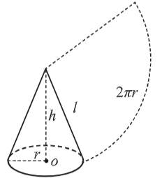
    7.  根据题意可知，非法渔船和执法船的行驶路线为上图所示，非法渔船在 A 点被追上。由于非法渔船的逃跑距离和发现执法船时其与执法船的距离相同，假设距离为 a，即 OA=OB=a； 渔船左转 30°， 即 ∠AOB=120°。
    8.  又因为△AOB为等腰三角形，故 ∠OBA= ∠OAB=30°。过点 O 作 OC 垂直 AB 于点 C，根据△OCB 为直角三角形，且∠OBA=30°可得 CB=(1)/(2)AB=(3)/(2)OB=(3)/(2)a，因此 AB=2×CB=2×(3)/(2)a=√(3)a。渔船从 O 到 A，执法船从 B 到 A，行驶时间相同，假设执法船速度为 ν 节，则有 (a)/(15)=(√(3)a)/(v)，解得 v= 15√(3)。故正确答案为 D。

   **5、等边三角形**：等边三角形的各个角都相等，并且每个角都等于60°。 `正六边形：由6个等边三角形构成`

    1.  （1）等边三角形的高与边的比为√(3)：2

    2.  （2）等边三角形面积：S\_=(3)/(4)a^2

   **6、三角形面积模型**：

    1.  （1）山脊模型：在两三角形共顶点的情况下，若两三角形的高相等，则其面积之比等同于底边之比。如下图，S\_1:S\_2=a：b

    2.  【图片】

    3.  （2）风筝模型：在任意四边形中(如下图所示)，由对角线分成的四个三角形的面积S1、S2、S3、S4。①满足S1×S3＝S2×S4；②满足(S△ABD)/(S△CBD)=(AO)/(OC)、(S△ABC)/(S△ACD)=(BO)/(OD)。

    4.  【图片】

    **例**：（2023吉林）为推动产业园和产业集聚区加快转型，某地计划在三角形ABC区域内建设新能源产业园区（如下图所示），三角形DEF是中央工厂区，已知BD：DE：EC=1：2：3，F为AE的中点，则新能源产业园区总面积是中央工厂区面积的：
    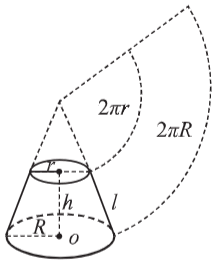

    1.  A.7倍   B.6倍   C.5倍   D.4倍

    解析

    5.  因为F为AE中点，则AF=EF，又因为△DAF、△DEF高相同，所以S△DAF：S△DEF=AF：EF=1：1。
    6.  根据山脊模型，S△ADE：S△ABD=2：1，S△ADE：S△AEC：2：3，所以赋值S△ABD为1，则S△ADE=S△DAF+S△DEF=2，S△AEC=3
    7.  即新能源产业园区总面积是中央工厂区面积的 S△ABC÷S△DEF=（2+1+3）/1=6。
    8.  故正确答案为B。

   **7、三角形的全等**：

    1.  （1）概念：两个图形的形状和大小都一样时，称为两个图形全等。

    2.  （2）全等证明：三条边都相等、两边及其夹角都相等、两角及其夹边都相等、两角及其中一角的对边都相等。

    3.  （3）当条件中出现“折叠、对称、旋转、平移”找全等。

   **8、三角形相似**：

    1.  （1）相似证明：角角相似、边角边相似、边边边相似。

    2.  （2）相似性质：

        1.  ①若两三角形相似，则这两个三角形的对应角相等，对应边成比例。其中，两相似三角形中任意一组对应边的比例称为这两个相似三角形的相似比。
        2.  ②若两三角形相似，则这两个三角形的对应边上的高成比例且其比例等于相似比。
    3.  （3）相似应用：条件中出现“平行线或三角形中两个角相等”找相似。

    4.  （4）两个图形相似时，长度之比为a：b时，面积之比为a^2：b^2，体积之比为a^3：b^3

    5.  （5）相似三角形模型：

        1.  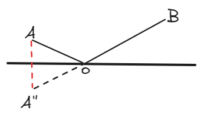
        2.  ①8字模型：AB平行DC，则△AOB∽△DOC。(OA)/(OD)=(BO)/(OC)=(AB)/(CD)
        3.  ②反8字模型：∠A=∠C或∠B=∠D，则△AOB∽△DOC。(AO)/(CO)=(BO)/(OD)=(AB)/(DC)
        4.  ③A字模型：EF平行BC，则△AEF∽△ABC。(AE)/(AB)=(AF)/(AC)=(EF)/(BC)
        5.  ④反A字模型：∠AFE=∠ABC或∠AEF=∠ACB，则△AEF∽△ABC。(AE)/(AC)=(AF)/(AB)=(EF)/(BC)
        6.  ⑤一线三等角：两个三角形中相等的两个角落在同一条直线上，另外两条边所构成的角与这两个角相等，这三个相等的角落在同一直线上，故称"一线三等角"。∠ABC=∠ACE=∠EDC，则△ABC∽△CED。(AB)/(CD)=(BC)/(DE)=(AC)/(CE)

    **例**：(2020新疆) 某演播大厅的地面形状是边长为100米的正三角形，现要用边长为2米的正三角形砖铺满（如图所示）。问，需要用多少块砖？

    1.  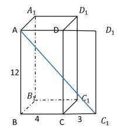
    2.  A. 2763   B. 2500   C. 2340   D. 2300

    解析

    6.  第一步，本题考查几何问题，属于几何特殊性质类。
    7.  第二步，小正三角形和大正三角形为相似图形，相似图形面积比=边长平方之比，边长比为 100∶2=50∶1，面积比为50²：1²=2500∶1，需要边长为2米的正三角形2500块。

    **例**：(2017河南) 一块三角形农田ABC（如下图所示）被DE、EF两条道路分成三块。已知BD=2AD，CE=2AE，CF=2BF，则三角形ADE、三角形CEF和四边形BDEF的面积之比为：

    1.  【图片】
    2.  A. 1:3:3   B. 1:3:4   C. 1:4:4   D. 1:4:5

    解析

    6.  由题意可知，D点、E、F点分别为AB、AC、BC的三等分点，DE//BC、EF//AD，根据A字模型可知：△ADE与△ABC相似，相似比=AD:AB=AD:3AD=1∶3；△CEF与△CAB相似，相似比=CE:CA=2AE:3AE=2∶3。
    7.  根据面积比等于相似比的平方，若设三角形ADE的面积为1，则三角形ABC的面积为9，三角形CEF的面积为4，四边形DEFB面积为9-1-4=4，三角形ADE、三角形CEF、四边形DEFB的面积之比为1∶4∶4，故本题选C。

   **9、三角形的内切圆**：内切圆的圆心，是三条角平分线的交点，内心到三边的距离相等

    1.  （1）一般三角形的内切圆半径r=(2S)/(a+b+c) （S为三角形的面积）

    2.  （2）等边三角形的内切圆半径r=(√(3)a)/(6)

    **例**：（2024江苏）如图所示，ABCDEF是一个边长为2的正六边形，圆O是的内切圆，则圆O的面积是（ ）。
    【图片】

    1.  A.π  B.2π  C.(5)/(4)π   D.(3)/(2)π

    解析

    2.  由于ABCDEF是正六边形，可得AC=CE=EA，又因为正六边形是由6个等边三角形构成，所以正六边形每个内角为60+60=120°。所以三角形ABC、三角形AFE、三角形CDE为等腰三角形。120°等腰三角形边长比例=1：1：√(3)
    3.  所以AC=AE=CE=2√(3)
    4.  等边三角形的内切圆半径r=(√(3)a)/(6)=(3)/(6)×2√(3)=1
    5.  则圆O的面积是 πr^2=π
    6.  故正确答案为A。

   **10、三角形的外接圆**：外接园的圆心，是三边的中垂线交点，外心到三个顶点的距离相等。

     1.  （1）一般三角形外接圆半径r=(abc)/(4S) （S为三角形的面积）

     2.  （2）直角三角形外接圆半径r=(c)/(2) (c为斜边长)

     3.  （3）等边三角形外接圆半径r=(3)/(3)a（a为边长）

     **例**：（2020重庆选调）工厂有一种测量中控工件内径的方法，就是用半径为R的钢珠放在圆柱形内孔上，只要测得钢珠顶端与工件顶端面之间的距离X，就可以求出工件内孔径（如下图所示）。已知X=5cm，R=3cm，那么该工件内径的直径是（ ）。
     【图片】

     1.  A.2√(5)cm  B.√(5)cm  C.√(10)cm   D.4cm

     解析

     2.  【图片】
     3.  方法一：如图所示，连接钢珠与圆柱内径的交点A、B，连接钢珠的圆心O与点B，连接钢珠的最高点C与圆心O，并延长交AB于点D，则三角形ODB为直角三角形。OC、OB为钢珠的半径，OC=OB= 3cm，OD=5-3=2cm。根据勾股定理得BD²=OB²-OD²=3²-2²=5cm，BD=√(5)cm，则AB的长度为2√(5)cm。
     4.  方法二：ABC是一个三角形，高等于5，AC=BC。要求AB的距离，圆为△ABC的外接圆，圆的半径为3，三角形外接圆半径r=3=(abc)/(4S)=(AC×BC×AB)/(4×0.5×AB×CD)，得BC²=30，根据勾股定理BD²=BC²-CD²=30-5²=5，BD=√(5)cm，则AB的长度为2√(5)cm。

## 四、蝴蝶模型

蝶形定理为我们提供了解决不规则四边形的面积问题的一个途径，通过构造模型，一方面可以使不规则四边形的面积关系与四边形内的三角形相联系；另一方面，也可以得到与面积对应的对角线的比例关系。

【图片】

##### **1、任意四边形中的比例关系(“蝶形定理”)**:

- （1）(S1)/(S2)=(S4)/(S3)=(OD)/(OB)，即S\_1×S\_3=S\_2×S\_4。

- （2）根据等比定理(S1)/(S2)=(S4)/(S3)=(OD)/(OB)=(S\_1+S\_4)/(S\_2+S\_3)

##### **2、梯形的蝶形定理及相似比例**：

- （1）(S1)/(S2)=(S4)/(S3)=(OD)/(OB)=(a)/(b)

- （2）S\_1×S\_3=S\_2×S\_4

- （3）(S1)/(S3)=(a2)/(b2)

- （4）S\_2+S\_3=S\_4+S\_3=>S\_2=S\_4

    综合以上四个，统一比例得到 S\_1:S\_2:S\_3:S\_4=a^2:ab:b^2:ab

    **例**：(2021广东选调)如图三角形中，A、B分别为两条边的中点，则图中阴影部分面积为三角形总面积的（ ）。

    【图片】
    2.  A. 1/3    B. 1/4    C. 2/7    D. 3/8

    解析

    1.  做链接AB两点线段，可得ABDF为梯形，可以使用蝴蝶定理，如下图所示。
    2.  【图片】
    3.  设AB长度为1，因为A、B分别为两条边的中点，所以DF为2。
    4.  根据梯形蝴蝶定理面积比：S1：S2：S3：S4＝a²：ab：ab：b²，则S△ABO：S△AOF：S△DFO：S△DOB=1²：2：2²：2，故梯形ABDF面积为1+2+4+2=9。
    5.  因为AB为S△BCF的中线，则S△ABC=S△ABO+S△AFO=1+2=3。
    6.  阴影面积为S△AOF+S△DOB=2+2=4。
    7.  面积总和为：三角形ABC+梯形ABDF=3+9=12。
    8.  占比=4÷12=1/3。

## 五、立体图形公式

##### **1、长方体**

- （1）表面积：(ab＋ac＋bc)×2

- （2）体积：V=abc

- （3）棱长和：(a＋b＋c)×4

- （4）体对角线：d=√(a^2+b^2+c^2)

    【图片】

##### **2、正方体**

- （1）表面积：6a²

- （2）体积：V=a³

- （3）体对角线：d=√(3)a

- （4）棱长和：l=12a

    `①正方体角上挖一个小正方体：表面积不变。（去掉3个外表面，露出3个新内表面。净增 0。）②正方体边上挖一个小正方体：只增加2个面的表面积；（去掉2个外表面，露出4个新内表面。净增 2个面的面积。）③正方体中间挖一个正方体、圆柱等（不挖穿）：总体新增抠挖的的侧面积。`

    【图片】

##### **3、圆柱体**

- （1）表面积：上底面积＋下底面积＋侧面积=2πr^2+2πrh

- （2）体积：V=底面积×高=πr^2h

- （3）体对角线：d=√(4r^2+h^2)

    【图片】

##### **4、圆锥体**

- （1）表面积：底面积＋侧面积=πr^2+πrl `l为圆锥的母线长，即围成此圆锥所用扇形的半径`

- （2）体积：V=(底面积×高)/(3)=(S×h)/(3)

    【图片】

##### **5、球体**

- （1）表面积：4πr²

- （2）体积：V=(4πr³)/(3)

    【图片】

##### **6、棱锥**

- （1）表面积：侧面积+底面积

- （2）体积：V=(S×h)/(3)

    【图片】

##### **7、圆台**

- （1）表面积：侧面积+上、下面积=π(R+r)l+π(R^2+r^2)。 `根据勾股定理：l=√((R−r)^2+h^2)`

- （2）体积：V=(1)/(3)πh(r^2+Rr+R^2)

    【图片】

    **例**：(2015国考) 某学校准备重新粉刷升国旗的旗台，该旗台由两个正方体上下叠加而成，边长分别为 1 米和 2 米，问需要粉刷的面积为：（ ）

    1.  A.30 平方米   B.29 平方米
    2.  C.26 平方米   D.24 平方米

    解析

    5.  小正方体每个面的面积为 1²=1，表面积为1×6=6；大正方体每个面的面积为2²=4，表面积为4×6=24；则两个正方体的总面积为 6+24=30m²。小的正方体在大的上面，所以其中重合部分为两个小正方体的面，面积为 2×1=2m²，并且大正方体作为旗台，其底面不用粉刷，故需要粉刷的面积为 30-2-4=24m²。故正确答案为 D。

    **例**：(2015江苏) 一实心圆锥体的底面半径为r，母线长为2r。若截圆锥体得到两个同样的锥体（如图），则所得两个锥体的表面积之和与原圆锥体表面积的比值是

    1.  【图片】
    2.  A. 1 ：2   B. π+4√(3) ：6
    3.  C. 3π+2√(3) ：3π  D. 3π+4 ：6π

    解析

    6.  已知圆锥体的底面半径为r，母线长为2r，圆锥体的表面积=底面积 + 侧面积，底面积=πr²，侧面积=πrl=πr×2r，则锥体的表面积=πr²+2πr²=3πr²。所截得的两个锥体的表面积之和要比原圆锥体的表面积多两个等边三角形截面的面积，等边三角形的边长为2r，每个角60°，则高=2r×sin60°=√(3)×r，其面积为√(3)×r×2r÷2=√(3)r²
    7.  那么两个锥体的表面积之和为3πr² + 2 × √(3)r²。则两个锥体的表面积之和与原圆锥体表面积的比值是3πr² + 2√(3)r²：3πr²，约掉πr²后：3π+2√(3) ：3π。
    8.  故正确答案为C。

    **例**：(2025上海28%) 某公司研发一款饮料瓶，一开始瓶身为圆柱，高h=10cm，底面半径r=5cm。为了更为美观，则以上底面为球的大圆做一个半球，轴截面如图所示。则瓶子的体积约为（ ）cm³。（精确到1cm³）

    1.  【图片】
    2.  A. 1440   B. 1047   C. 930   D. 865

    解析

    5.  根据题意，该饮料瓶由两部分组成，上半部分是半径为5cm的半球，下半部分是高为10cm，底面半径为5cm的圆柱。
    6.  根据球的体积公式：4πr³÷3，则上半部分半球体积=0.5×4×π×5³÷3=(250π)/(3)cm³。
    7.  根据圆柱体积公式：底面积(`πr²`)×高(`h`) ，则下半部分圆柱体积=π×5²×10=(250π)cm³。
    8.  故该饮料瓶的体积为(250π)/(3)+250π=(1000π)/(3)≈1047cm³。(`π取3.14`)
    9.  故正确答案为B。

    **例**：(2024江苏)某品牌奶茶所用纸杯均为圆台型。已知M型纸杯的上、下口直径分别为70毫米、50毫米，高为80毫米；N型纸杯的上、下口直径分别为60毫米、45毫米，高为60毫米。则M型纸杯与N型纸杯的侧面积之比为（ ）。

    1.  A. 16：7   B. 32：21   C. 48：35   D. 64：49

    解析

    5.  本题考查求圆台的侧面积，圆台侧面积=π×（R+r）×l。其中r和R分别为上、下底面的半径，l为侧面母线长（如下图所示）。
    6.  【图片】
    7.  M型纸杯：r=50÷2=25毫米，R=70÷2=35毫米，则l=√((35−25)^2+80^2)=10√(65)
    8.  N型纸杯：r=22.5毫米，R=30毫米，则l=√((30−22.5)^2+60^2)=7.5√(65)
    9.  故所求比例为：π×(25+35)×10√(65)：π×(22.5+30)×7.5√(65)=32：31
    10.  故正确答案为B。

   **8、立体几何相似**：

    1.  （1）相似图形面积比=长度比²

    2.  （2）相似图形体积比=长度比³

    **例**：(2018联考)某甜品店出售一种规则球形的甜品，该甜品由内部中空的球形面皮（每立方厘米成本0.4元），和实心的芝士球（每立方厘米成本1元）组成，无论甜品大小规格如何，其中的芝士球半径始终为甜品半径的四分之三，已知制作半径为1厘米的该甜品成本约为2.73元，那么要制作半径为2厘米的该甜品，成本约为：

    1.  A. 5.46元   B. 7.45元  C. 14.92元   D. 21.88元

    解析

    1.  由于无论甜品大小规格如何，其中的芝七球半径始终为甜品半径的四分之三，所以大小芝十球属于相似图形，根据 相似图形体积比=长度比³=2³=8倍，则成本=2.73×8=21.84元，所以选择 D。

## 六、外接球与内切球

##### **1、外接球**：外接球的直径等于几何体体对角线。

##### **2、内切球**：

- （1）正方体的内切球直径：等于正方体的边长

- （2）等边圆柱的内切球直径：等于底面直径

    `【阿基米德公理】等边圆柱与它的内切球的表面积之比和体积之比均等于3:2`

##### **3、外接半球**：利用拼接的思想来做外接半球。

- （1）长、宽、高为别为a，b，c的长方体的外接半球：相当于长、宽、高分别为a，b，2c的长方体外接球。

- （2）底面半径为r，高为h的圆柱的外接半球：相当于底面半径为r，高为2h 的圆柱的外接球。

    **例**：（2025江苏）某地考古出土了一种呈长方体的青铜器，测得其长、宽、高分别为60cm、40cm、60cm。为了防止氧化，有关部门为其做个半球形的保护罩，则该保护罩（厚度忽略不计）的表面积至少为（ ）。

    1.  A.1.47πm²  B.1.02πm²   C.0.98πm²   D.0.68πm²

    解析

    2.  半球形的保护罩，则该保护罩（厚度忽略不计）的表面积至少为多少？那就是刚好把长方体盖住，即求外接半球。
    3.  求外接半球那么就转换为求长、宽、高分别为a，b，2c的长方体外接球外接球，最后减半即可。
    4.  外接球的直径等于几何体体对角线。直径=长方体的对角线=√(60²+40²+120²)=140cm=1.4m，即半径=0.7m
    5.  半球表面积=球表面积÷2=2πr²=2π×0.7²=0.98πm²
    6.  故正确答案为C。
    7.  备注：本题所求保护罩的表面积不包含底面。因为通常所说的“罩子”是没有底面的，即使罩子有底面，往往底面材质和罩子材质也不一样，会更厚一些，和题目中厚度忽略不计矛盾。

## 七、最短路径

##### **1、识别**：求AB两点到直线距离之和最短

##### **2、原理**: 两点之间，线段最短

##### **3、方法**：

- （1）两点为异侧：直接连线
- （2）两点为同侧：到直线的最短，镜面对称后连线。
【图片】
##### **4、立体中求最短路径**：一般通过展开变成一个平面，利用两点之间线段最短来求解；

    **例**：(2017湖南)如下图所示，某条河流一侧有A、B两家工厂，与河岸的距离分别为4km和5km，且A与B的直线距离为11km。为了处理这两家工厂的污水，需要在距离河岸1km处建造一个污水处理厂，分别铺设排污管道连接A、B两家工厂。假定河岸是一条直线，则排污管道总长最短是：

    【图片】
    2.  A. 12km   B. 13km   C. 14km   D. 15km

    解析

    5.  本题考查最短路径。
    6.  如下图所示，过污水处理厂做河岸的平行线HC，D为A关于HC的对称点，则最短距离为DB。
    7.  由题污水厂离河1km可得A点距离到HC为HA＝HD＝3km，B点距离HC等于5-1＝4＝EH，则DE＝HD+EH＝3+4＝7km。
    8.  由勾股定理可知BE²=AB²-AE²=11²-1²=120，所以DB²=BE²+DE²=7²+120=169，所以DB=13km。
    9.  【图片】

    **例**：（2019河北）长、宽、高分别为12cm、4cm、3cm的长方体ABCD−A\_1B\_1C\_1D\_1上，有一个蚂蚁从A出发沿长方体表面爬行到C₁获取食物，其路程最小值是多少cm？

    1.  A.13  B.√(193)   C.√(241)   D.17

    解析

    5.  由题干蚂蚁从A出发沿长方体表面爬行到 C\_1求AC\_1 最短，画图可知，在长方体中A和C\_1不在同一平面，要求最短距离先要把A和C\_1放在同一平面内，则把面翻折CDC\_1D\_1，形成面ABC\_1D\_1，再连接AC\_1，根据两点之间直线最短求解。如下图：
    6.  【图片】
    7.  根据勾股定理，则所求AC\_1最短=√(12^2+(4+3)^2)=√(193)
    8.  故正确答案为B。

## 八、最值理论

##### **1、平面图形中**：

- （1）当周长一定时，平面图形越接近于圆，面积越大；

- （2）当面积一定时，平面图形越接近与圆，周长越小。

- （3）周长相等的多边形中，以正多边形的面积为最大。

##### **2、立体几何中**：

- （1）当表面积一定时，立体图形越接近于球，体积越大；

- （2）当体积一定，立体图形越接近于球，表面积越小。

##### **3、特殊矩形**：

- （1）四边形周长一定，正方形面积最大。

- （2）四边形面积一定，正方形周长最小。

    **例**：(2019新疆)某健身馆准备将一块周长为100米的长方形区域划为瑜伽场地，将一块周长为160米的长方形区域划为游泳场馆。若瑜伽场地和游泳场馆均是满足周长条件下的最大面积。问两块场地面积之差为多少平方米？（ ）

    1.  A. 625   B. 845   C. 975   D. 1150

    解析

    5.  设瑜伽场地的长为x，根据周长公式，则宽为100÷2-x=50-x，根据理论：周长相等的多边形中，以正多边形的面积为最大。要使四边形面积最大，则为正方形，因此x=50-x，x=25，此时面积最大值为25×25=625平方米
    6.  同理，设游泳场馆的长为y米，则宽为160÷2-y=80-y，则当y=40时面积最大值为1600平方米。则题干所求为1600-625=975平方米。
