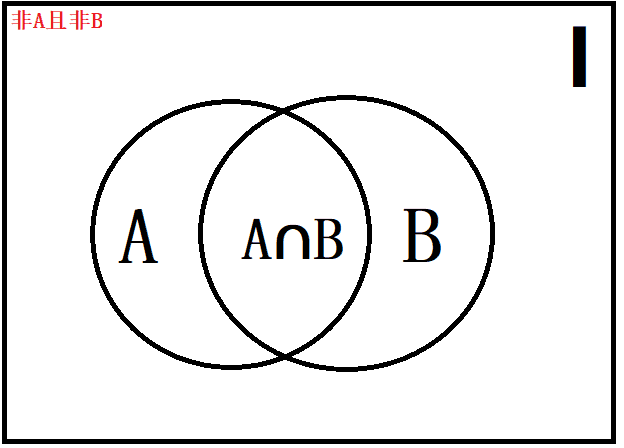
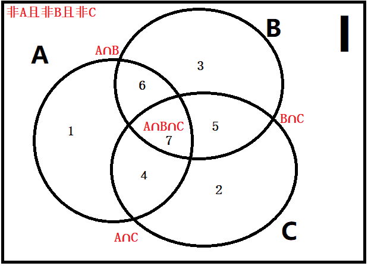
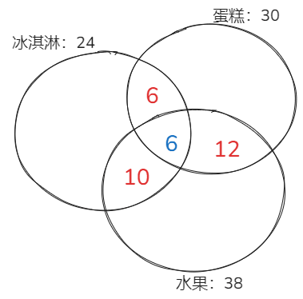
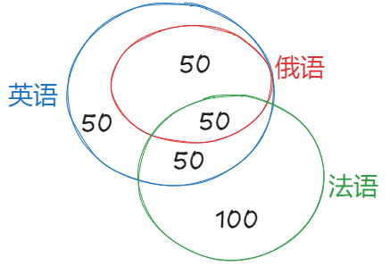

# 容斥问题

先判断是两集合还是三集合：两个集合用 `A∪B=A+B-A∩B`；三个集合要看清题干给的是“只满足两项”还是“至少满足两项”，两者相差一个“三项都满足”。至少满足一项与两项都不满足互为补集，总数已知时可从反面求“都不”。

## 一、两者容斥

如果被计数的事物有 A、B 两类，那么，先把 A、B 两个集合的元素个数相加，A 和 B 中都算了一次 A∩B 部分的元素，所以要把这部分重复计算的元素减去一次。如下图所示。

**1、公式**：I-非A且非B=A＋B-A∩B，【记忆口诀】总数－都不＝两集合之和－两集合公共数

**2、注意**：如果题目中有提到类似“每人参加了至少一项”的表述，说明都不满足数=0，即非A且非B=0

## 二、三者容斥

**1、三集合标准公式**：I-非A且非B且非C=A＋B＋C-A∩B-B∩C-A∩C＋A∩B∩C，【记忆口诀】总数－都不满足=A＋B＋C-(A∩B)-(A∩C)-(B∩C)＋(A∩B∩C)
**2、三集合非标准型公式**：总数－都不满足=A＋B＋C－只满足两项－2×满足三项

公式推导

根据上图：总数－都不满足=**1＋2＋3＋4＋5＋6＋7**；**A=1＋4＋6＋7**；**B=3＋5＋6＋7**；**C=2＋4＋5＋7**。
然后A＋B＋C=1＋2＋3＋4＋4＋5＋5＋6＋6＋7＋7＋7，发现跟**总数－都不满足**相比，4、5、6多计算了一次，7多计算两次。
4代表只满足AC，5代表只满足BC，6代表只满足AB，我们把4、5、6三块统称为“只满足两项”
7是A∩B∩C，统称为“满足三项”
因此**总数－都不满足=A＋B＋C－只满足两项－2×满足三项**（非标准型公式）
我们在换个思路，4＋7可以用A∩C表示，5＋7可以用B∩C表示，6＋7可以用A∩B表示
因此我们可以这样写：**A＋B＋C-（4＋7）-（5＋7）-（6＋7）**=1＋2＋3＋4＋5＋6
发现多减了一个7，因此需要加回来，所以总数－都不满足=A＋B＋C-（4＋7）-（5＋7）-（6＋7）＋7
即**总数－都不满足=A＋B＋C-A∩B-A∩C-B∩C＋A∩B∩C**（标准公式）

**3、注意**：如果题目中有提到类似“每人参加了至少一项”的表述，说明都不满足数=0，即非A且非B且非C=0

## 三、画图法

**1、在以下情况下需要画图**：画图法可以解决所有的容斥问题，公式可以解决一部分基础的容斥问题。

- （1）当题目中明确指出某个元素“只满足”或“仅满足”某个条件时，画图法比较适合，可以帮助清晰地表示各个集合之间的关系。

- （2）容斥问题涉及多个集合的并集和交集计算时，画图可以帮助直观地展示各个集合之间的关系，避免重复计数。

- （3）题中所给所求公式没有。

## 四、随笔练习

**例1**：(2016年河南省)某公司组织歌舞比赛，共68人参赛。其中，参加舞蹈比赛的有12人，参加歌唱比赛的有18人，45人什么比赛都没有参加。问同时参加歌舞比赛的有多少人？ （ ）

   A.7
   B.8
   C.9
   D.10

解析

   总人数 = 参加舞蹈比赛人数 ＋ 参加歌唱比赛人数 - 两项比赛都参加人数 ＋ 两项比赛都未参加人数。
   所以两项比赛都参加的人数为12＋18-（68-45）=7人。
   故答案为A

**例2**：(2011年国家)某市对52种建筑防水卷材产品进行质量抽检，其中有8种产品的低温柔度不合格，10种产品的可溶物含量不达标，9种产品的接缝剪切性能不合格，同时两项不合格的有7种，有1种产品这三项都不合格。则三项全部合格的建筑防水卷材产品有多少种？ （ ）

   A.34
   B.35
   C.36
   D.37

解析

   在将低温柔度不合格、可溶物含量不达标、接缝剪切性能不合格的产品数相加时，两项同时不合格的产品数被计算了两次，需减掉一次；三项同时不合格的产品数被计算了三次，需减掉两次。
   设三项全合格的建筑防水卷材产品有 x 种，根据容斥原理可得，8＋10＋9-7-2×1＋x=52，解得 x=34。
   故答案为A

**例3**：(2018年江西) 某高校做有关碎片化学习的问卷调查，问卷回收率为90%，在调查对象中有180人会利用网络课程进行学习，200人利用书本进行学习，100人利用移动设备进行碎片化学习，同时使用三种方式学习的有50人，同时使用两种学习方式的有20人，不存在三种学习都不用的人。那么这次共发放了多少份问卷？

   A.370
   B.380
   C.390
   D.400

解析

   这是一道三集合的容斥问题。注意题目中提到：不存在三种学习都不用的人。所以在套用三集合容斥问题非标准形式的过程中，非A且非B且非C=0。
   代入三集合容斥问题非标准形式得到：总人数=180＋200＋100-20-2*50，总人数=360，总问卷=360/90%=400。
   答案选D。

**例4**：(2024广东梅州事业单位)某单位42名职工参加健身活动，每人至少参加一种，已知参加瑜伽的有22人，参加蛙跳的有30人，参加跑步的有15人，其中5名职工三种健身活动都参加了，该单位有（ ）名职工只参加了一种健身活动？

   A.19
   B.20
   C.21
   D.22

解析

   这是一道三集合的容斥问题。
   根据三集合容斥问题非标准型公式：A＋B＋C-满足两项-满足三项×2=总数-都不，可得：22＋30＋15-参加两种健身活动-5x2=42-0，解得参加两种健身活动的人数 = 15。
   根据三集合容斥问题常识公式：满足一项＋ 满足两项 ＋ 满足三项 = 总数-都不，则只参加一种健身活动的人数=42-15-5=22人。
   故正确答案为D。

**例5**：(2016重庆35%)一旅行团共有50位游客到某地旅游，去A景点的游客有35位，去B景点的游客有32位，去C景点的游客有27位，去A、B景点的游客有20位，去B、C景点的游客有15位，三个景点都去的游客有8位，有2位游客去完一个景点后先行离团，还有1位游客三个景点都没去。那么，50位游客中有多少位恰好去了两个景点：

   A. 29
   B. 31
   C. 35
   D. 37

解析

   方法一：设去A、C景点的游客有X位，根据容斥原理标准公式可得：35＋32＋27-20-15-X＋8=50-1，可得X=18位。因此恰好去了两个景点的有20＋15＋18-3×8=29。去了两个景点的包含了去三次景点的，因此需要减三次。
   方法二：设有Y位游客恰好去了两个景点，根据容斥原理非标准公式可得：35＋32＋27-Y-2×8=50-1（可根据尾数法选择），解得Y=29
   故正确答案为A。

**例6**：(2018黑龙江)联欢会上，有24人吃冰激凌、30人吃蛋糕、38人吃水果，其中既吃冰激凌又吃蛋糕的有12人，既吃冰激凌又吃水果的有16人，既吃蛋糕又吃水果的有18人，三样都吃的则有6人。假设所有人都吃了东西，那么只吃一样东西的人数是多少？

   A. 12
   B. 18
   C. 24
   D. 32

解析

   根据题干信息，可画出下图：
   
   如图所示，共有24人吃冰激凌，其中有12人吃了蛋糕，16人吃了水果，既吃了蛋糕又吃了水果的有6人。
   则只吃了冰激凌的人数为24-（6＋6＋10）=2人；
   同理，只吃了蛋糕的人数为30-（6＋6＋12）=6人；
   只吃了水果的人数为38-（10＋6＋12）=10人；
   则只吃一样东西的人数为2＋6＋10=18人。

**例7**：(2024国家)某高校外国语学院中，会俄语的学生都会英语，其中一半还会法语；会英语的学生中有一半会法语；这三种语言都会的学生有50人，只会其中两种语言的有100人，只会其中一种语言的有150人。问会法语的学生有多少人？

   A. 100
   B. 200
   C. 50
   D. 150

解析

   因为“会俄语的学生都会英语”，所以会俄语的学生包含于会英语的学生，因此作图如下：
   
   又因为“会俄语的学生都会英语，其中一半还会法语”，即会俄语的学生的一半三种语言都会，又因为“三种语言都会的学生有50人”，所以会俄语的学生的一半是50人，另一半只会俄语和英语的有50人。
   又因为“只会其中两种语言的有100人”，所以只会英语和法语的学生有100-50=50人，会英语的学生中有50＋50=100人会法语，结合“会英语的学生中有一半会法语”，可得会英语的学生共有100×2=200人，其中只会英语的学生有200-50-100=50人。
   根据“只会其中一种语言的有150人”，可得只会法语的学生有150-50=100人，则会法语的学生有100＋50＋50=200人。
   故正确答案为B。

**例8**：(2022天津)某班期末考试结束后统计，物理、化学均不及格的人数占全班的14%，物理及格的人数比化学及格的人数多10人，且化学及格的人数占全班人数的60%。已知全班人数不超过70人，问物理及格的人中化学也及格的有多少人？

   A. 25
   B. 26
   C. 27
   D. 28

解析

   根据题意可得(物理、化学均不及格的人数)/(全班人数)=(14)/(100)= (7)/(50)，总人数为50的整数倍，又由于全班人数不超过70人，则全班人数为50人，物理、化学均不及格的人数为7人。
   化学及格的人数为50×60%=30人，物理及格的人数为30＋10=40人。
   根据两集合容斥公式：A＋B-A∩B=总数－都不，可得：40＋30－物理、化学均及格的人数=50－7，则物理、化学均及格的人数为27人，即物理及格的人中化学也及格的有27人。
   故正确答案为C。
