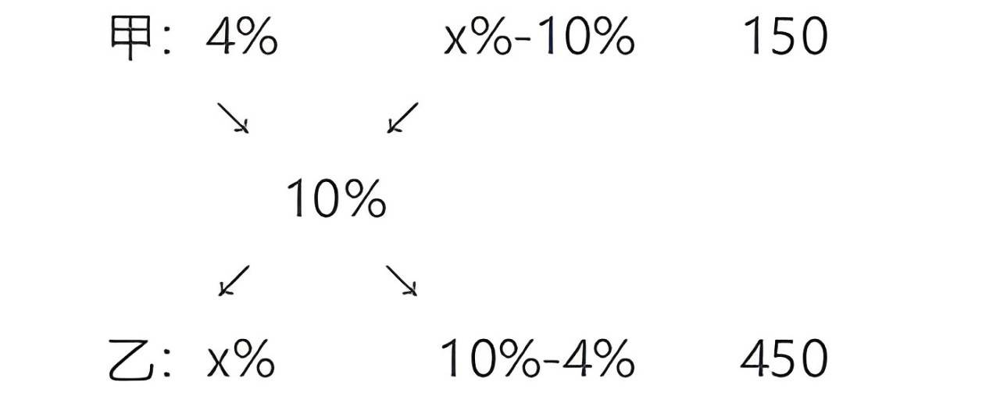
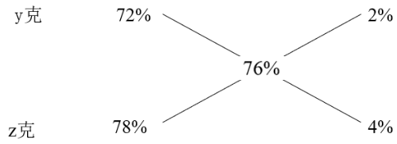
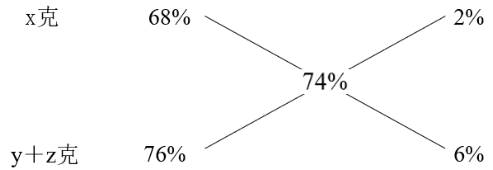

# 溶液问题

##### **1、溶液**：将一种或多种物质（溶质）溶解到另一种物质（溶剂）中，形成的均一、稳定的混合物。（例如：盐水、糖水） `在溶解过程中，没有质量凭空产生或消失，只是物质均匀地混合在了一起。`

##### **2、溶质**：被溶解的物质（例如：盐、糖）。

##### **3、溶剂**：用来溶解溶质的物质（最常见的是水）。

## 一、核心公式

##### **1、质量守恒定律**：溶液质量 = 溶质质量 + 溶剂质量

##### **2、浓度公式**：浓度 = 溶质质量 ÷ 溶液质量 × 100% （变形公式：溶质 = 浓度 × 溶液质量；溶液质量 = 溶质 ÷ 浓度）

##### **3、公式解释**：将10克食盐溶解在90克水中。

    溶质质量是你加入的盐的质量，为10克；
    溶剂质量是你使用的水的质量，为90克；
    溶液质量是最后得到的这碗完整的汤的质量，为 10+90=100克；
    那么浓度可知为 10÷100×100%=10%。

## 二、题型（变化）

> 在变化过程中，溶质可能不变（如稀释、蒸发），也可能变化（如混合或反复操作），需根据具体情境灵活运用公式。

### 1、稀释

   **特点**：向原溶液中添加溶剂（如水），使浓度降低。稀释前后溶质质量不变，溶液质量增加。

   **例题**：在浓度为15%的糖水100克中，加水稀释，加入n克水后，浓度变为10%，再加入n克水后，浓度为多少？

    `分析`：看题目，给定溶液为糖水，即溶质为糖、溶剂为水；溶液质量100克，浓度为15%，即有15%×100=15克溶质；第一次加入水，即溶剂增多，溶液浓度发生变化；但溶质质量不变！又加水，溶质依然为原来的糖，溶质质量不变！所以紧盯溶质，第一次加水即得到等量关系：(15)/(100+n)=10%，求得第一次加了n=50克水；再加一次水：(15)/(150+50)=7.5%

### 2、蒸发

   **特点**：从原溶液中移除溶剂（如蒸发水），会使浓度提高。但蒸发前后溶质质量不变，溶液质量减少。

   **例题**：瓶中有浓度为20%的盐水1000g，先后加入甲盐水200g，乙盐水400g，然后对混合溶液加热，若甲盐水浓度是乙盐水浓度的3倍，水分蒸干后总重量减轻至加热前的四分之一，则甲盐水的浓度为多少？

    `分析`：问甲盐水的浓度，与甲盐水有关的倍数关系出现“甲浓度为乙的3倍”，则假设乙浓度为x，甲浓度为3x；回看条件：
        原有浓度20%的盐水1000g，其中溶质(浓度×溶剂)为20%x1000=200g；
        甲盐水浓度为3x，溶液为200g，含盐即溶质为600x；
        乙盐水浓度为x，溶液为400g，含盐即溶质为400x；
        开始加热，水分蒸干，溶质依然没变，就剩下了盐了，总的溶质有：200+600x+400x=200+1000x。
        根据题意，总重量为加热前的四分之一，加热前总量是1000+200+400=1600g，加热后即总量是400g全是盐
        则有等量关系：200+1000x=400，求得x=0.2，甲盐水浓度为3x=60%。

### 3、混合

   **识别**：涉及不同浓度溶液混合后浓度的计算。解题核心在于抓住混合前后溶质质量守恒的原则，并灵活运用相关公式和方法。

   **基础公式**：

- （1）混合后的溶质=溶质1+溶质2+...

- （2）混合后的质量=质量1+质量2+...

- （2）混合后的浓度 =(溶质1+溶质2+...)/(质量1+质量2+...)

   **十字交叉法或**：溶液混合可以使用十字交叉法，但一定要搞清楚数据各自的位置，分子分母的含义，不然就会乱掉。在本章节就不详细讲解该方法，需了解请跳转[【十字交叉】](/数量关系/数学运算/十字交叉.html)

   **线段法**：溶液混合，浓度距离比=溶液质量反比。如溶液甲浓度为a，质量为m，溶液乙浓度为b，质量为n，混合后的浓度为c，则有(a−c)/(c−b)=(n)/(m)

> 如：将 300 克浓度 95%的酒精与若干浓度 60%的酒精，混合成浓度 75%的酒精，需要浓度 60%的酒精多少克？

    `分析`：已知了溶液和浓度，浓度=溶质／溶液。
        300克95%的酒精，含溶质=300x95%=285g；
        假设60%浓度的溶液x克，则含溶质=0.6x克；
        混合后的溶质为：285+0.6x，溶液为300+x；
        则浓度75%=（285+0.6x）／（300+x）求得：x=400

### 4、反复操作

   **特点**：多次进行倒出、加水、蒸发或混合等操作。需逐步分析每次操作后溶质和溶液的变化。（每次操作后，溶质可能减少，如倒出溶液；溶剂可能变化，如加水或蒸发）

   **考法一**：溶液浓度为n%，倒出比例a，水加满，再倒出比例b，水加满，再倒出比例c，水加满。最后浓度公式=n% ×（1-a）×（1-b）×（1-c）

   **考法二**：装有的试管若干，溶液浓度为n%，取一定量的溶液倒入试管A，再从试管A取一定溶液倒入试管B。最后浓度公式=n%×溶液占比×溶液占比

   **例题**：从一瓶浓度为54%的酒精溶液中倒出(1)/(3)，加满纯净水，再倒出(1)/(3)，又加满纯净水，此时酒精溶液的浓度是多少？

    `分析`：已知浓度54%，从溶液倒出(1)/(3)，可以为溶液赋值300；则含溶质=54%x300=162；
        被倒出(1)/(3)，溶质还余(1−(1)/(3))，即溶质还有：162×(2)/(3)=108
        又被倒出(1)/(3)，溶质余1−(1)/(3)，即溶质还有：108×(2)/(3)=72
        此时溶液的总量不变为300，则浓度=(溶质)/(溶液)=(72)/(300)=24%
        观察题目是考法一，可以不分析直接套公式：最后浓度公式=54% ×（1-(1)/(3)）×（1-(1)/(3)）=24%

## 三、总结

  以上四种题型中，不论是糖、盐还是酒精，也不论是稀释、蒸发、混合还是反复操作，我们的本质思路都是从基本公式出发，紧盯不变的量（一般是溶质），找等量关系，利用方程法、赋值法、比例法、十字交叉等我们熟知的方法，简单计算即可求得答案。

## 四、随笔练习

**例1**：(2017河南选调)某饮料店有纯果汁（即浓度为 100%）10 千克，浓度为 30%的浓缩还原果汁 20 千克。若取纯果汁、浓缩还原果汁各10千克倒入10千克纯净水中，再倒入10千克的浓缩还原果汁，则得到的果汁浓度为：

   A.40%
   B.37.5%
   C.35%
   D.30%

解析

   根据题意，给了两种不同浓度的溶液，紧盯溶质：取纯果汁、浓缩还原果汁各10kg，
    则共取出溶质：10x100%+30%x10=13kg；
    再倒入10kg浓缩还原果汁，即又取出溶质30%x10=3kg；此时溶质为13+3=16kg；
    （水+果汁）溶液共：10+10+10+10=40kg，则浓度为16/40=40%，答案选A。

**例2**：(2009国考)一种溶液，蒸发掉一定量的水后，溶液的浓度为10%；再蒸发掉同样多的水后，溶液的浓度变为12%；第三次蒸发掉同样多的水后，溶液的浓度将变为多少？

   A.14%
   B.17%
   C.16%
   D.15%

解析

   蒸发问题，蒸发的是溶剂(水)，溶质一直不变。无具体数值考虑赋值法，赋值不变量溶质为10与12的公倍数60g，公式浓度=溶质/溶液 可转化为 溶液=溶质+溶剂=溶质/浓度，则第一次蒸发水后溶液为60/10%=600g，第二次蒸发水后溶液为60/12%=500g，则蒸发的水为600-500=100g。故第三次蒸发水后溶液浓度为 60/(500-100)=15%。故正确答案为D。

**例3**：(2021山东47%) X 千克甲盐水和 Y 千克乙盐水中的含盐量相同。将 X 千克乙盐水与 X 千克甲盐水混合，并蒸发掉 X 千克水之后，得到的溶液浓度是乙盐水的 Z 倍。问乙盐水的浓度是甲盐水的多少倍？

   A.(1)/(Z+1)
   B.(1)/(Z−1)
   C.(1)/(z+(X)/(Y))
   D.(1)/(z+(Y)/(X))

解析

   根据题意，给定了溶质的质量，溶质之间、浓度的等量关系；从基本公式：浓度=溶质／溶液，可知溶质一样的情况下，浓度与溶液成反比；
    则由“X 千克甲盐水和 Y 千克乙盐水中的含盐量相同”可知：(甲盐水浓度)/(乙盐水浓度)=(Y)/(X)，则可假设甲盐水浓度为x，乙盐水浓度为y，则有：
    混合后的溶液含溶质为Xx+Xy，蒸发X千克水后，溶质不变，溶液为X，则浓度为(Xx+Xy)/(X)，且有等量关系：(Xx+Xy)/(X)=Zy，化简后：x+y=Zy，即x=(z-1)y，则设问：乙浓度/甲浓度=(y)/(x)=(1)/(z−1),故答案选B

**例4**：(2019上海)一碗芝麻粉，第一次吃了半碗，然后用水加满搅匀；第二次喝了1/3碗，用水加满搅匀；第三次喝了1/6碗，用水加满搅匀；最后一次全吃完。则最后一次吃下的芝麻糊中芝麻粉含量是\_\_\_\_\_\_。

   A.1/6
   B.5/6
   C.1/18
   D.5/18

解析

   方法一：一碗芝麻粉可以设浓度为100%，则芝麻粉的质量为1，第一次吃了半碗，芝麻粉剩1/2；水加满搅匀后，第二次又喝了1/3，芝麻粉剩（1/2）×（2/3）=1/3；再次水加满搅匀后，第三次又喝了1/6，芝麻粉剩（1/3）×（5/6）=5/18，此时加满水搅匀后，碗大小没变，质量为1，此时芝麻糊中芝麻的含量=溶质/溶液=(518)/(1)=5/18。故正确答案为D。
   方法二：一碗芝麻粉可以设浓度为100%，则芝麻粉的质量为1，最后浓度公式=100% ×（1-(1)/(2)）×（1-(1)/(3)）×（1-(1)/(6)）=5/18，此时芝麻糊中芝麻的含量=溶质/溶液=5÷18÷1=5/18。故正确答案为D。

**例5**：(2018江苏) 某化学实验室有 A、B、C 三个试管分别盛有 10 克、20 克、30 克水，将某种盐溶液10克倒入试管A中，充分混合均匀后，取出10克溶液倒入B试管，充分混合均匀后，取出10克溶液倒入C试管，充分混合均匀后，这时C试管中溶液浓度为 1%，则倒入 A 试管中的盐溶液浓度是：

   A.40%
   B.36%
   C.30%
   D.24%

解析

   方法一：根据题意，给定原始溶剂、加入溶液和最终浓度，求加入溶液的浓度，假设为x；根据最终浓度，求出最终的溶质，即有：最终C试管溶液为：30+10=40g，最终含溶质40x1%=0.4g；
    紧盯溶质：10g某种盐溶液倒入A(10g)试管，溶质不变为10x，取出10g即(1)/(2)，此时含溶质5x；
    倒入B（20g）试管融合为30g，溶质不变5x，又取出10g即(1)/(3)，此时溶质为(5)/(3)x。
    倒入C试管，溶质不变即：(5)/(3)x=0.4，则x=(6)/(25)=24%，答案为D
   方法二：知道最后溶液浓度，问原始浓度，根据考法二公式：1%=n%×(10)/(10+10)×(10)/(10+20)×(10)/(10+30)，解得n%=24%，答案为D

**例6**：(2013天津)甲容器中有浓度 4% 的盐水 150 克，乙容器中有某种浓度的盐水若干，若从乙容器中 取出 450 克盐水放入甲中混合成浓度为 10% 的盐水，问乙容器中盐水的浓度是多少？

   A.11%
   B.12%
   C.14%
   D.16%

解析

   此题为溶液混合问题，设乙容器中盐水的浓度为 x%，应用十字交叉法如下：
    
    因此，有(x%−10%)/(10%−4%)=(150)/(450)。解得 x%=12%，故正确答案为 B。

**例7**：(2023江苏30%)浓度分别为68%、72%、78%的三种酒精溶液的总质量为240克。若将它们全部混合，则可得浓度为74%的酒精溶液；若只将浓度为72%和78%的酒精溶液混合，则可得浓度为76%的酒精溶液。这三种酒精溶液中，浓度为72%的酒精溶液质量为（ ）。

   A.30克
   B.40克
   C.48克
   D.60克

解析

   第一步，本题考查溶液问题。
   第二步，设68%、72%、78%的三种酒精溶液的质量分别为x、y、z克。根据十字交叉法可得：
   量之比1：3，则浓度为76%的酒精溶液质量为180克。根据“若只将浓度为72%和78%的酒精溶液混合，则可得浓度为76%的酒精溶液”，可画如下线段
   
   即有：(y)/(z)=(2%)/(4%)，解得z=2y...①
   若将它们全部混合，则可得浓度为74%的酒精溶液，可画如下线段
   
   即有：(x)/(z+y)=(2%)/(6%)，结合①式，解得x=y...②
   第三步，三种酒精溶液的总质量为x+y+z=y+y+2y=240克，解得y=60。所以，浓度为72%的酒精溶液质量为60克，因此，选择D选项，

**例8**：(2020上海41%)有甲、乙两个瓶子，甲瓶里装了200毫升清水，乙瓶里装了200毫升纯酒精。第一次把20毫升纯酒精由乙瓶倒入甲瓶，第二次把甲瓶中20毫升溶液倒回乙瓶，此时甲瓶里含有纯酒精的量\_\_\_\_\_\_乙瓶里含水的量。

   A.大于
   B.小于
   C.等于
   D.不能确定

解析

   在倾倒之前甲、乙两瓶各有200ml的溶液；
   倾倒两次后，甲、乙两瓶还是各有200ml的溶液，那么甲瓶中少的水是用来自于乙瓶中的酒精来补充；同理，乙瓶中少的酒精是用来自于甲瓶中的水来补充，故此时甲瓶里含有纯酒精的量等于乙瓶里含水的量。
   验证一下：
   第一次把20毫升纯酒精由乙瓶倒入甲瓶。此时甲溶液有220ml，溶质20ml，浓度为20/220=1/11。乙瓶有180ml溶质。
   第二次把甲瓶中20毫升溶液倒回乙瓶。甲瓶浓度是不变的，此时甲瓶溶液200ml，溶质=（1/11）×200=200/11，那么甲瓶的水为200-（200/11）ml；乙瓶溶液是200ml，加入的20毫升的甲有20×（1/11）=20/11ml溶质，则乙瓶溶液的溶质为180+（20/11）=200-20+（20/11）=200-（200/11）ml，因此是一样的。

**例9**：(2013浙江)瓶中装有浓度为20%的酒精溶液1000克，现在又分别倒入200克和400克的A、B两种酒精溶液，瓶里的溶液浓度变为15%，已知A种酒精溶液的浓度是B种酒精溶液浓度的2倍。那么A种酒精溶液的浓度是多少?

   A.5%
   B.6%
   C.8%
   D.10%

解析

   设A浓度为n，则B浓度为(n)/(2)；
   方法一：根据混合后浓度 =(溶液A的溶质质量+溶液B的溶质质量+...)/(溶液A的质量+溶液B的质量+...)。可列式15%=(100×20+200×n+400×（n/2）)/(1000+200+400)，解得n=10%。
   方法二：根据 混合后溶质=溶质1+溶质2+...，可列式：1000×20%+200×n+400×(n)/(2)=（1000+200+400）×15%，解得n=10%。
   故正确答案为D。
